# 一、下载安装

## 1.anaconda下载 ：https://repo.anaconda.com/archive/

### 注意：不要下载最新那个，不稳定,我们这里使用Anaconda Distribution 2023.09


## 2.安装，点击对应的exe文件就可以安装，这里我们选择只是为我安装，安装路径是我的用户目录


# 二、anaconda使用

## 启动方式1：使用powershell终端窗口

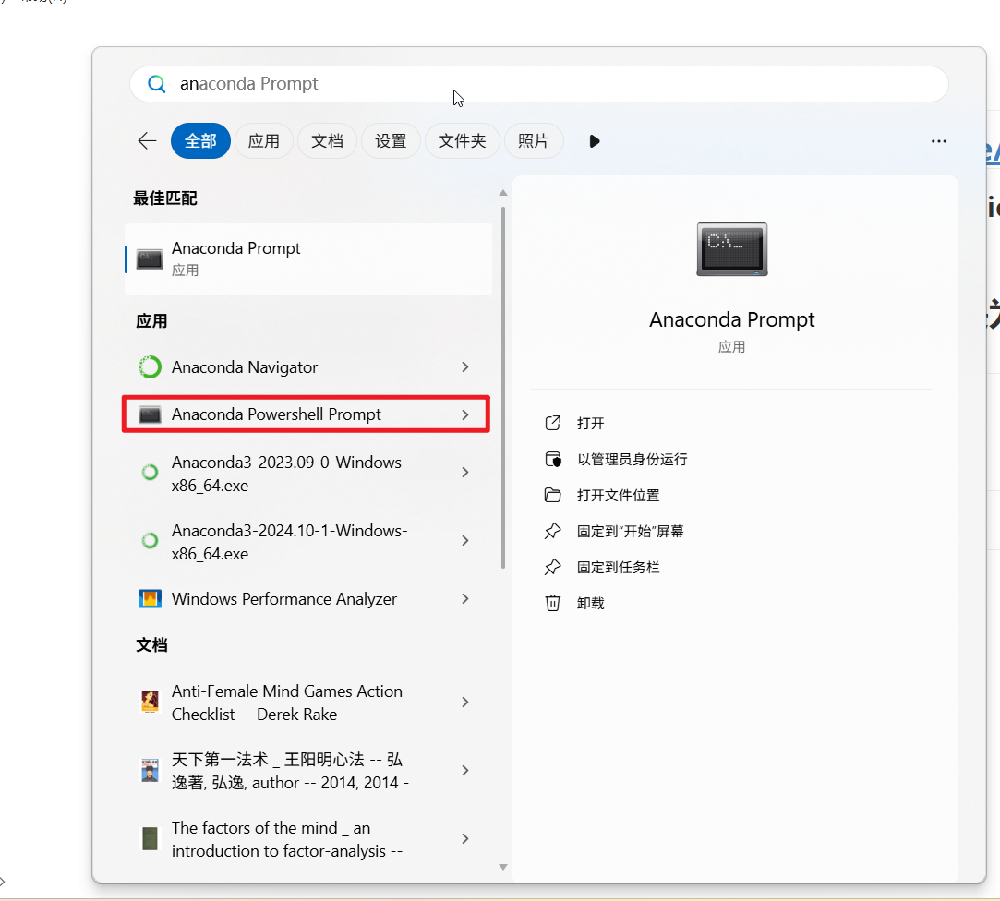

## 启动方式2： cmd终端，

### 1.需要把下面这几个路径添加到Path环境变量

```
C:\Users\kenny\anaconda3
C:\Users\kenny\anaconda3\Scripts
C:\Users\kenny\anaconda3\Library\bin
```

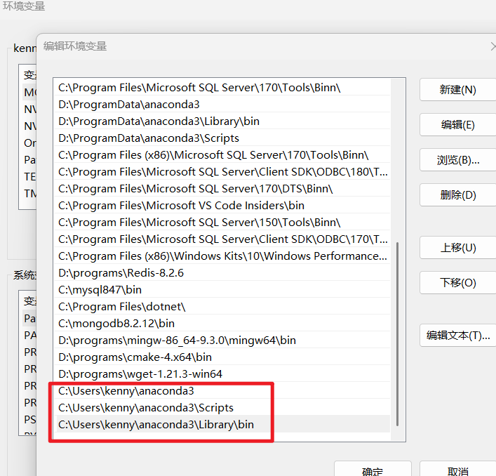

### 2.然后就可以打开一个cmd窗口，输入conda env list查看安装的虚拟环境

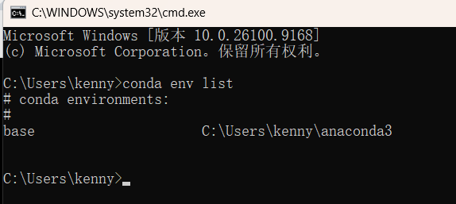

## 创建一个langchain1.2虚拟环境，使用python3.13.12,conda是可以创建比它自带的python更高版本的虚拟环境的。

```
conda create --name langchain1.2 python=3.13.12
```

### 创建完成后的界面如下

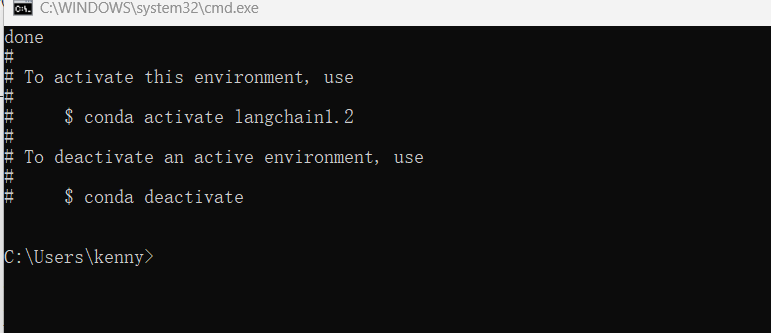

## 可以使用conda env list 查看一下我们刚刚创建的虚拟环境

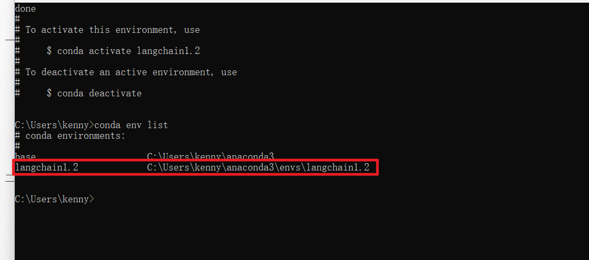

## 在激活虚拟环境之前，需要先初始化，执行 conda init ，就会完成初始化

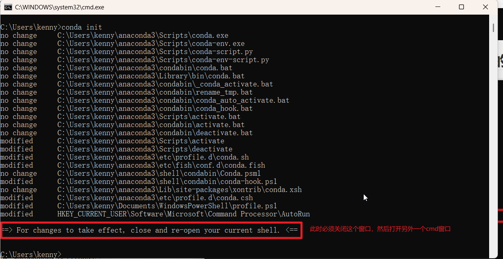

## 按照提示把上面的cmd窗口关闭，然后打开另外一个cmd窗口

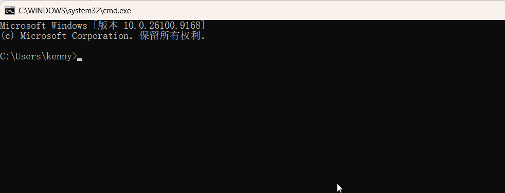

## 输入：conda activate langchain1.2来激活我们的虚拟环境

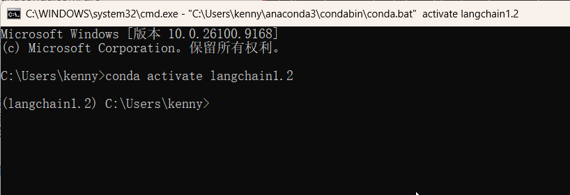

## 可以输入Python 来查看python的版本

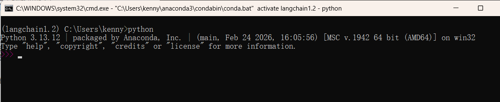

### 的确是我们安装的版本

# 三、安装langchain

## 这些是参考命令

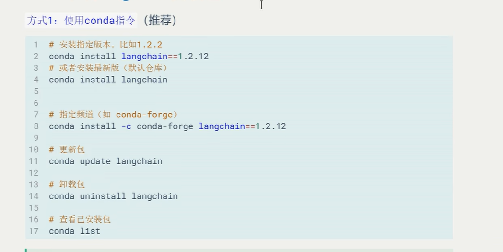

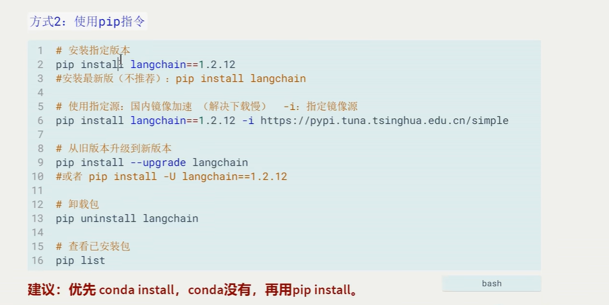

## 我们优先使用conda install langchain==1.2.12,安装失败，conda没有这个包，使用pip 安装

```
pip install langchain==1.2.12
```

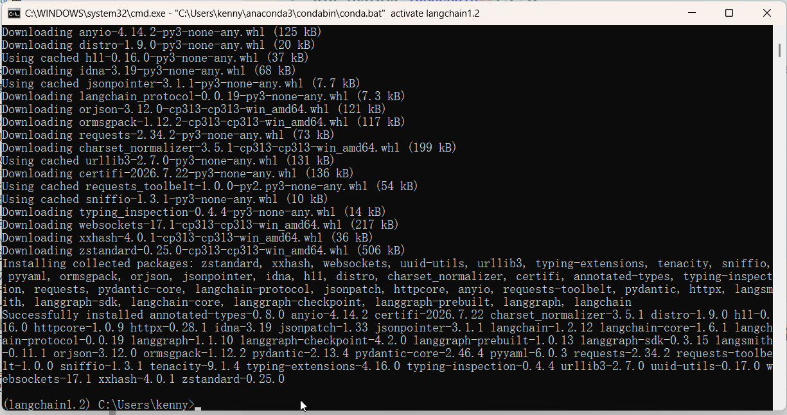

### 我们发现langgraph和langsmith也一起安装了

# 四.使用虚拟环境

## 1.我们在GitHub上面新建一个仓库：kenny_learn_langchain_2026，

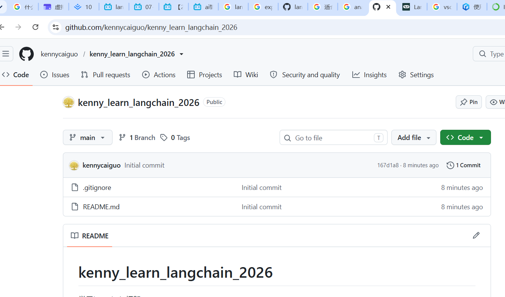

## 2.把它下载到本地，然后用vscode打开这个仓库，创建一个codes文件夹，然后在里面创建一个langchain_study文件夹，在里面新建一个demo1.py,然后选择我们的虚拟环境作为开发环境

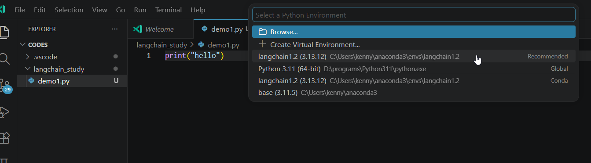

### 我们来些一些测试代码，比如，显示langchain的版本

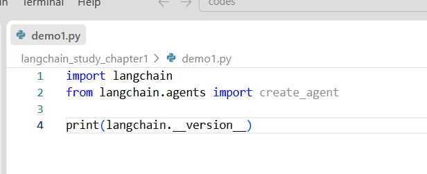

### 需要注意：如果你想在命令行激活虚拟环境，不要使用powshell终端，使用cmd终端

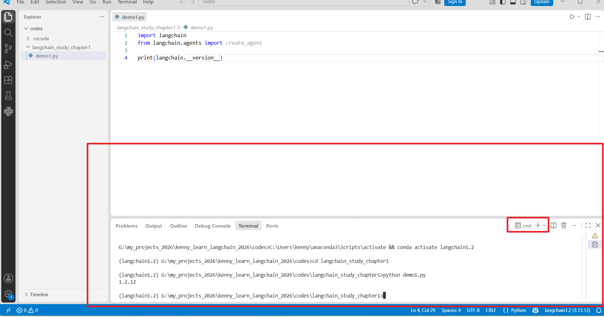

### 可以看到输出了langchain的版本1.2.12

## 到此为止，vscode+conda+langchain开发环境搭建完成

