# Invoke方法的返回值详解

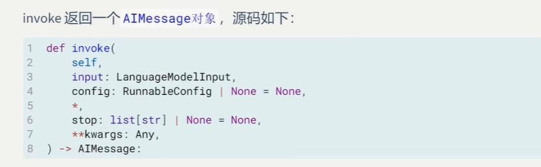

## 模型的返回值的内容非常丰富

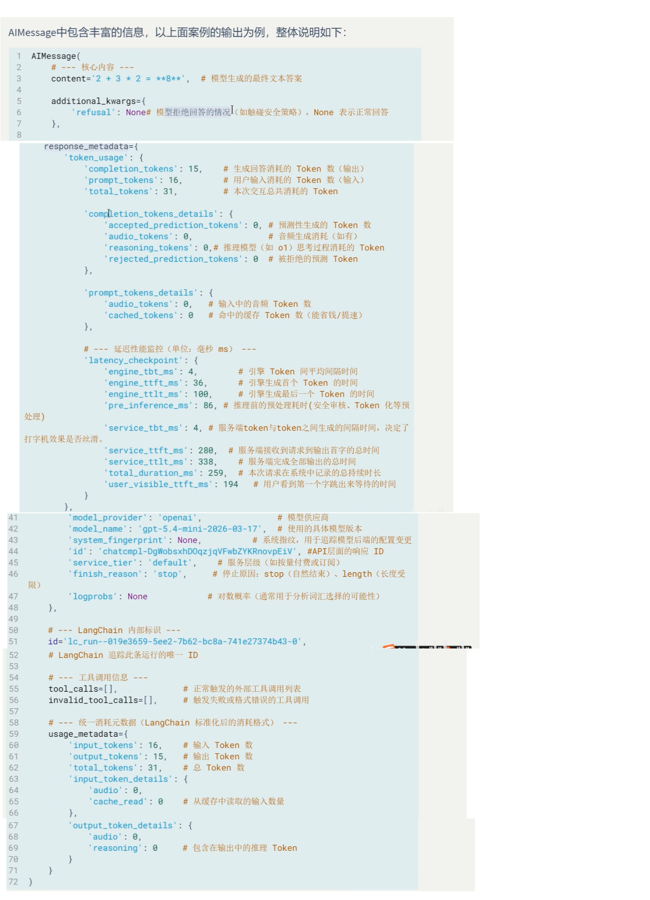

### 注意，如果你调用的是本地部署的大模型，信息可能就没有那么丰富了，因为本地模型不需要计费，不会由计费信息

## 这个返回值主要由下面这些内容

### 1.核心内容和基本信息

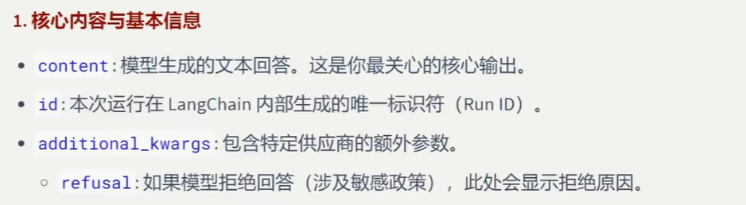

### 2.token的消耗统计

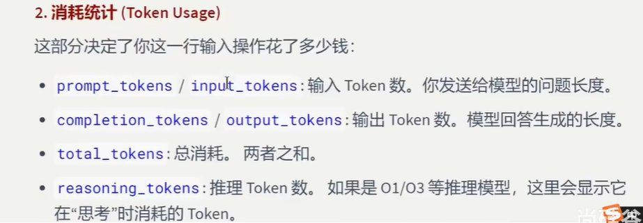


### 3.相应元数据

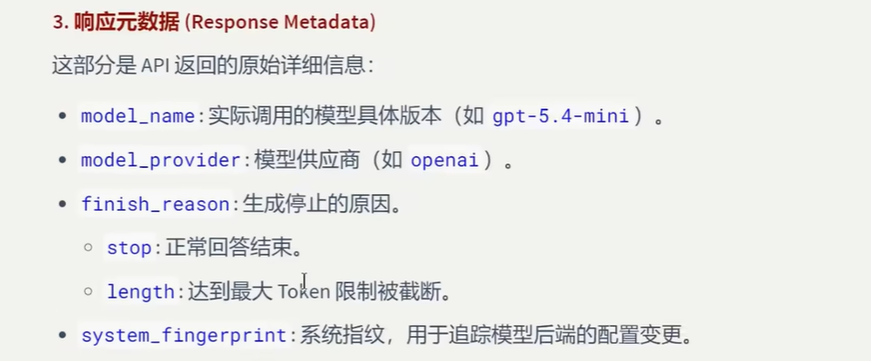

### 4.性能与延迟

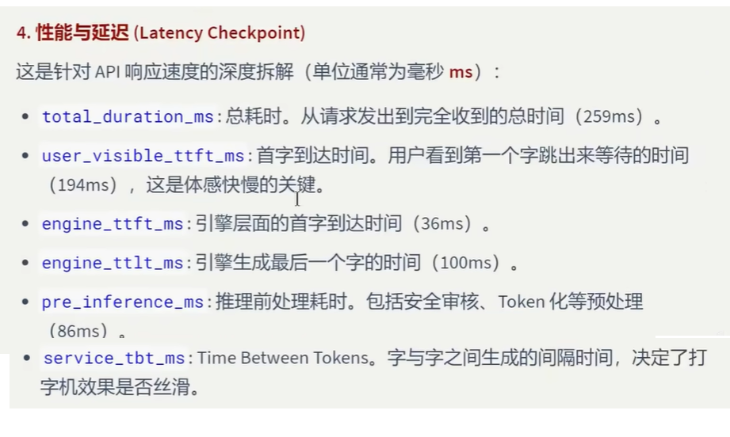

### 5.工具调用信息

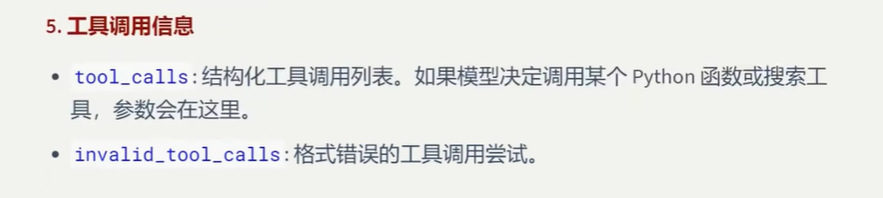

## 实例1,我们使用jupyter notebook编程，所以可以一段一段来执行代码，先调用模型保存结果

```
from langchain_core.messages import SystemMessage,HumanMessage,AIMessage
from langchain_ollama import ChatOllama

llm = ChatOllama(
    model='deepseek-r1:8b'
)

msg=[
       HumanMessage("什么是祝由术")  
]

result1 = llm.invoke(msg)
```

## 然后我们来查看模型结果的类型

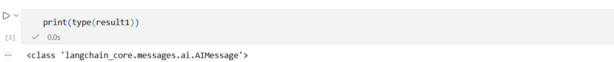

可以看到，输出类型的确是AIMessage

## 此时如果我们打印result1，你会发现，可读性比较差

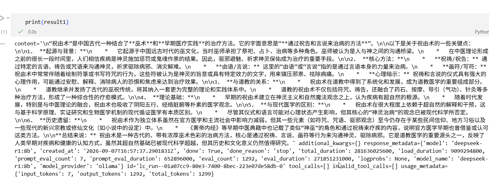

## 如果你想把输出美化一下，你可以调用输出结果的pretty_print()方法，此时输出就比较好看

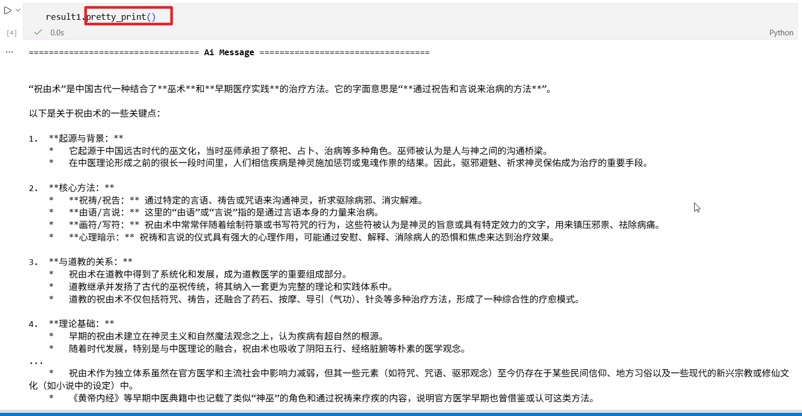

## 不过这种方法由一个缺点，就是控制字符无法输出，第二种方法就是使用rich库（pip install rich）

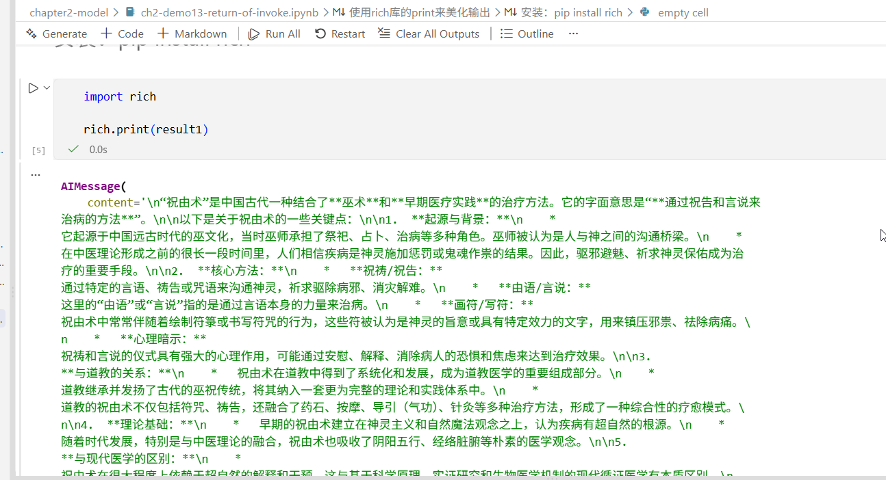

## 访问这些信息

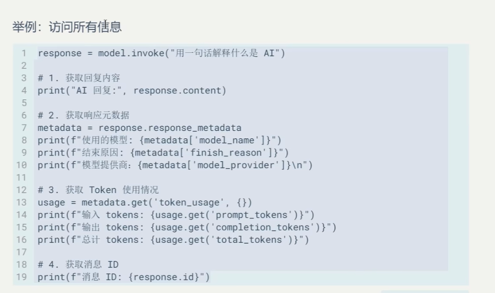

## 实例2，获取模型返回值的比较有用的信息，还是jupyter lab

## 先获取模型的返回值

```
from langchain_openai import ChatOpenAI
from dotenv import load_dotenv
import os

load_dotenv(override=True)
gemini_api_key = os.getenv("gemini_api_key")

llm = ChatOpenAI(
    model="gemini-3.1-flash-lite",
    api_key=gemini_api_key,
    base_url="https://generativelanguage.googleapis.com/v1beta/openai/"
)

resp = llm.invoke("花花公子是什么")
```


## 然后来获取有用信息

```
## 获取返回值中的比较有用的信息
metadata = resp.response_metadata
print(f"使用的模型：{metadata.get('model_name','None')}")
print(f"结束的原因：{metadata.get('finish_reason','None')}")
print(f"模型提供商：{metadata.get('model_provider','None')}\n")
# token使用情况
usage = metadata.get('token_usage',{})
print(f"输入token：{usage.get('prompt_tokens')}")
print(f"输出token：{usage.get('completion_tokens')}")
print(f"总计token：{usage.get('total_tokens')}")
# 获取消息ID
print(f"消息ID：{resp.id}")
```


### 运行程序，效果如下

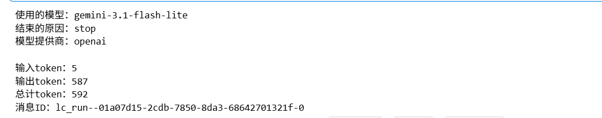