# 流式调用

## invoke和stream有什么区别

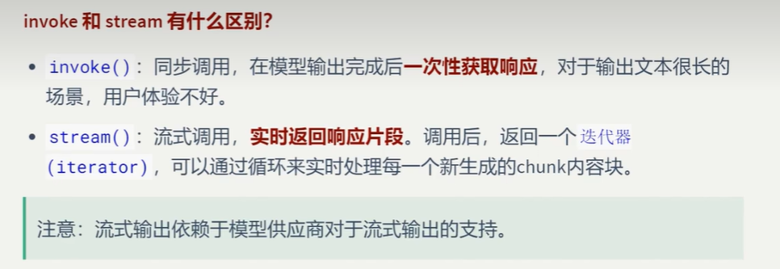

## 流式调用使用举例

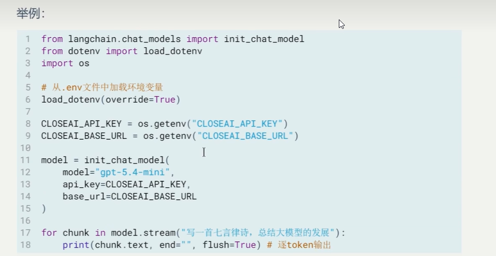

## 演练，用本地大模型实现流式调用

```
from langchain.chat_models import init_chat_model


model = init_chat_model(
    model='deepseek-r1:8b',
    model_provider="ollama"
)

question = "写一首五言绝句"

for chunk in model.stream(question):
    print(chunk.text,end="",flush=True)
```


## 模型输出：

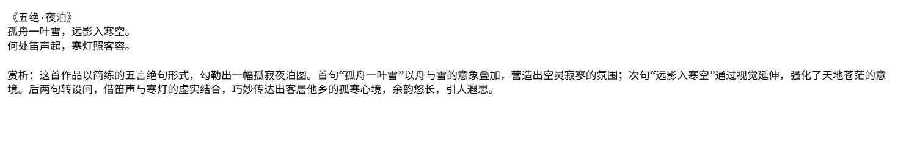

## 流式调用的好处

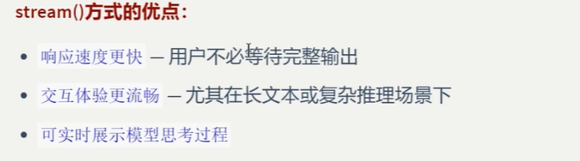

# 批量调用

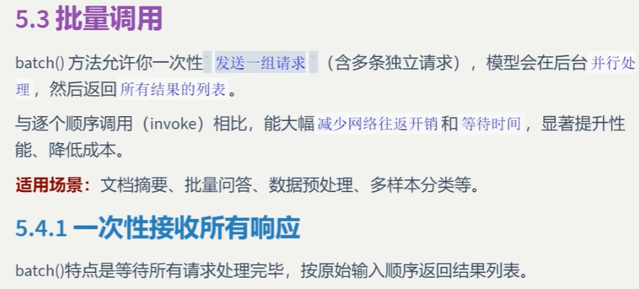

## 1》一次性接受所有相应，使用本地大模型

```
from langchain.chat_models import init_chat_model


model = init_chat_model(
    model='deepseek-r1:8b',
    model_provider="ollama"
)

msgs=[
    "土库曼斯坦的首都是哪里？","土库曼斯坦有多少女人？","土库曼斯坦的经济支柱是什么？"
]

responses = model.batch(msgs)
for res in responses:
    print(res.text)
```


## 模型输出

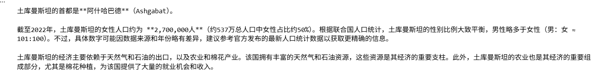

## 2》按照完成的顺序接收响应,模型会给输入编号0，1，2，然后哪个先完成就先输出哪个可以2，1，0或者1，2，0等等等等

```
from langchain.chat_models import init_chat_model


model = init_chat_model(
    model='deepseek-r1:8b',
    model_provider="ollama"
)

msgs=[
    "美国有多少女人","什么是美国的经济支柱","美国的体制有什么弊端"
]

responses = model.batch_as_completed(msgs) # 返回的是一个元组列表
for res in responses:
    print(res)
```


## 3>性能对比，循环使用invoke和batch调用对比,注意模型对象还是上面的模型对象

```
import time

inputs = [
       "翻译为英文：春天来了",
       "翻译为英文：夏天很热",
       "翻译为英文：秋天落叶",
       "翻译为英文：冬天下雪"
]

start = time.time()
resps = model.batch(inputs)
for res in resps:
    print(res.text)
batch_time = time.time() - start
print(f"batch:{batch_time}")

start = time.time()
for i in inputs:
    res = model.invoke(i)
    print(res)
loop_invoke_time = time.time() - start
print(f"loop_invoke_time:{loop_invoke_time}")

```


## 效果：

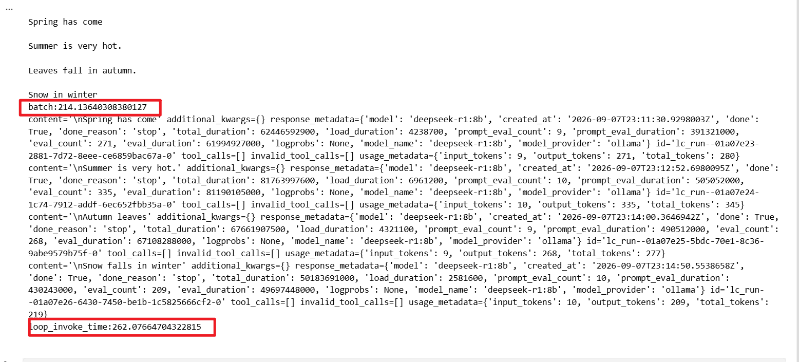


# 异步调用

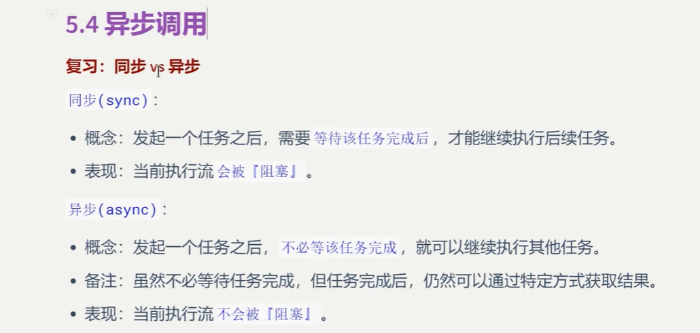

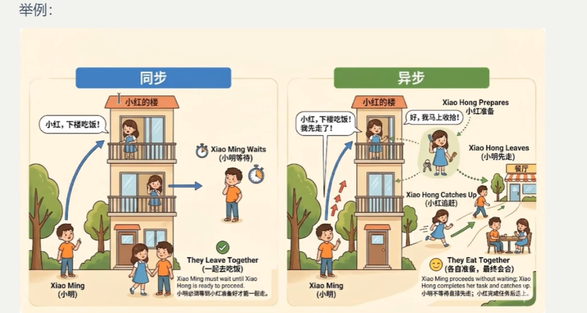

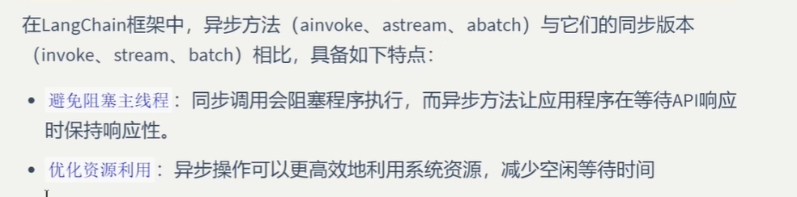

## 演练1，ainvoke，异步调用，注意此时响应使用py文件，在jupyter在使用asyncio会有问题，我们使用ollama部署的本地大模型

### 文件： ch2-demo15-ainvoke.py

```
import asyncio

from langchain.chat_models import init_chat_model
import time
from asyncio import create_task


model = init_chat_model(
    model='deepseek-r1:8b',
    model_provider="ollama"
)

async def async_invoke():
    print("===================演示ainvoke的用法=======================")
    start_time = time.perf_counter()
    print("开始....")
    # 1.创建异步任务
    print(">>>发起模型调用")
    as_task = create_task(model.ainvoke("中国现在人工智能的发展如何？"))
    # 2.继续执行其他操作
    print(">>>模型请求已经在后台发送，继续执行本地逻辑")
    for i in range(3):
        await asyncio.sleep(1) # 使用异步等待，释放控制权
        print(f"正在执行第{i+1}个任务，（已耗时{time.perf_counter()-start_time})")

    # 3.获取模型结果
    print("本地任务完成，检查模型状态")
    resp = await as_task
    end_time = time.perf_counter()
    print(f"模型返回{resp.content}")
    print(f"总运行耗时{end_time - start_time:.2f}s===")

async def main():
    await async_invoke()    
        
if __name__ == '__main__':
    asyncio.run(main())
```


### 程序输出

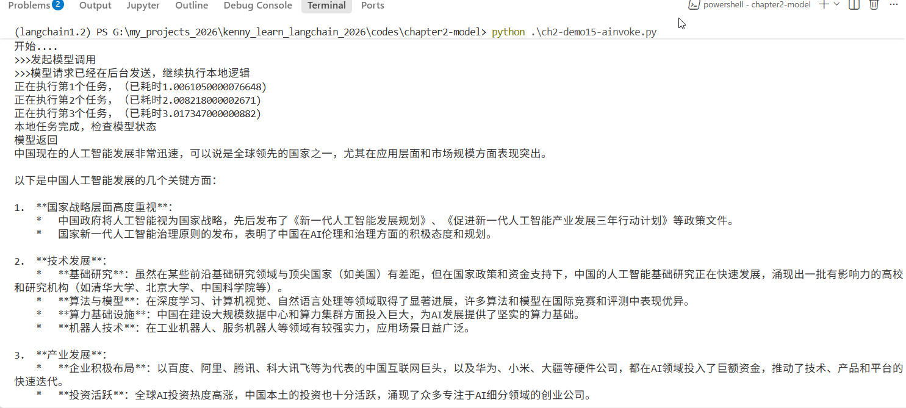


## 演练2.astream方式

### ch2-demo16-astream.py

```
import asyncio

from langchain.chat_models import init_chat_model
import time
from asyncio import create_task


model = init_chat_model(
    model='deepseek-r1:8b',
    model_provider="ollama"
)

async def async_invoke():
    print("===================演示astream的用法=======================")
    start_time = time.perf_counter()
    print("开始....")
    # 1.创建异步任务
    print(">>>发起模型调用")
    stream_resp = model.astream("巴拉圭的首都是哪里？") # 这是一个异步生成器函数返回一个异步迭代器
    # 2.继续执行其他操作
    print(">>>模型请求已经在后台发送，继续执行本地逻辑")
    for i in range(3):
        await asyncio.sleep(1) # 使用异步等待，释放控制权
        print(f"正在执行第{i+1}个任务，（已耗时{time.perf_counter()-start_time})")

    # 3.获取模型结果
    print("本地任务完成，开始流式输出")
    print(">>> 流式输出：",end="",flush=True)
    async for chunk in stream_resp:
        content = chunk.content if hasattr(chunk,"content") else str(chunk)
        print(content,end="",flush=True)
    print()    
    end_time = time.perf_counter()
    print(f"总运行耗时{end_time - start_time:.2f}s===")

async def main():
    await async_invoke()    
        
if __name__ == '__main__':
    asyncio.run(main())
```


### 模型输出：

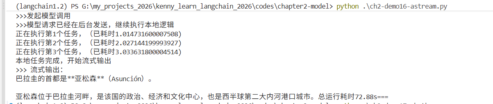


## 演练3.abatch方式

### 文件：ch2-demo17-abatch.py

```
import asyncio

from langchain.chat_models import init_chat_model
import time
from asyncio import create_task


model = init_chat_model(
    model='deepseek-r1:8b',
    model_provider="ollama"
)

async def async_invoke():
    inputs = [
       "翻译为英文：春天来了",
       "翻译为英文：夏天很热",
       "翻译为英文：秋天落叶",
       "翻译为英文：冬天下雪"
    ]

    print("===================演示abatch的用法=======================")
    start_time = time.perf_counter()
    print("开始....")
    # 1.创建异步任务
    print(">>>发起模型调用")
    as_bat_task = create_task(model.abatch(inputs))
    # 2.继续执行其他操作
    print(">>>模型请求已经在后台发送，继续执行本地逻辑")
    for i in range(3):
        await asyncio.sleep(1) # 使用异步等待，释放控制权
        print(f"正在执行第{i+1}个任务，（已耗时{time.perf_counter()-start_time})")

    # 3.获取模型结果
    print("本地任务完成，检查模型状态")
    resp = await as_bat_task
    for res in resp:
        content = res.content if hasattr(res,"content") else str(res)
        print(f"响应内容：{content}")
    end_time = time.perf_counter()
    print(f"总运行耗时{end_time - start_time:.2f}s===")

async def main():
    await async_invoke()    
        
if __name__ == '__main__':
    asyncio.run(main())
```


### 模型输出：

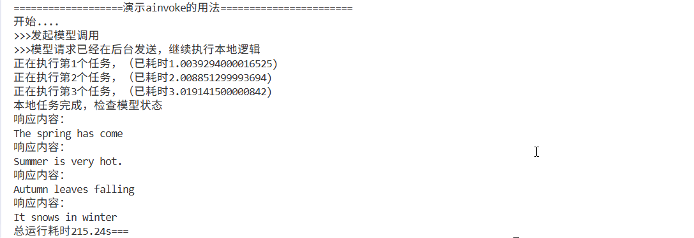

## 异常处理参考

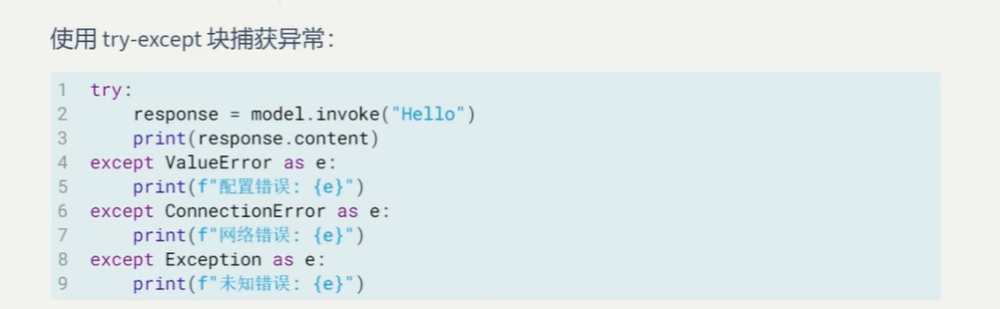
