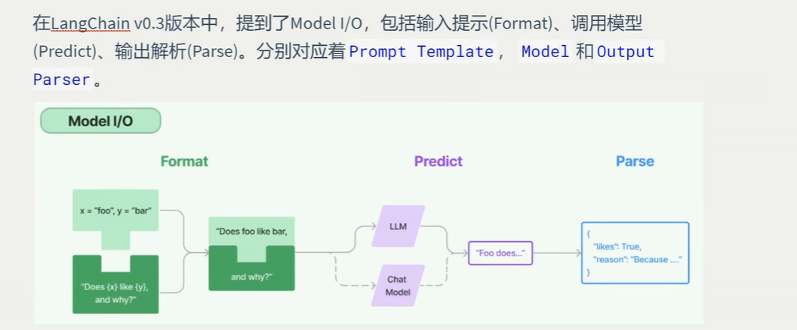
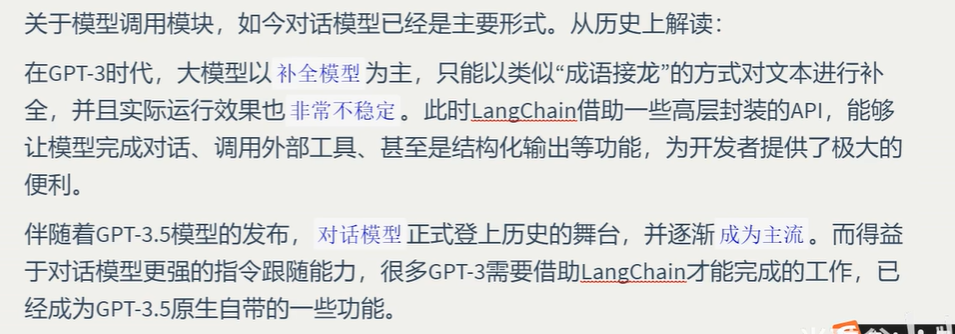
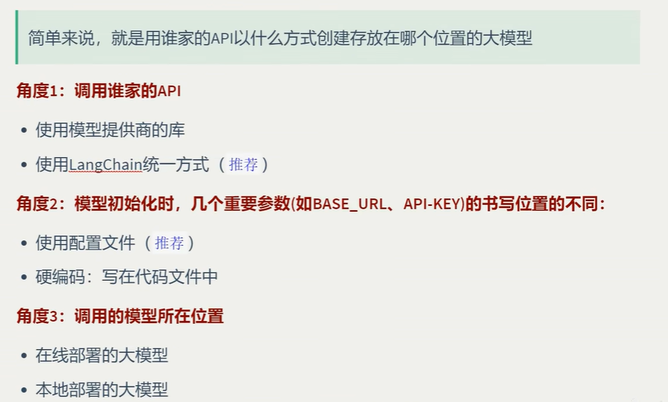
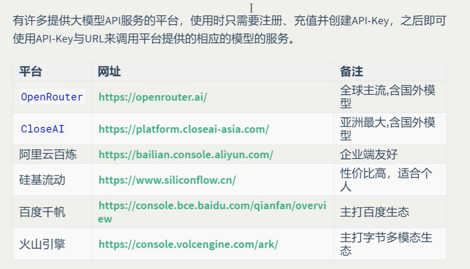
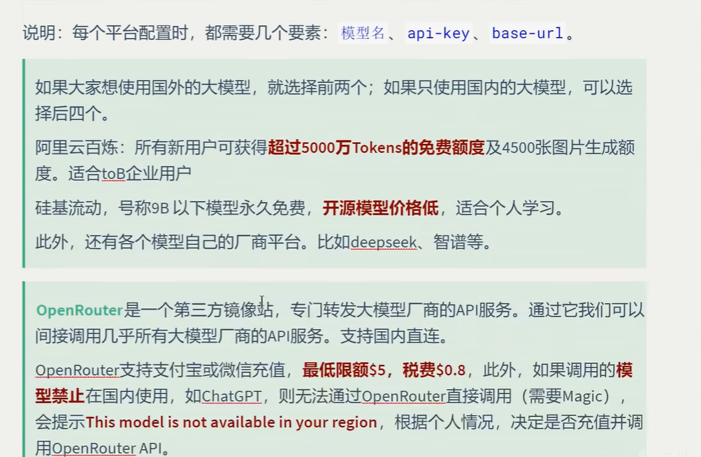

# 参考文档：

## https://docs.langchain.com/oss/python/integrations/providers/overview

## 1.模型调用图解





## 2.模型初始化的分类方式




## 3.线上大模型服务平台






## 4.安装相关的库

## 可以把下面的库写到一个requirements.txt文件中，

```
langchain==1.2.12                   
langchain-core==1.6.1                   
langchain-protocol==0.0.19                   
langgraph==1.1.10                   
langgraph-checkpoint==4.2.0                   
langgraph-prebuilt==1.0.13                  
langgraph-sdk==0.3.15                  
langsmith==0.11.1  
langgraph-checkpoint-postgres==3.0.5
langchain-text-splitters>=1.1.2
langchain-tavily >= 0.2.12
langchain-openrouter

#交换编程笔记本
jupyter

# ollama,用来调用本地大模型
langchain-ollama==1.0.1
ollama==0.6.2


# MCP/FastMCP集成
mcp==1.27.0
fastmcp==3.2.4
langchain-mcp-adapters==0.2.1

# 大模型适配器
openai==2.26.0
anthropic==0.84.0
langchain-openai==1.1.11
langchain-deepseek==1.0.1
langchain-anthropic==1.3.4
langchain-community
python-dotenv
```


## 进入我们的虚拟环境，然后输入：pip install -r requirements.txt,因为我们已经使用pip来安装langchain了，以后就使用pip


