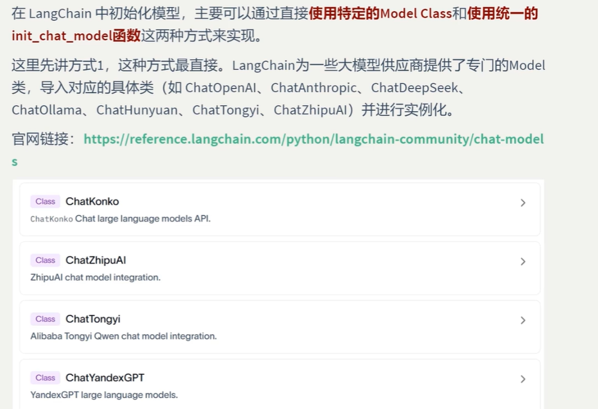
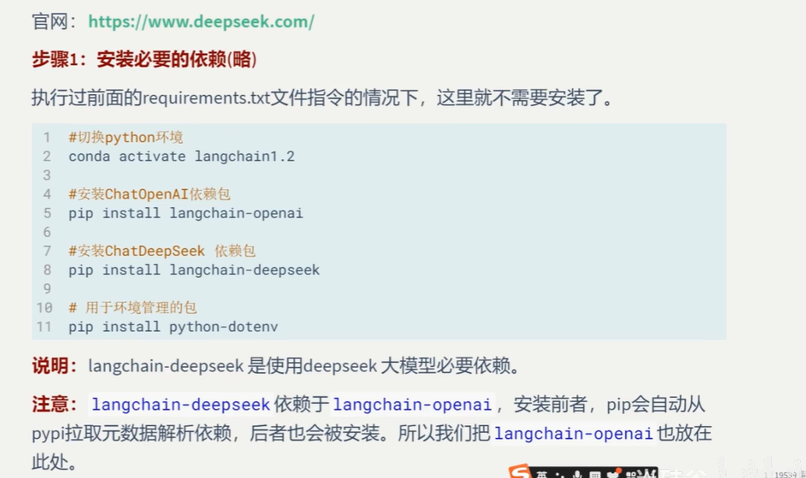
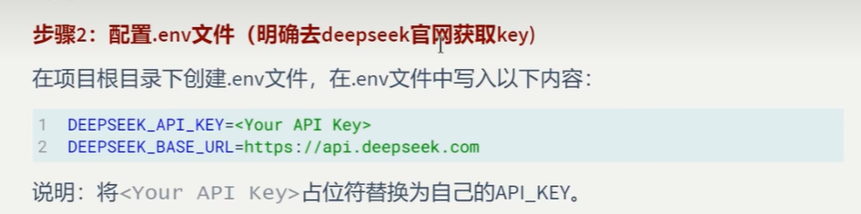
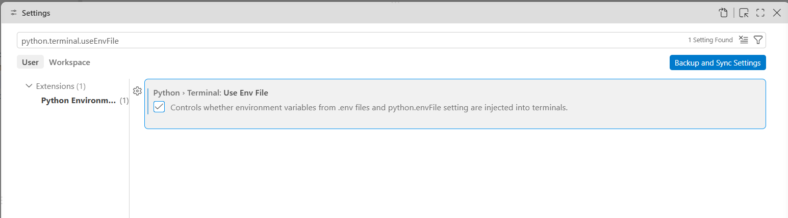
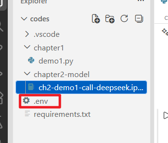
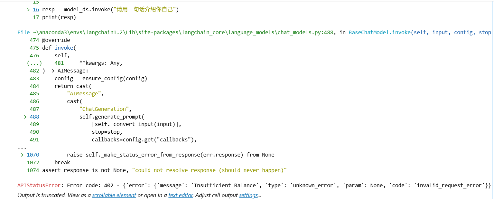

## 模型的类名称如下

|                                                              |      |      |      |      |                                                              |
| ------------------------------------------------------------ | ---- | ---- | ---- | ---- | ------------------------------------------------------------ |
| [`AzureChatOpenAI`](https://docs.langchain.com/oss/python/integrations/chat/azure_chat_openai) | ✅    | ✅    | ✅    | ✅    | [](https://pypi.org/project/langchain-openai/) |
| [`ChatOpenAI`](https://docs.langchain.com/oss/python/integrations/chat/openai) | ✅    | ✅    | ✅    | ✅    | [](https://pypi.org/project/langchain-openai/) |
| [`ChatVertexAI`](https://docs.langchain.com/oss/python/integrations/chat/google_vertex_ai) (deprecated) | ✅    | ✅    | ✅    | ✅    | [](https://pypi.org/project/langchain-google-vertexai/) |
| [`ChatAnthropic`](https://docs.langchain.com/oss/python/integrations/chat/anthropic) | ✅    | ✅    | ✅    | ✅    | [](https://pypi.org/project/langchain-anthropic/) |
| [`ChatGoogleGenerativeAI`](https://docs.langchain.com/oss/python/integrations/chat/google_generative_ai) | ✅    | ✅    | ✅    | ✅    | [](https://pypi.org/project/langchain-google-genai/) |
| [`ChatOllama`](https://docs.langchain.com/oss/python/integrations/chat/ollama) | ✅    | ✅    | ✅    | ✅    | [](https://pypi.org/project/langchain-ollama/) |
| [`ChatDatabricks`](https://docs.langchain.com/oss/python/integrations/chat/databricks) | ✅    | ✅    | ✅    | ❌    | [](https://pypi.org/project/databricks-langchain/) |
| [`ChatGroq`](https://docs.langchain.com/oss/python/integrations/chat/groq) | ✅    | ✅    | ✅    | ✅    | [](https://pypi.org/project/langchain-groq/) |
| [`ChatLiteLLM`](https://docs.langchain.com/oss/python/integrations/chat/litellm) | ✅    | ✅    | ✅    | ✅    | [](https://pypi.org/project/langchain-litellm/) |
| [`ChatHuggingFace`](https://docs.langchain.com/oss/python/integrations/chat/huggingface) | ❌    | ✅    | ✅    | ✅    | [](https://pypi.org/project/langchain-huggingface/) |
| [`ChatMistralAI`](https://docs.langchain.com/oss/python/integrations/chat/mistralai) | ✅    | ✅    | ✅    | ❌    | [](https://pypi.org/project/langchain-mistralai/) |
| [`ChatOpenRouter`](https://docs.langchain.com/oss/python/integrations/chat/openrouter) | ✅    | ✅    | ✅    | ✅    | [](https://pypi.org/project/langchain-openrouter/) |
| [`ChatCohere`](https://docs.langchain.com/oss/python/integrations/chat/cohere) |      |      |      |      | [](https://pypi.org/project/langchain-cohere/) |
| [`ChatXAI`](https://docs.langchain.com/oss/python/integrations/chat/xai) | ✅    | ✅    | ✅    | ❌    | [](https://pypi.org/project/langchain-xai/) |
| [`ChatNVIDIA`](https://docs.langchain.com/oss/python/integrations/chat/nvidia_ai_endpoints) | ✅    | ✅    | ✅    | ✅    | [](https://pypi.org/project/langchain-nvidia-ai-endpoints/) |
| [`ChatDeepSeek`](https://docs.langchain.com/oss/python/integrations/chat/deepseek) | ✅    | ✅    | ✅    | ❌    | [](https://pypi.org/project/langchain-deepseek/) |
| [`ChatTogether`](https://docs.langchain.com/oss/python/integrations/chat/together) | ✅    | ✅    | ✅    | ✅    | [](https://pypi.org/project/langchain-together/) |
| [`ChatAmazonNova`](https://docs.langchain.com/oss/python/integrations/chat/amazon_nova) | ✅    | ✅    | ✅    |      | [](https://pypi.org/project/langchain-amazon-nova/) |

### 参考网址： https://docs.langchain.com/oss/python/integrations/chat/index#anthropic

### 也可以参考这里： https://reference.langchain.com/python/langchain-community/chat-models

## 1.使用模型提供商



### 调用DeepSeek大模型

### 1>安装对应的库



### 2.获取API KEY: https://deepseek.com



#### 用Google登录deepseek的api开放平台，然后申请一个key保存在我们的.env中，注意当你创建.env文件的时候，vscode会告诉你需要一个配置来开启.env在终端中的使用，这么设置就行了（勾选上）




## 项目演练

### 1.创建一个ch2-demo1-call-deepseek.ipynb文件，然后在工作区文件夹里面新建一个.env文件，把我们获取到的api_key和base_url写在里面，注意保存好这个文件，不要给任何人，也不要上传到GitHub，因为别人可能会使用你的api而你支付费用。




### 2.输入下面的代码，然后发现报错，在Google上面搜索一下，发现没有钱用不了

```
import os
from dotenv import load_dotenv
from langchain_deepseek import ChatDeepSeek


# 从.env文件中加载配置信息，override=True表示相关的环境变量以.env文件设置的优先
load_dotenv(override=True)
DEEPSEEK_API_KEY = os.getenv("DEEPSEEK_API_KEY")
DEEPSEEK_BASE_URL = os.getenv("DEEPSEEK_BASE_URL")
model_ds = ChatDeepSeek(
    model="deepseek-v4-flash",
    api_key=DEEPSEEK_API_KEY,
    api_base=DEEPSEEK_BASE_URL
)

resp = model_ds.invoke("请用一句话介绍你自己")
print(resp)
```



### 注意，其实这个api_key和api_base我们可以不写，只要你的.env里面有，程序会自动寻找配置并且自动加载,优化后的代码如下

```
import os
from dotenv import load_dotenv
from langchain_deepseek import ChatDeepSeek


# 从.env文件中加载配置信息，override=True表示相关的环境变量以.env文件设置的优先
load_dotenv(override=True)
model_ds = ChatDeepSeek(
    model="deepseek-v4-flash"
)

resp = model_ds.invoke("请用一句话介绍你自己")
print(resp)
```


