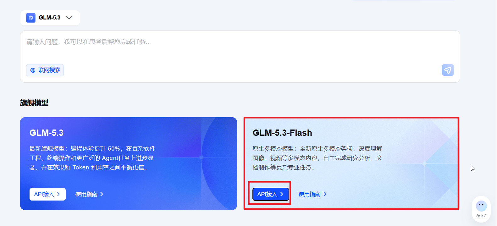
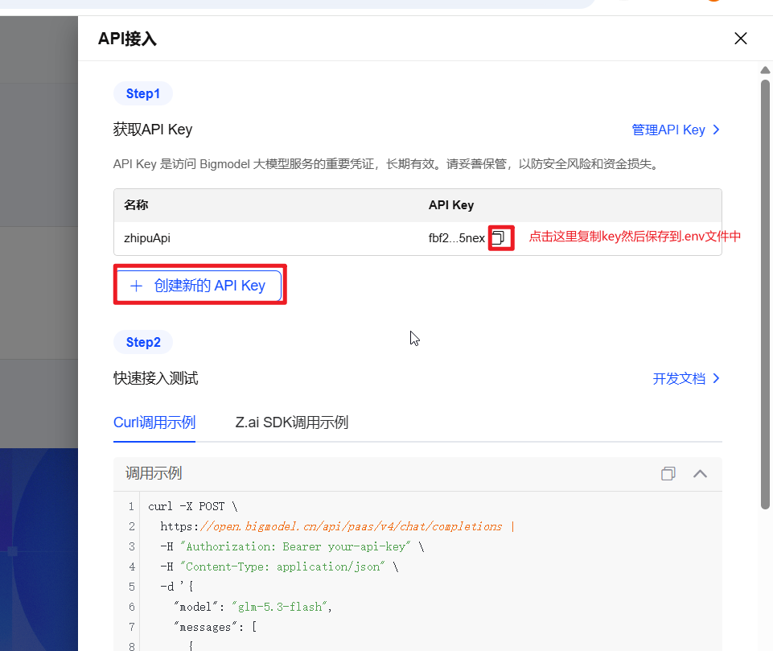
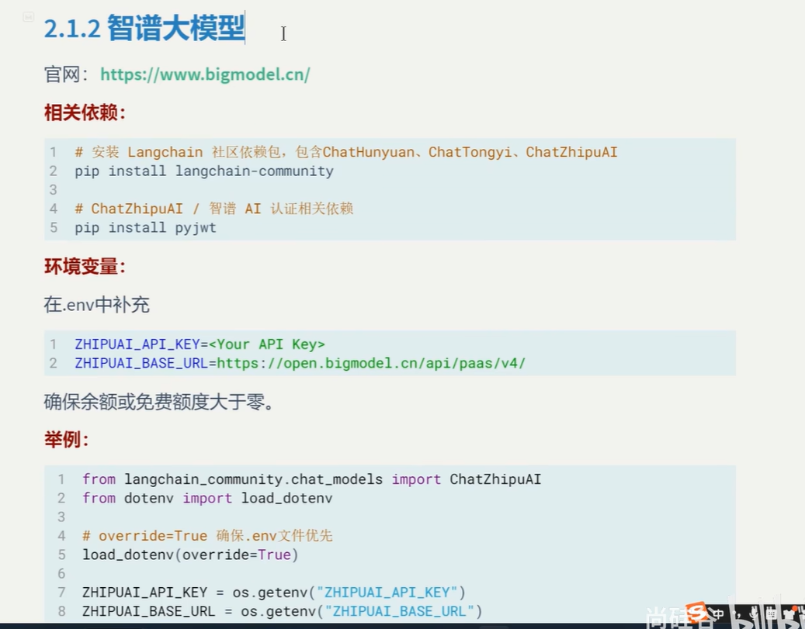
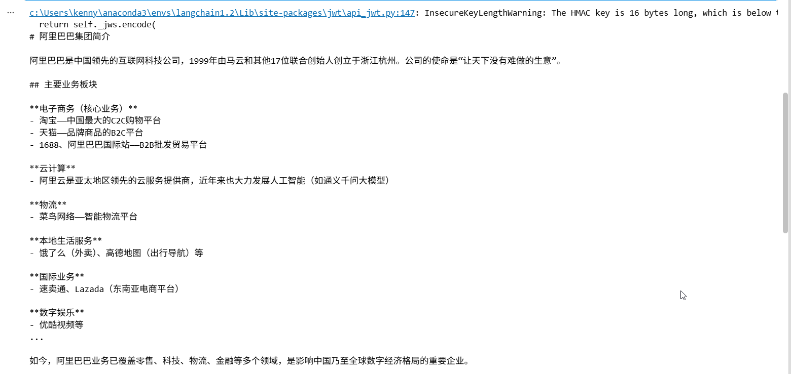
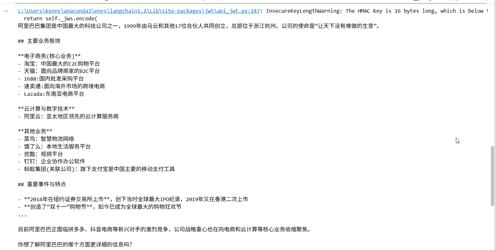
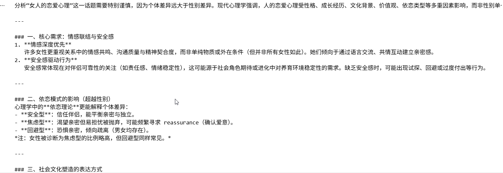

# 1.智普大模型

## 先访问它的官网，想办法获取api key： https://bigmodel.cn/

## 需要使用本地手机号注册，这里使用cr手机号，然后需要填写邮箱

## 然后我们登录，点击控制台，选择GLM-5.3-Flash,点击api接入



## 就会进入一个创建api key的页面，输入一个名称点击创建，就可以创建一个api key了，然后我们把它保存到.env文件中。



## 然后我们来接入大模型



## 代码实例，新建一个ch2-demo4-call-zhipuai.ipynb，内容如下

```
from langchain_community.chat_models import ChatZhipuAI
from dotenv import load_dotenv
import os

load_dotenv(override=True)
zhipuai_api_key = os.getenv("ZHIPUAI_API_KEY")
zhipuai_base_url = os.getenv("ZHIPUAI_BASE_URL")

llm=ChatZhipuAI(
    api_key=zhipuai_api_key,
    api_base=zhipuai_base_url,
    model="glm-5.3-flash"
)

# 调用模型
resp= llm.invoke("阿里巴巴是一家什么样的公司")
print(resp.text)
```


## 运行程序，得到下面的结果




## 代码优化，这个这个api非常聪明，他会到.env文件里面查找api key和base url，前提是你必须使用大写而且名称必须是ZHIPUAI_API_KEY和**ZHIPUAI_ BASE_URL**,简化后的代码如下

```
from langchain_community.chat_models import ChatZhipuAI

llm=ChatZhipuAI(
    model="glm-5.3-flash"
)

# 调用模型
resp= llm.invoke("阿里巴巴是一家什么样的公司")
print(resp.text)
```


## 运行程序，效果是一样的



# 2.阿里百炼平台千问大模型

## 首先安装ChatTongyi的库dashscope

### pip install dashscope


## 然后访问https://bailian.console.aliyun.com/cn-beijing#/home, 获取api key,然后保存到.env文件中，注意，这个模型不需要base url，写了反而会报错

## 在国外，我们需要选择international，也就是国际版，然后用Google账号注册，密码是name+year

# copy了某某人的key保存在.env中,注意这个模型不要设置base_url

## 实例代码:ch2-demo5-call-qwen.ipynb

```
from langchain_community.chat_models import ChatTongyi
from dotenv import load_dotenv
import os

load_dotenv(override=True)
DASHSCOPE_API_KEY = os.getenv("DASHSCOPE_API_KEY")

llm = ChatTongyi(
    api_key=DASHSCOPE_API_KEY,
    model="qwen3-max"
    
)

resp = llm.invoke("请分析一下女人的恋爱心理")
print(resp.text)
```

###  模型输出



