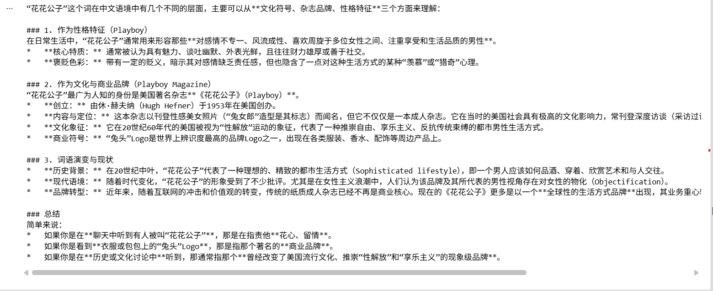
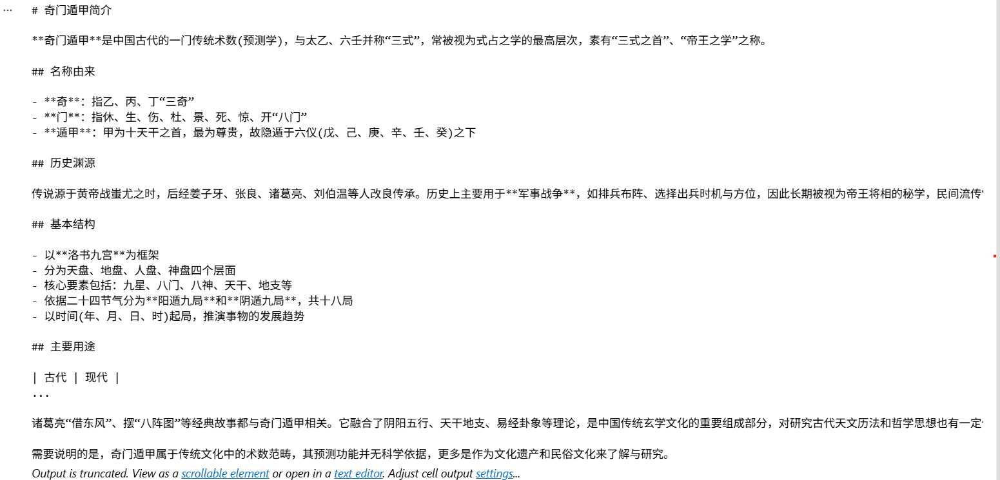

## 首先，我们用兼容模式来调用Gemini

### 注意：使用langchain_openai里面的ChatOpenAI，不要使用langchain-community里面的ChatOpenAI，因为它已经过时了

```
from langchain_openai import ChatOpenAI
from dotenv import load_dotenv
import os

load_dotenv(override=True)
gemini_api_key = os.getenv("gemini_api_key")

llm = ChatOpenAI(
    model="gemini-3.1-flash-lite",
    api_key=gemini_api_key,
    base_url="https://generativelanguage.googleapis.com/v1beta/openai/"
)

resp = llm.invoke("花花公子是什么")
print(resp.text)
```


## 模型输出



## 使用兼容模式调用智普大模型

```
from langchain_openai import ChatOpenAI
from dotenv import load_dotenv
import os

load_dotenv(override=True)
ZHIPUAI_API_KEY = os.getenv("ZHIPUAI_API_KEY")
ZHIPUAI_BASE_URL = os.getenv("ZHIPUAI_BASE_URL")

llm = ChatOpenAI(
    model="glm-5.3-flash",
    api_key=ZHIPUAI_API_KEY,
    base_url=ZHIPUAI_BASE_URL
)

resp = llm.invoke("奇门遁甲是什么")
print(resp.text)
```


## 模型输出



## 使用chatgpt-5.4-mini

```
from langchain_openai import ChatOpenAI
from dotenv import load_dotenv
import os

load_dotenv(override=True)
CHATGPT_API_KEY = os.getenv("CHATGPT_API_KEY")

llm = ChatOpenAI(
    model="gpt-5.4-mini",
    api_key=CHATGPT_API_KEY
)

resp = llm.invoke("奇门遁甲是什么")
print(resp.text)
```

