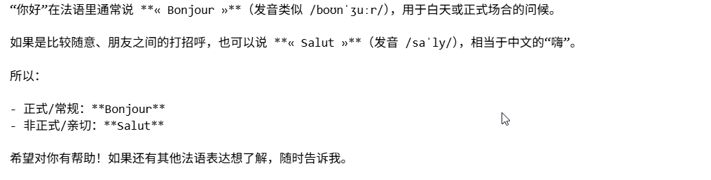
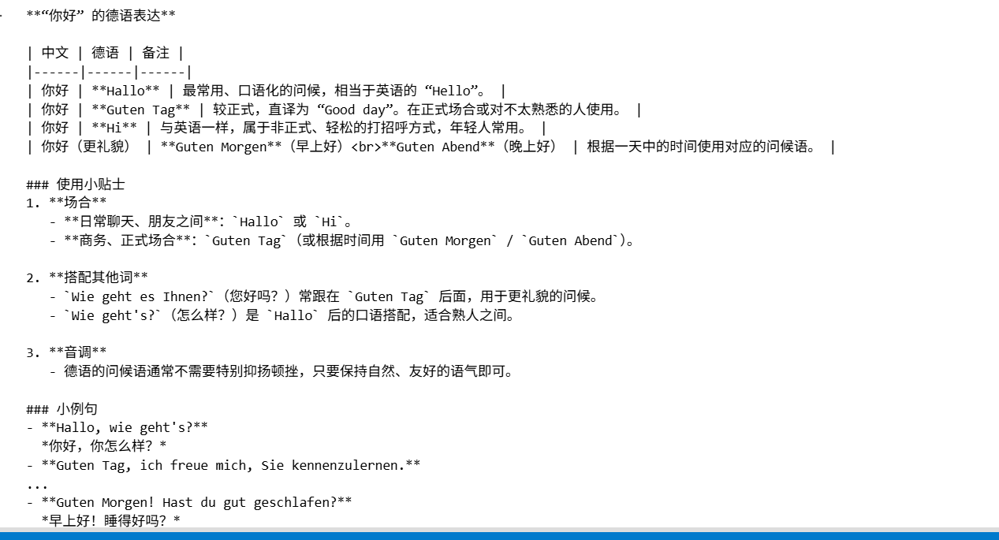

## 首先，我们用兼容模式来调用Gemini

### 注意：使用langchain_openai里面的ChatOpenAI，不要使用langchain-community里面的ChatOpenAI，因为它已经过时了

```
from langchain_openai import ChatOpenAI
from dotenv import load_dotenv
import os

load_dotenv(override=True)
gemini_api_key = os.getenv("gemini_api_key")

llm = ChatOpenAI(
    model="gemini-3.1-flash-lite",
    api_key=gemini_api_key,
    base_url="https://generativelanguage.googleapis.com/v1beta/openai/"
)

resp = llm.invoke("花花公子是什么")
print(resp.text)
```


## 模型输出


## 使用兼容模式调用智普大模型

```
from langchain_openai import ChatOpenAI
from dotenv import load_dotenv
import os

load_dotenv(override=True)
ZHIPUAI_API_KEY = os.getenv("ZHIPUAI_API_KEY")
ZHIPUAI_BASE_URL = os.getenv("ZHIPUAI_BASE_URL")

llm = ChatOpenAI(
    model="glm-5.3-flash",
    api_key=ZHIPUAI_API_KEY,
    base_url=ZHIPUAI_BASE_URL
)

resp = llm.invoke("奇门遁甲是什么")
print(resp.text)
```


## 模型输出


## 使用chatgpt-5.4-mini

```
from langchain_openai import ChatOpenAI
from dotenv import load_dotenv
import os

load_dotenv(override=True)
CHATGPT_API_KEY = os.getenv("CHATGPT_API_KEY")

llm = ChatOpenAI(
    model="gpt-5.4-mini",
    api_key=CHATGPT_API_KEY
)

resp = llm.invoke("奇门遁甲是什么")
print(resp.text)
```

## 用兼容语法调用Groq大模型，使用ChatOpenAI类

```
import os
from langchain_openai import ChatOpenAI
# Groq大模型需要把api key设置到GROQ_API_KEY环境变量中，否则无法使用

# 初始化 ChatOpenAI 调用 Groq 模型
llm = ChatOpenAI(
    model="openai/gpt-oss-120b",  # 或者是 Groq 支持的其他模型名字
    temperature=0.7,
    api_key=os.environ.get("GROQ_API_KEY"),
    base_url="https://api.groq.com/openai/v1",  # 指向 Groq 的 OpenAI 兼容接口
)

# 调用模型
response = llm.invoke("你好法语怎么说")
print(response.content)
```


## 模型输出



## 用兼容语法调用Groq大模型，使用init_chat_model函数

```
from langchain.chat_models import init_chat_model
from langchain_core.messages import HumanMessage


llm = init_chat_model(
    model="openai/gpt-oss-120b",  # 指定具体的 Groq 模型名称
    model_provider="groq",    # 明确指定提供商为 groq
    temperature=0.7
)

# 调用模型
messages = [
    HumanMessage(content="你好的德文")
]

response = llm.invoke(messages)

# 打印输出结果
print(response.content)
```


## 模型输出


