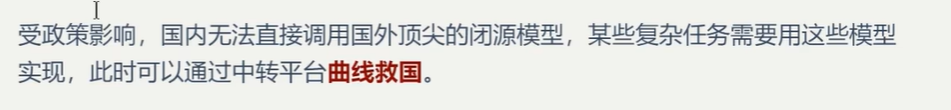
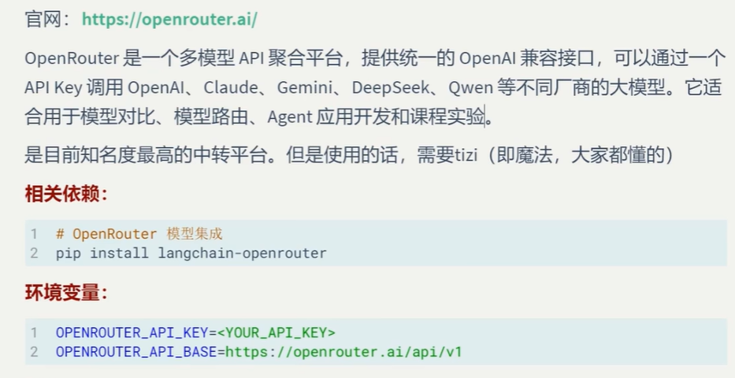
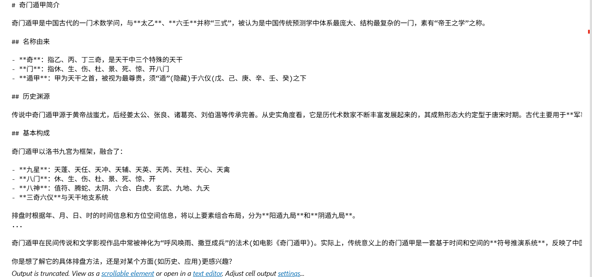
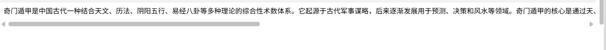
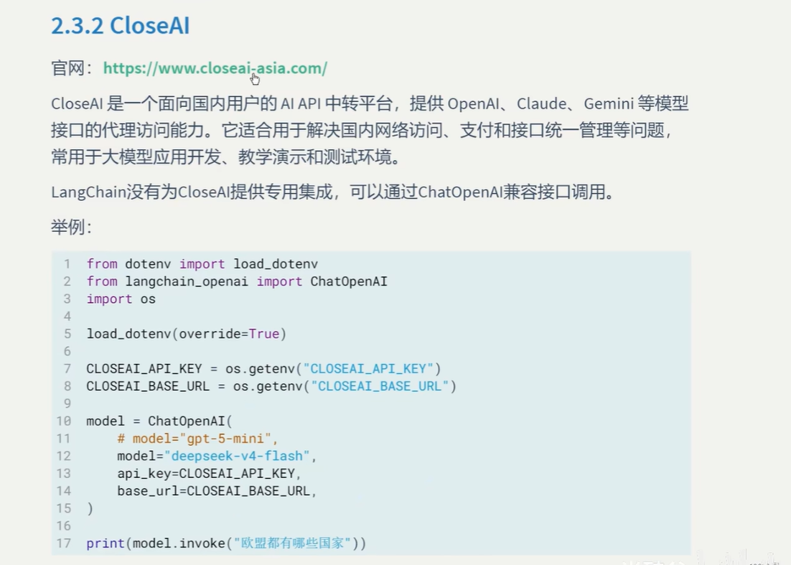
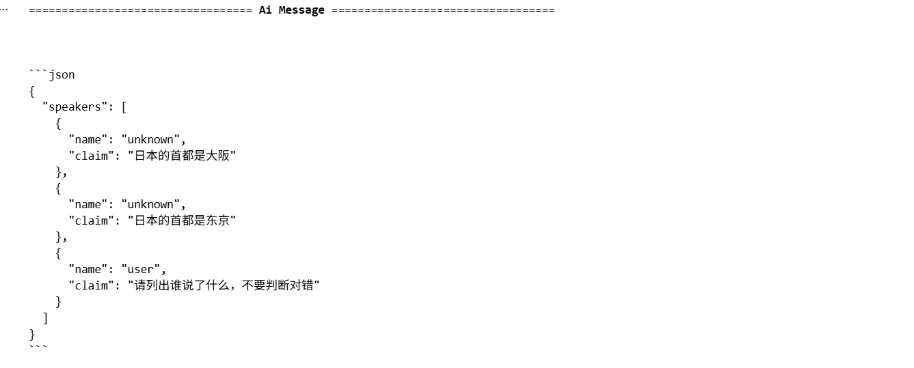

# 为什么需要中转平台



# OpenRouter

## 官网：https://OpenRouter.ai



```
pip install langchain-openrouter
```

## 把上面的库安装了，然后到官网获取api key保存到.env文件中

## 案例:ch2-demo6-openrouter.ipynb

```
from dotenv import load_dotenv
import os
from langchain_openrouter import ChatOpenRouter

load_dotenv(override=True)
OPENROUTER_API_KEY = os.getenv("OPENROUTER_API_KEY")
OPENROUTER_API_BASE = os.getenv("OPENROUTER_API_BASE")

llm = ChatOpenRouter(
    model="glm-5.3-flash",
    api_key=OPENROUTER_API_KEY,
    base_url=OPENROUTER_API_BASE
)

resp = llm.invoke("奇门遁甲是什么")
print(resp.text)
```


### 模型输出



## 利用ChatOpenRouter调用DeepSeek大模型

```
from dotenv import load_dotenv
import os
from langchain_openrouter import ChatOpenRouter

load_dotenv(override=True)
OPENROUTER_API_KEY = os.getenv("OPENROUTER_API_KEY")
OPENROUTER_API_BASE = os.getenv("OPENROUTER_API_BASE")

llm = ChatOpenRouter(
    model="deepseek/deepseek-v4-flash",
    api_key=OPENROUTER_API_KEY,
    base_url=OPENROUTER_API_BASE
)

resp = llm.invoke("奇门遁甲是什么")
print(resp.text)
```


### 模型输出



## OpenRouter只有2次免费使用，用完了。。。

# CloseAI

## 官网：https://www.closeai-asia.com



## 需要获取api key和base url保存到.env文件中

# CloseAI需要收费，没有免费额度

### 参考代码如下

```
from openai import OpenAI
from dotenv import load_dotenv
import os

CLOSEAI_API_KEY = os.getenv("CLOSEAI_API_KEY")

client = OpenAI(
    base_url='https://api.openai-proxy.org/v1',
    api_key=CLOSEAI_API_KEY,
)

chatModel = client.chat.completions.create(
    messages=[
        {
            "role": "user",
            "content": "Say hi",
        }
    ],
    model="gpt-3.5-turbo",
)
print(chatModel.choices[0].message.content)
```


# CUN.ai

user:kennycai2

pwd:name+year


# SilicoFlow

## 官网：https://www.siliconflow.com/ ，可以使用Google账号登录，然后需要获取一个api key保存到.env文件里面，并且保存base url

### 示例代码

```
from langchain_openai import ChatOpenAI
from dotenv import load_dotenv
from langchain_core.messages import HumanMessage,SystemMessage
import os

load_dotenv(override=True)
SiliconFlow_API_KEY = os.getenv("SiliconFlow_API_KEY")
SiliconFlow_BASE_URL = os.getenv("SiliconFlow_BASE_URL")

llm = ChatOpenAI(
    model="Qwen/Qwen3-32B",
    api_key=SiliconFlow_API_KEY,
    base_url=SiliconFlow_BASE_URL
)

messages = [
  SystemMessage("""你是一个消息抽取器。你会收到来自不同发言者的user消息。每条消息可能带有name字段。
   你的任务是：严格根据每条消息的name提取发言者及其观点，并输出JSON。禁止使用”第一人称/第二人称“这种称呼。
   若某条消息没有name，则输出unknown。输出格式：{\"speakers\":[{\"name\":\"...\",\"claim\":\"}]}"""),
  HumanMessage(
       content="我认为日本的首都是大阪",
       name="Bob"
  ),
  HumanMessage(
      content="我认为日本的首都是东京",
      name="Mary"
  ),
  HumanMessage(
      content="请列出谁说了什么，不要判断对错",
      name="audience"
  )
]

resp = llm.invoke(messages)
resp.pretty_print()
```


模型输出：



## 一个api key只能够使用一次
