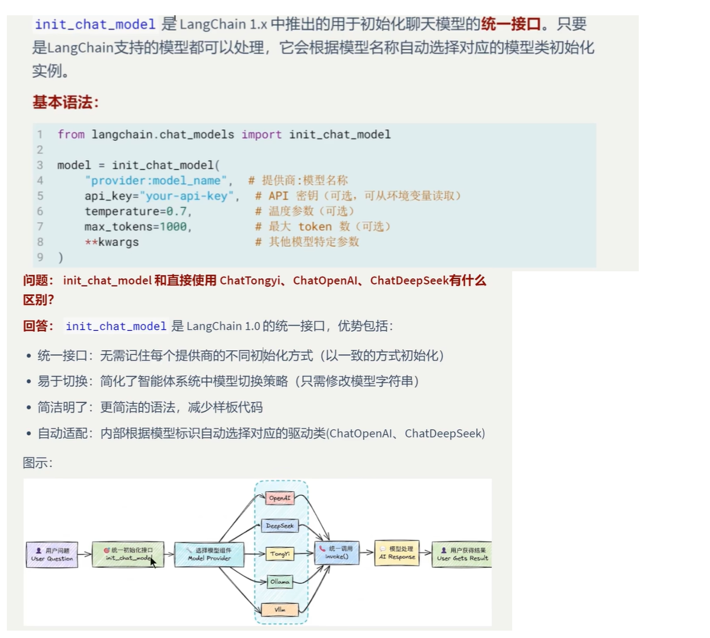
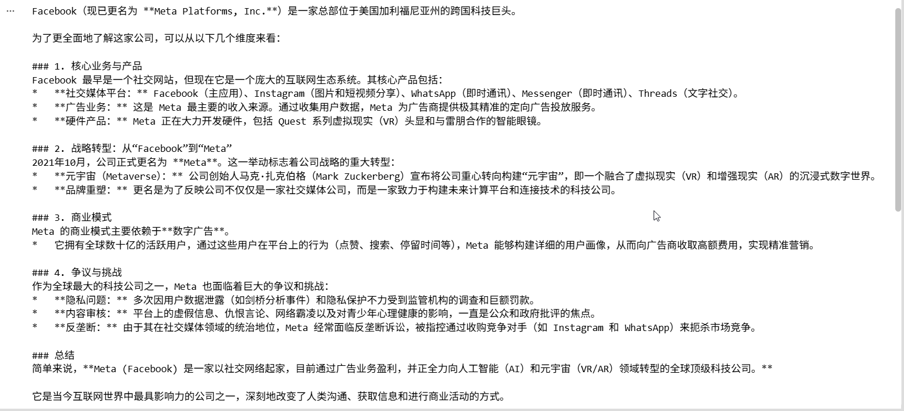
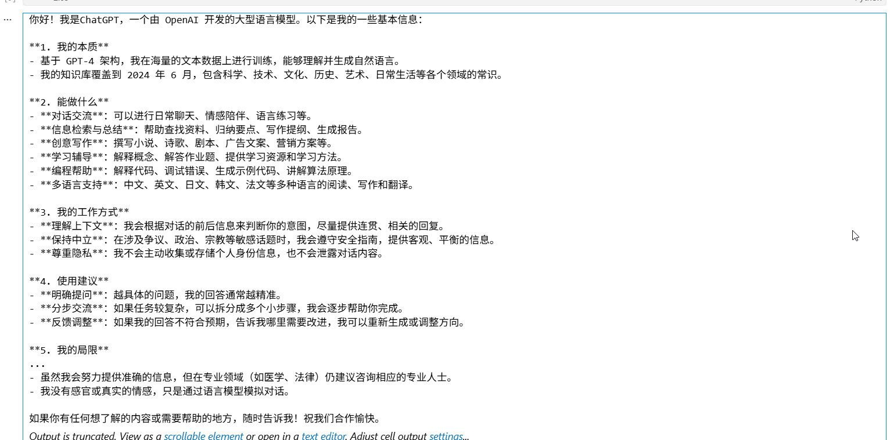
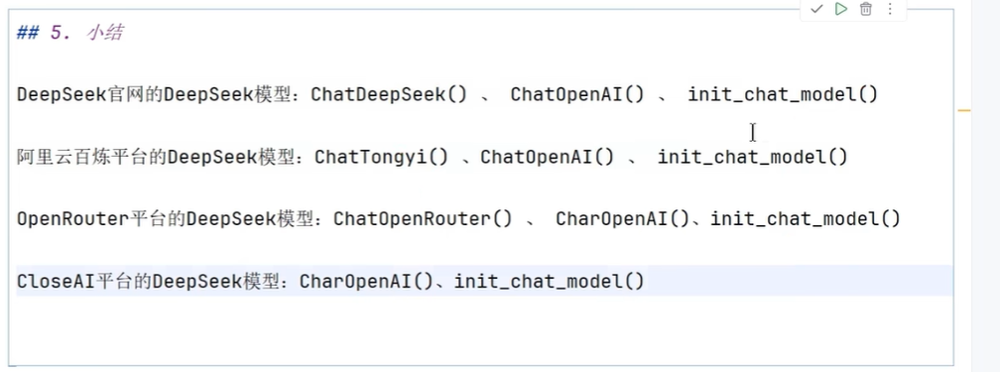
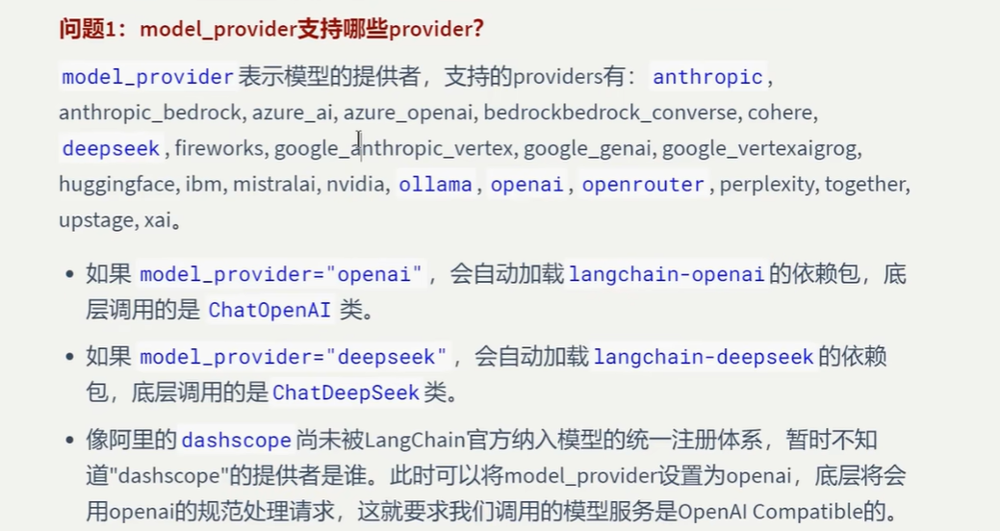
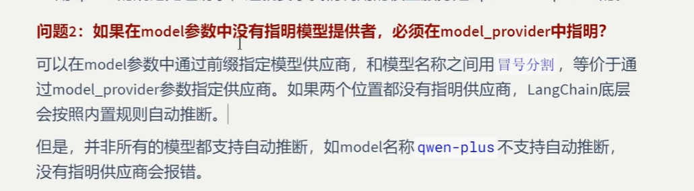

# 模型初始化角度1：init_chat_model()




## 使用init_chat_model调用Gemini模型，需要安装langchain-google-genai

### pip install langchain-google-genai

```
from langchain.chat_models import init_chat_model
from dotenv import load_dotenv
import os

from openai import api_key

load_dotenv(override=True)
gemini_api_key=os.getenv("gemini_api_key")

# model = init_chat_model("openai:gpt-4o", temperature=0)
model = init_chat_model("google_genai:gemini-3.1-flash-lite",api_key=gemini_api_key, temperature=0)

# Invoke the model with a simple message
response = model.invoke("Facebook是一家什么公司")
print(response.text)
```


### 模型输出



## 使用init_chat_model调用groq大模型,注意使用Groq模型需要把apikey添加到环境变量GROQ_API_KEY中

## **需要安装langchain-groq**

### pip install langchain-groq

```
from langchain.chat_models import init_chat_model

# 初始化 Groq 模型
model = init_chat_model("openai/gpt-oss-120b", model_provider="groq")

# 调用模型
response = model.invoke("你好，请介绍一下你自己。")
print(response.content)
```


### 模型输出



## 小结





