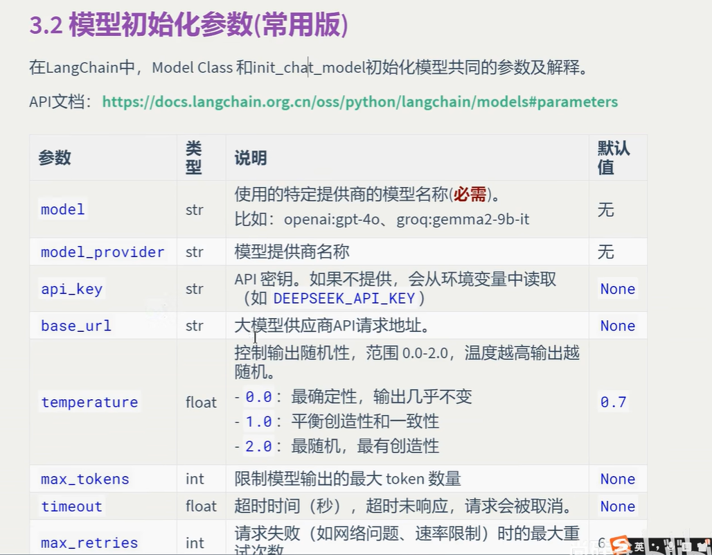
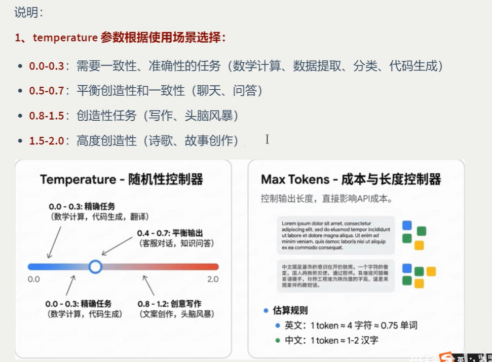
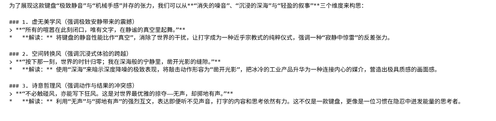
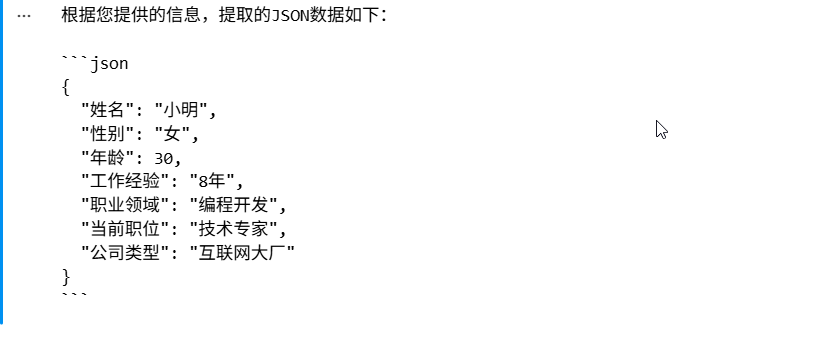
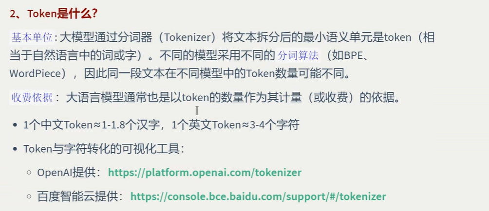
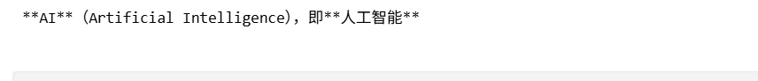

# 模型初始化常用参数



## 参数说明

### 1.temperature



### 案例

```
from langchain.chat_models import init_chat_model
from dotenv import load_dotenv
import os

from openai import api_key

load_dotenv(override=True)
gemini_api_key=os.getenv("gemini_api_key")

# model = init_chat_model("openai:gpt-4o", temperature=0)
model = init_chat_model("google_genai:gemini-3.1-flash-lite",api_key=gemini_api_key, temperature=1.9)

# Invoke the model with a simple message
response = model.invoke("请为一款极致静音的机械键盘写3个充满诗意且极具张力的广告语")
print(response.text)
```


### 模型输出



### 我们设置temperature=1.9，此时模型非常有创意

## 1.2 格式化输出

```
from langchain.chat_models import init_chat_model
from dotenv import load_dotenv
import os

from openai import api_key

load_dotenv(override=True)
gemini_api_key=os.getenv("gemini_api_key")

# model = init_chat_model("openai:gpt-4o", temperature=0)
model = init_chat_model("google_genai:gemini-3.1-flash-lite",api_key=gemini_api_key, temperature=1.5)

# Invoke the model with a simple message
response = model.invoke("小明,女,30岁,拥有8年编程开发经验,目前在谋互联网大厂担任技术专家.帮我从上文中提取数据,返回JSON格式"
)
print(response.text)
```


### 模型输出



### 2.max_tokens



### 案例，我们指定了最大的token数量是15，所以输出也会是15个汉字左右

```
from langchain.chat_models import init_chat_model
from dotenv import load_dotenv
import os

from openai import api_key

load_dotenv(override=True)
gemini_api_key=os.getenv("gemini_api_key")

# model = init_chat_model("openai:gpt-4o", temperature=0)
model = init_chat_model("google_genai:gemini-3.1-flash-lite",api_key=gemini_api_key, temperature=0,max_tokens=15)

# Invoke the model with a simple message
response = model.invoke("用中文简要介绍什么是AI")
print(response.text)
```


### 模型输出

