# 本地模型的部署于调用

## 1.Ollama介绍

### 官网：https://ollama.com, 是一个软件，需要安装

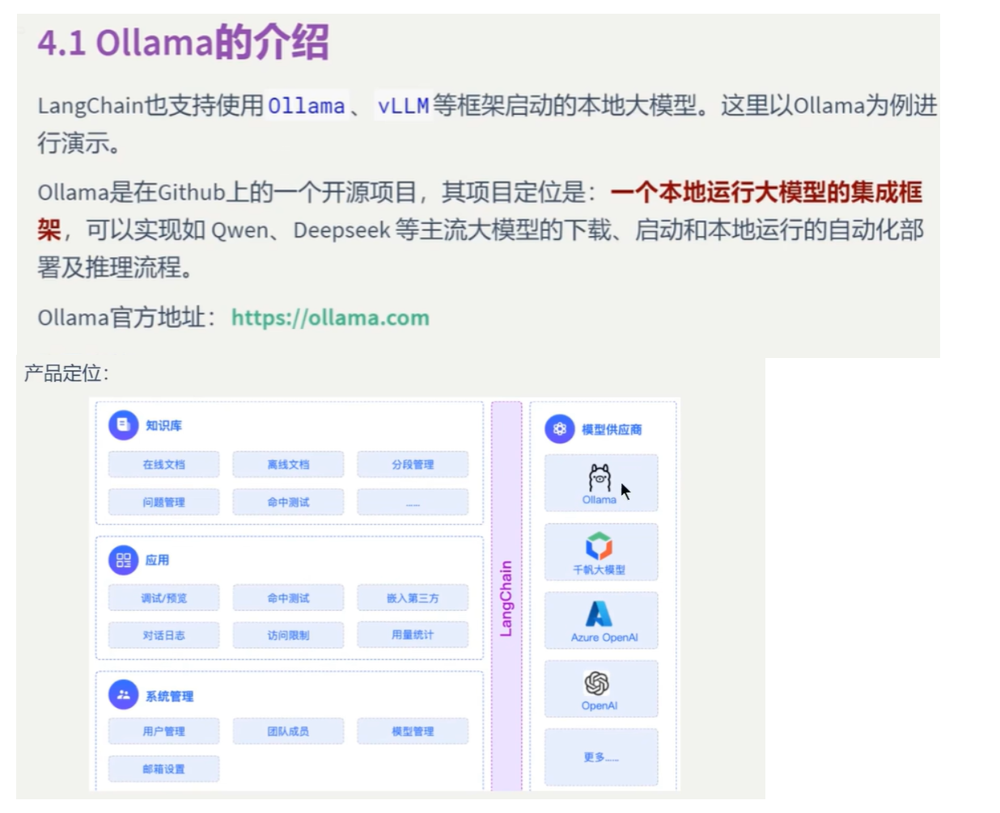


### 需要注意：在企业中一般使用vLLM不使用Ollama，不过原理的一样的，我们这里学习Ollama

## 2.Ollama安装

Windows 一键安装命令：

```
irm https://ollama.com/install.ps1 | iex
```

### 这个会安装在C盘，我们想安装的D盘，使用我们下载是setup文件，并且使用下面的目录

```
OllamaSetup.exe /DIR=D:\ollama
```


### 安装完成会自动打开

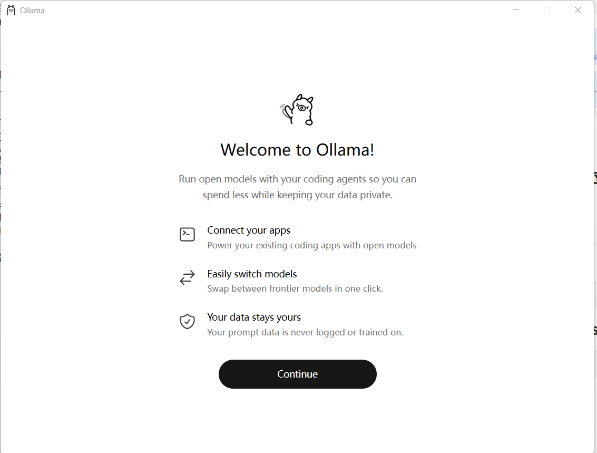

### 点击继续，就会弹出这样子的窗口

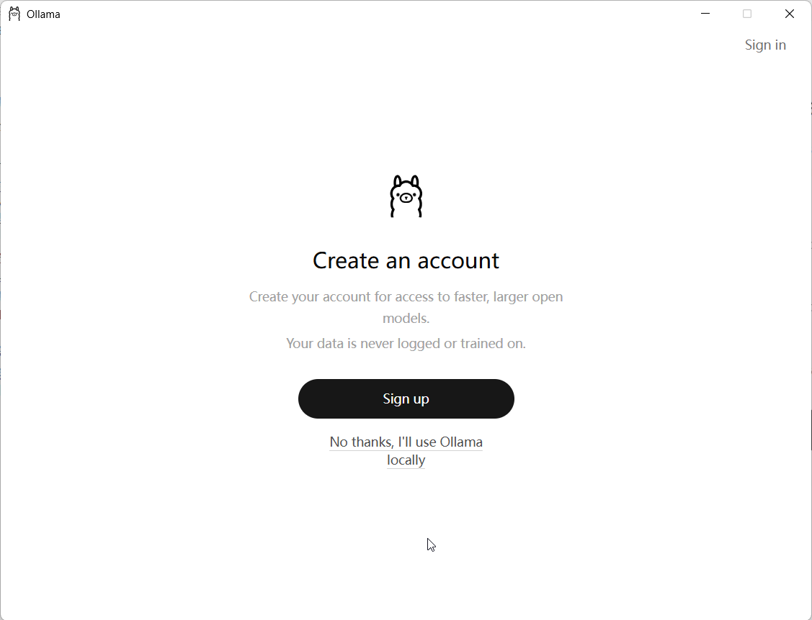

### 直接关闭，然后打开安装目录点击ollama app.exe,就可以打开图形界面应用程序

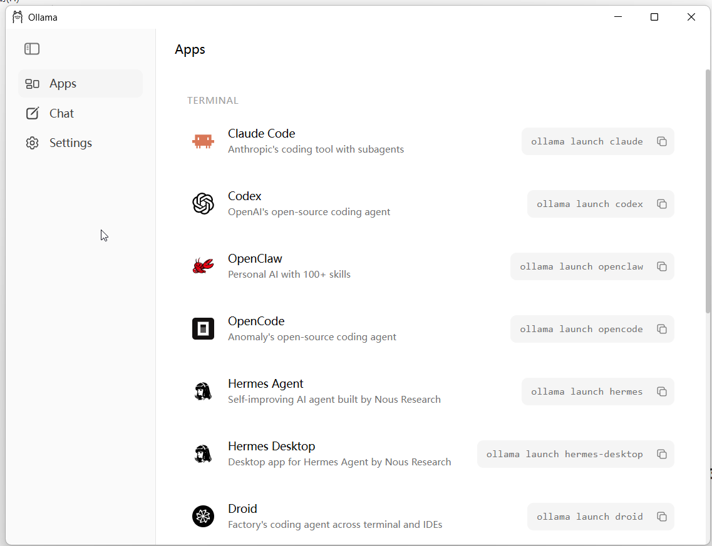

### 点击settings，因为我们想配置一下模型的保存位置，找到model location一项，把它改为c盘以外的路径，比如d:\ollama_models\

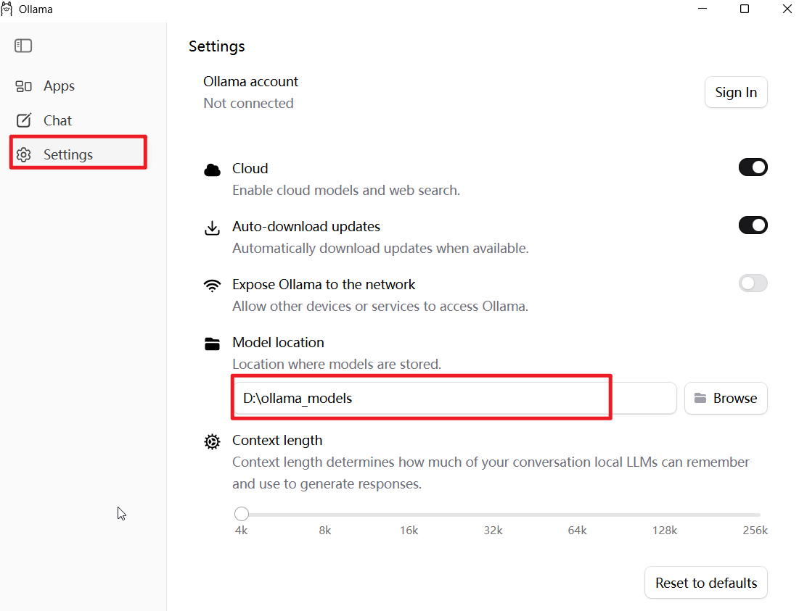

### 然后到ollama官网去找模型，比如我们找到deepseekr-1，软件滚动到下面的模型列表，注意个人电脑，不要下载大于9G的模型，几乎无法运行，这里我们下载一个5.2g的模型

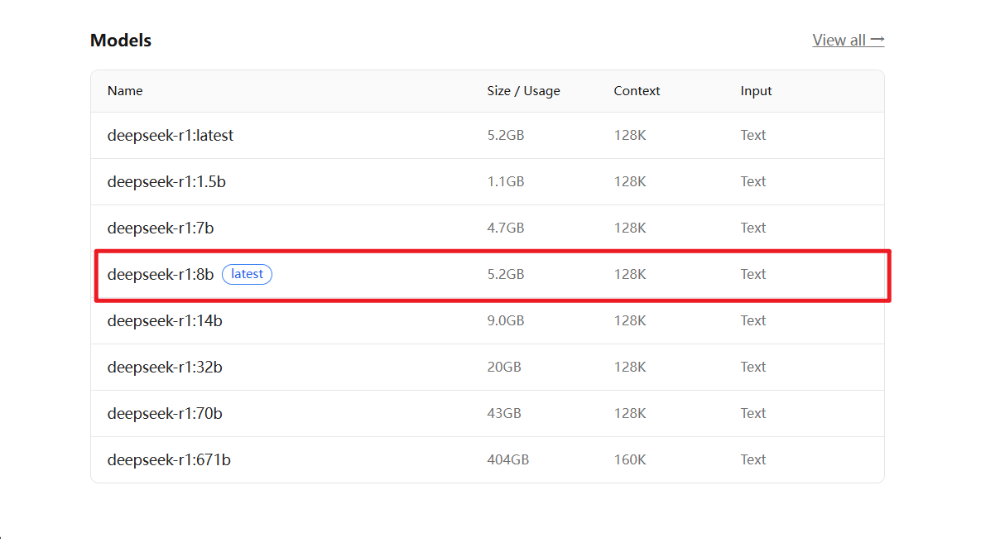

### 点击链接，然后复制run命令

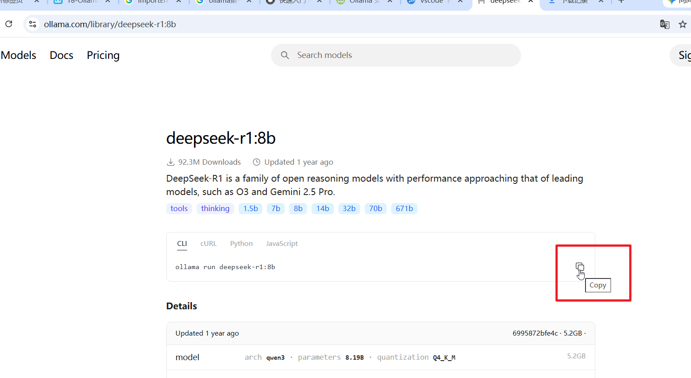

### 然后打开一个cmd窗口，输入刚刚的命令

```
ollama run deepseek-r1:8b
```

### 然后就开始下载了

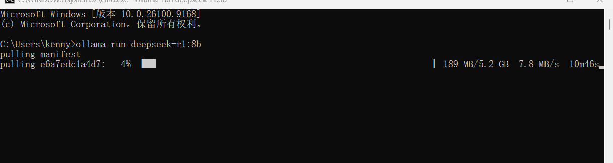

### 我们需要等待它下载完成... 好的，下载完成,ollama会要求你输入信息，也就是可以你模型对话

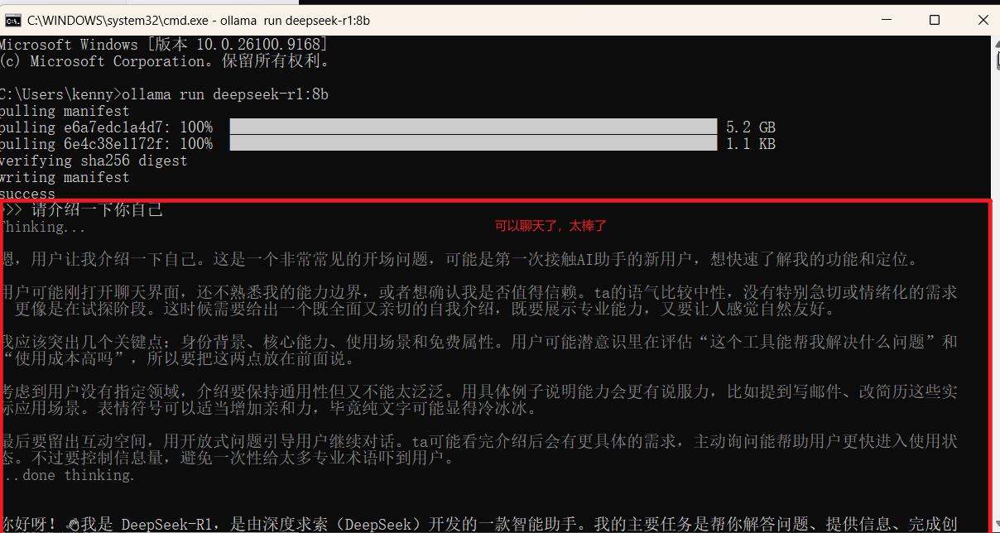

### 以后，使用同样的命令，就可以和模型对话，

```
ollama run deepseek-r1:8b
```

### 如果需要提供python来使用ollama，需要安装ollama库

```
pip install ollama
```

### 如果需要在langchain中使用，需要安装langchain-ollama

```
pip install langchain-ollama
```

### 还可以查看你电脑上面部署了什么模型

```
ollama list
```

### 当然，使用app界面也是可以使用的

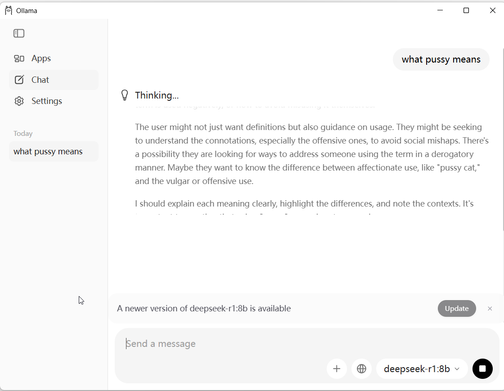

### ollama常用命令

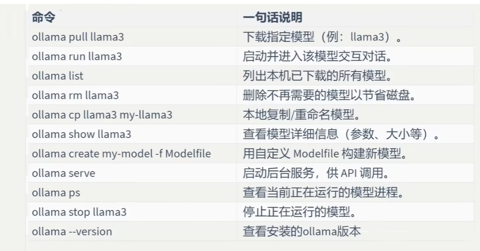

## 案例，使用python来和本地模型对话，需要安装上面的库

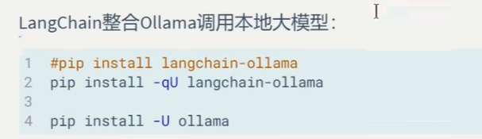

```
from ollama import chat

resp = chat(
    model='deepseek-r1:8b',
    messages=[{"role":"user","content":"百度是一家什么公司"}]
)

print(resp.message.content)
```


### 模型输出

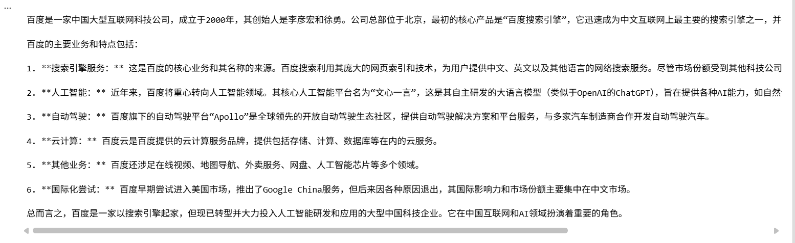

## 使用langchain-ollama来调用本地模型

```
from langchain_ollama import ChatOllama

llm = ChatOllama(
    model='deepseek-r1:8b'
)

question = "你好，请你介绍一下Autodesk Revit软件"

result = llm.invoke(question)
print(result.content)
```


### 模型输出

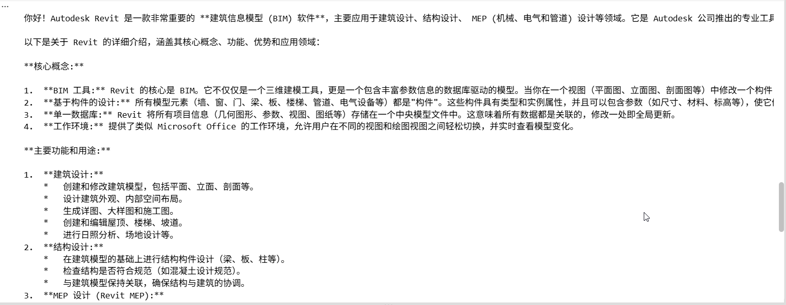

## langchain调用ollama模型的第二种方式，init_chat_model函数

```
from langchain.chat_models import init_chat_model


model = init_chat_model(
    model='deepseek-r1:8b',
    model_provider="ollama"
)

question = "简要讲解一下女人性高潮的表现"

result = model.invoke(question)
print(result.content)
```


### 模型输出

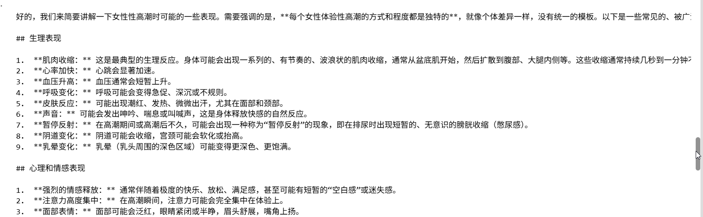