# 模型的调用

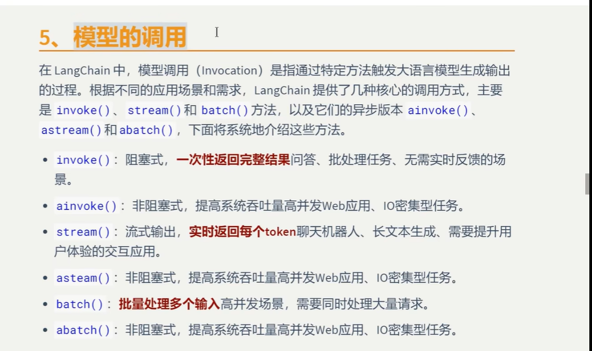

## 1.invoke

### 1.1 invoke说明

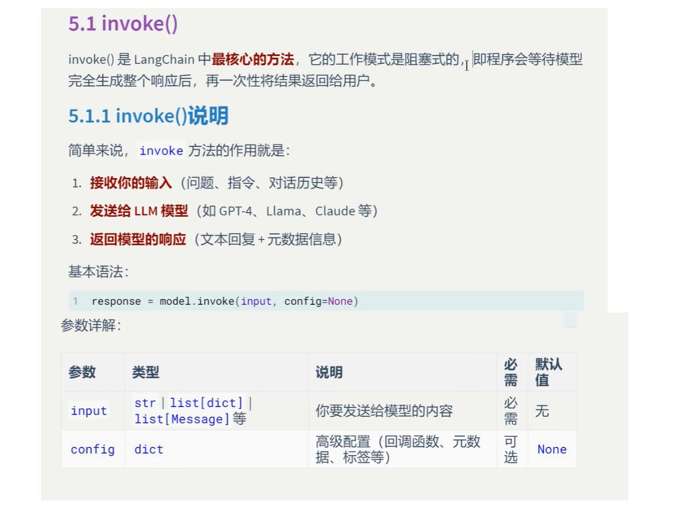

### 1.2.invoke参数说明

### 1.2.1.文本输入

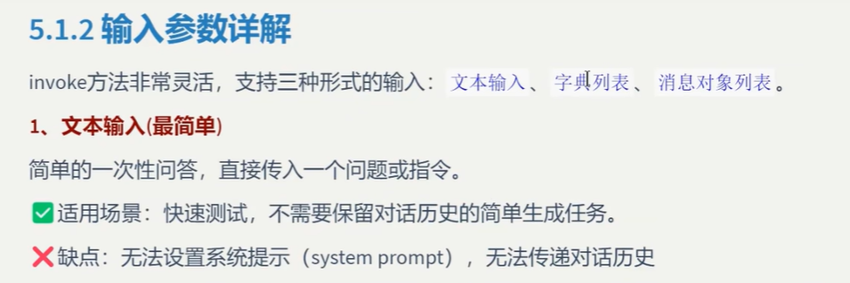

### 这种方式是我们前面一直在使用的。代码如下

```
from langchain_ollama import ChatOllama

llm = ChatOllama(
    model='deepseek-r1:8b'
)

question = "分析一下中国的经济现状"

result = llm.invoke(question)
print(result.content)
```


### 模型输出

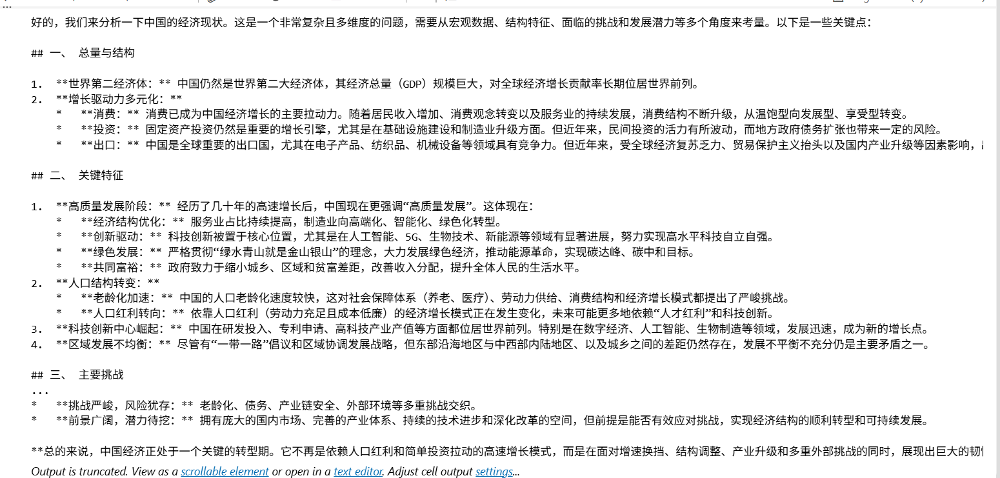

### 1.2.2.字典列表，这是最灵活的方式，推荐使用

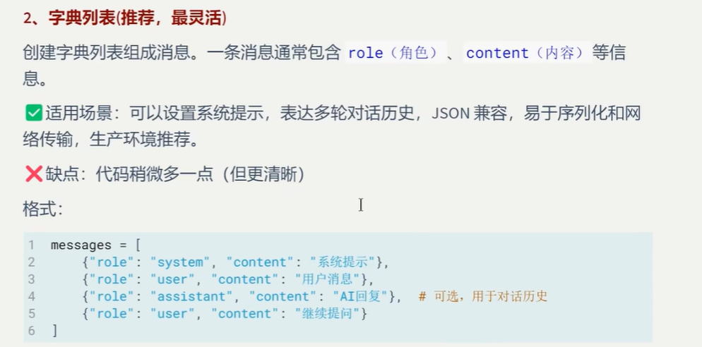

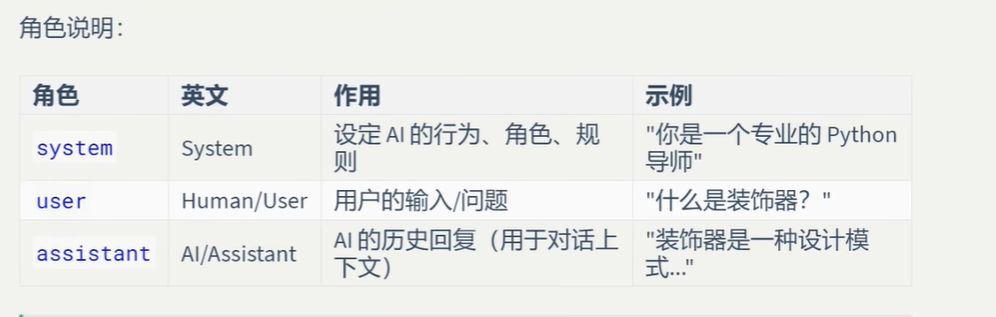

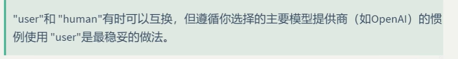

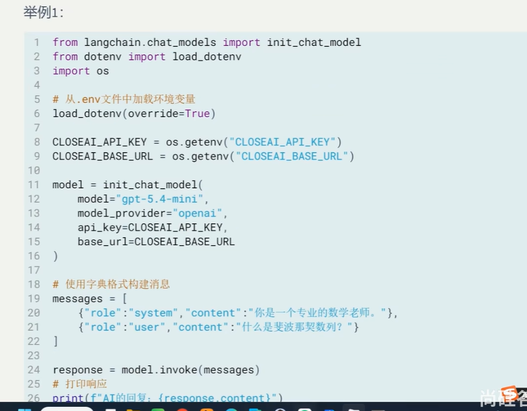

### 使用字典列表来调用本地ollama大模型

```
from langchain_ollama import ChatOllama

llm = ChatOllama(
    model='deepseek-r1:8b'
)

messages=[
        {"role":"system","content":"你是一位专业的数学老师"},
        {"role":"user","content":"什么是斐波拉契数列"},
      
]

result = llm.invoke(messages)
print(result.content)
```


### 模型输出

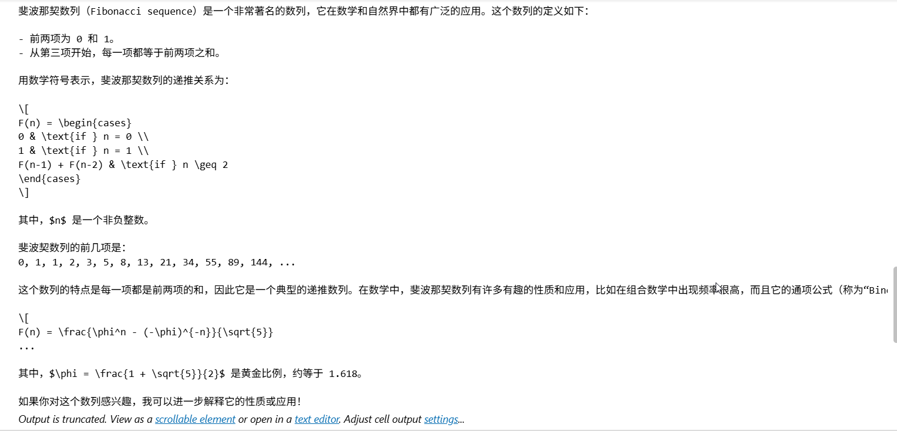

### 多轮对话方式

```
from langchain_ollama import ChatOllama

llm = ChatOllama(
    model='deepseek-r1:8b'
)

messages=[
        {"role":"system","content":"你是一位专业的数学老师"},
        {"role":"user","content":"0是偶数吗"},
        {"role":"assistant","content":"是"},
        {"role":"user","content":"我刚才问了什么问题"},
]

result = llm.invoke(messages)
print(result.content)
```


### 模型输出

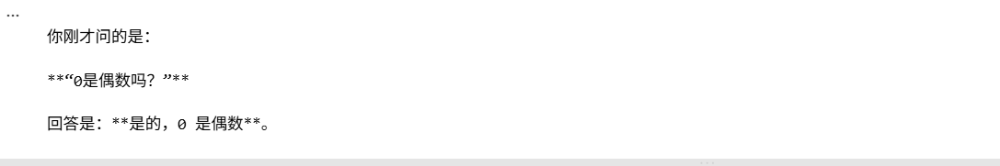

### 模型的失忆问题

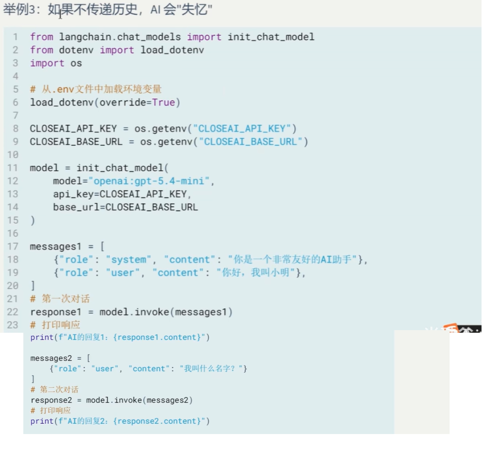

### 实例代码

```
from langchain_ollama import ChatOllama

llm = ChatOllama(
    model='deepseek-r1:8b'
)

messages1=[
        {"role":"system","content":"你是一位非常友好的AI助手"},
        {"role":"user","content":"你好，我叫Kenny"},
]

result = llm.invoke(messages1)
print(result.content)
messages2=[
        {"role":"user","content":"我叫什么名字？"},
]
result = llm.invoke(messages2)
print(result.content)
```


### 模型输出

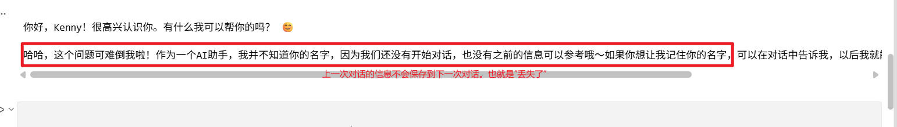

### 解决大模型没有记忆的方法

```
from langchain_ollama import ChatOllama

llm = ChatOllama(
    model='deepseek-r1:8b'
)

msg=[
        {"role":"system","content":"你是一位非常友好的AI助手"},
        {"role":"user","content":"你好，我叫Kenny"},
]

result1 = llm.invoke(msg)
print(result1.content)
# 添加记忆
msg.append({"role":"assistant","content":result1.content}) #把上一次大模型输出的内容添加到字典列表中
msg.append({"role":"user","content":"我叫什么名字？"})# 把第二轮的用户提问添加到字典列表中
result2 = llm.invoke(msg)
print(result2.content)
```


### 模型输出

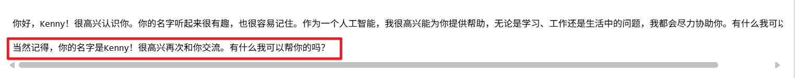

### 1.2.3.信息对象列表的输入，从langchain-core.messages导入SystemMessage，AIMessage和HumanMessage

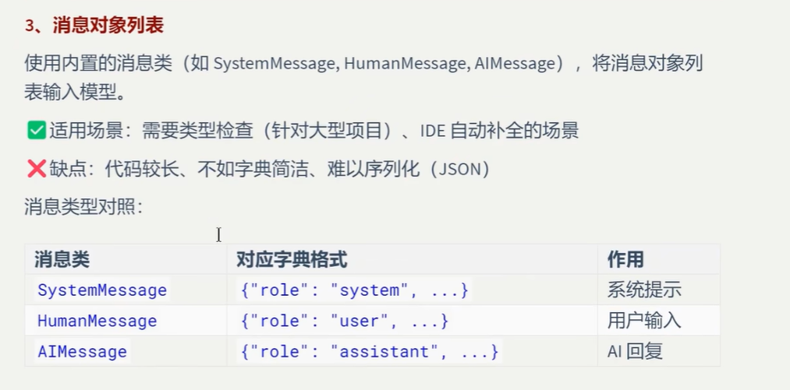

### 使用消息对象作为模型输入的案例

```
from langchain_core.messages import SystemMessage,HumanMessage,AIMessage
from langchain_ollama import ChatOllama

llm = ChatOllama(
    model='deepseek-r1:8b'
)

messages=[
        SystemMessage("你是一位专业的数学老师"),
        HumanMessage("什么是齐次矩阵")      
]

result = llm.invoke(messages)
print(result.content)
```


### 模型输出

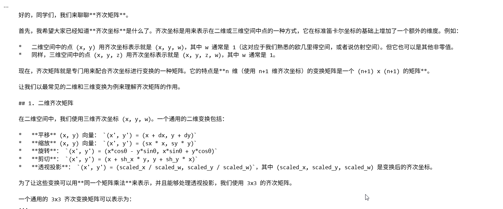


### 用消息对象的方式给模型添加记忆功能

```
from langchain_core.messages import SystemMessage,HumanMessage,AIMessage
from langchain_ollama import ChatOllama

llm = ChatOllama(
    model='deepseek-r1:8b'
)

msg=[
       SystemMessage("你是一位非常友好的AI助手"),
       HumanMessage("你好，我叫Guo")  
]

result1 = llm.invoke(msg)
print(result1.content)
# 添加记忆
msg.append(AIMessage(content=result1.content))
msg.append(HumanMessage("我叫什么名字？"))
result2 = llm.invoke(msg)
print(result2.content)
```


### 模型输出：

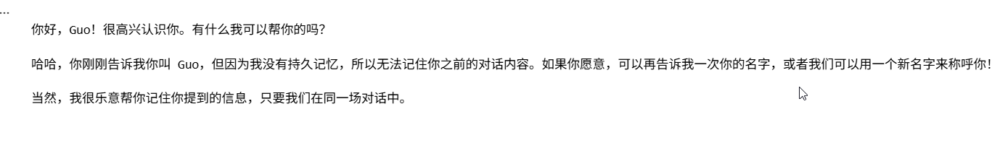

