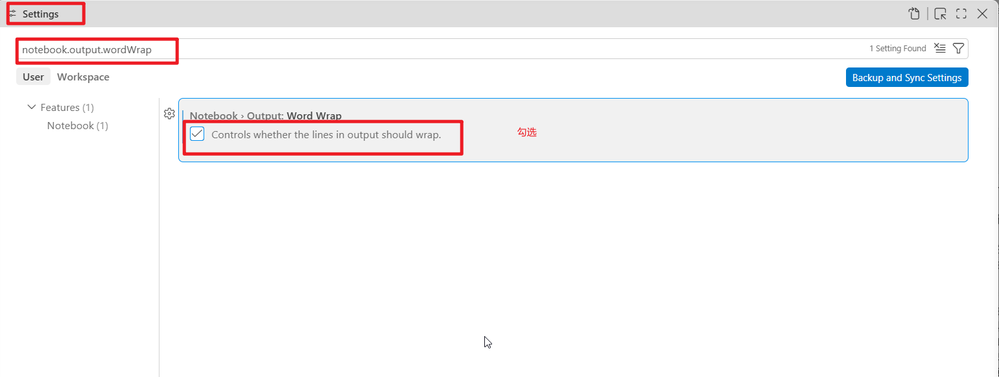

开启 VS Code 的 Notebook 输出自动换行功能即可解决输出内容挤在一行、需要左右滚动的问题。 [[1](https://tech.kateva.org/2024/03/visual-studio-code-jupyter-python.html)]

修改设置步骤

1. 打开设置：使用快捷键 `Ctrl + ,`（Windows/Linux）或 `Cmd + ,`（macOS）。

2. 搜索选项：在顶部的搜索框中输入 `notebook.output.wordWrap`。

3. 勾选开启：找到 **Notebook > Output: Word Wrap**，将其勾选（设置为 `true`），如图：

   

通过 `settings.json` 修改

你也可以直接按 `Ctrl + Shift + P` 或 `Cmd + Shift + P` 打开命令面板，输入 **Preferences: Open Settings (JSON)**，在文件中添加以下代码： [[1](https://stackoverflow.com/questions/76544303/how-can-i-see-all-the-output-without-a-horizontal-scrollbar-appearing-in-jupyter), [2](https://www.linkedin.com/pulse/some-useful-vs-code-tricks-python-kifayat-ullah-t7lef)]

json

```
"notebook.output.wordWrap": true
```

请谨慎使用此类代码。

如果长文本输出显示不全或者行数被截断，你还可以调整 **Notebook > Output: Text Line Limit** 设置

