# 1.langsmith初探

## 1.langsmith概述

### 1.1.什么是langsmith

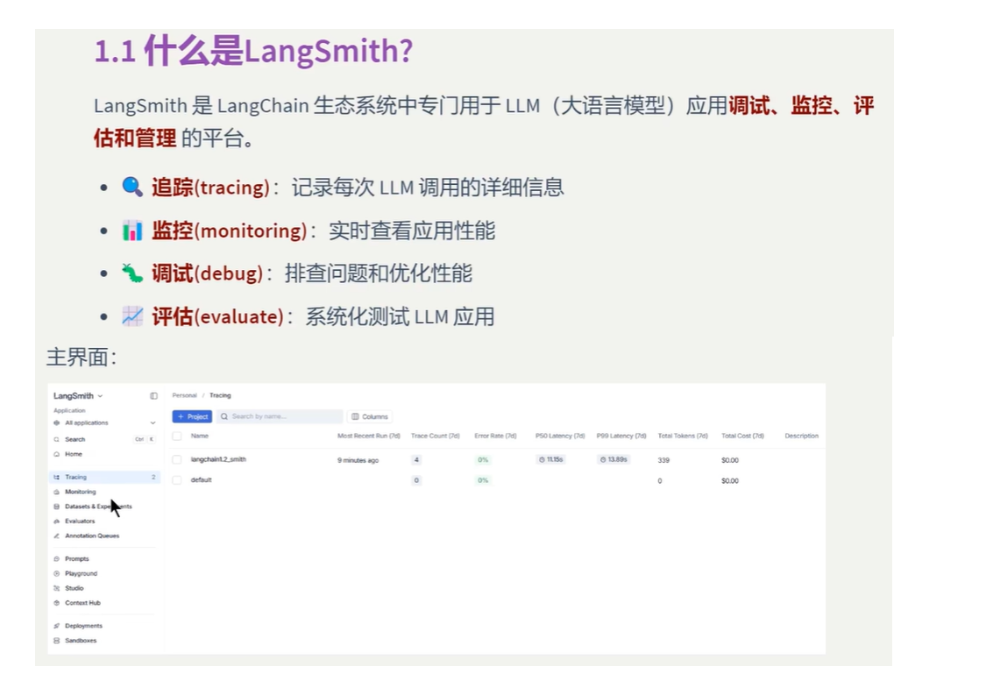

## 1.2具体功能

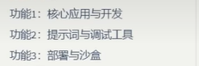

## 2.账号准备

### 2.1.注册或者登录: https://smith.langchain.com，进入后选择用Google账号登录，然后选择需要构建agent，然后选择langchain框架，然后就会进入控制台，然后我们点击settings，就会出现这个界面

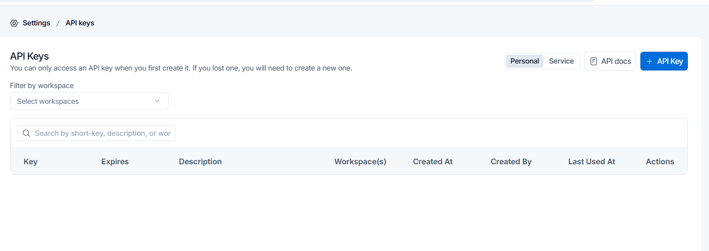

## 点击+API Key,就可以创建一个api key，创建后记得点击copy复制下来保存到我们的.env文件中。此外我们还需要添加3个变量，LANGSMITH_PROJECT就是我们vscode的工作区文件夹，这里改名为langchain1.2-learning

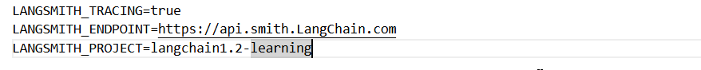

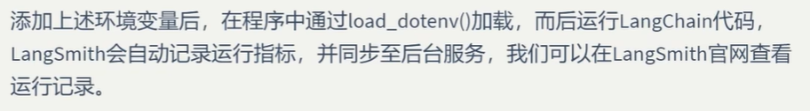

## 演练1，写云端代码调用一下Gemini模型使用ChatOpenAI类，然后运行

```
from langchain_openai import ChatOpenAI
from dotenv import load_dotenv
import os

load_dotenv(override=True)
gemini_api_key = os.getenv("gemini_api_key")

llm = ChatOpenAI(
    model="gemini-3.1-flash-lite",
    api_key=gemini_api_key,
    base_url="https://generativelanguage.googleapis.com/v1beta/openai/"
)

resp = llm.invoke("花心的英文")
print(resp.text)
```


## 模型有输出，说明上面的调用成功

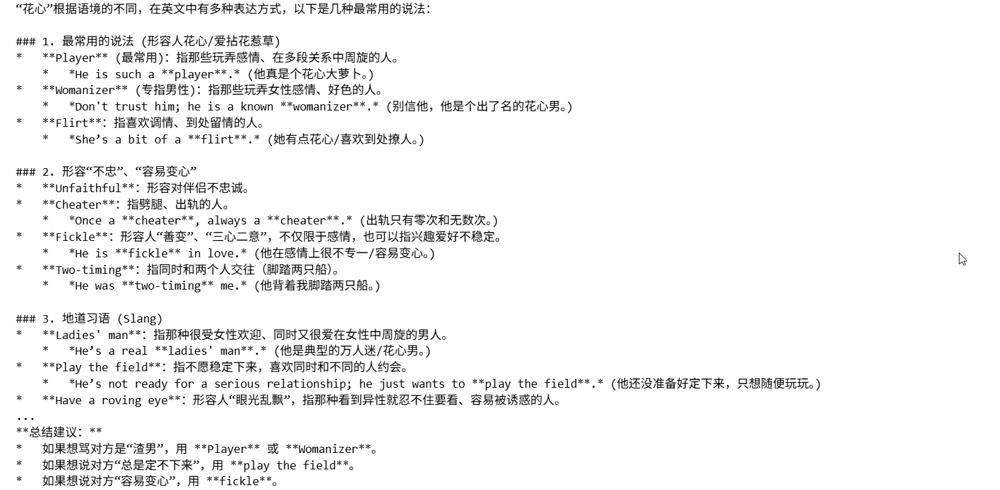

## 我们回到langsmith平台，点击home，就可以看到我们的项目

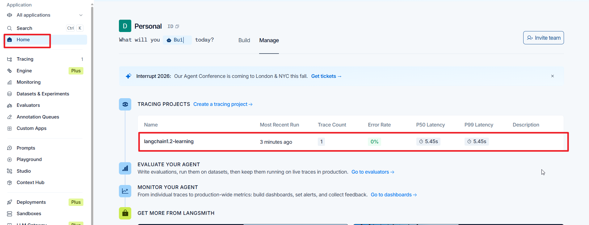

## 点击一下这个项目，就会进入tracing界面

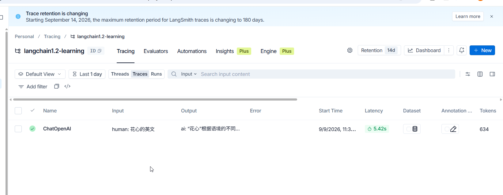

## 再点击一下Name对应的类，就可以看到详细的对话内容

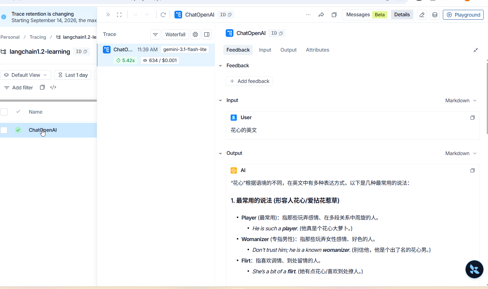

## 演练2，写云端代码调用一下Gemini模型使用init_chat_model,运行代码

```
from langchain.chat_models import init_chat_model
from dotenv import load_dotenv
import os


load_dotenv(override=True)
gemini_api_key=os.getenv("gemini_api_key")

# model = init_chat_model("openai:gpt-4o", temperature=0)
model = init_chat_model("google_genai:gemini-3.1-flash-lite",api_key=gemini_api_key, temperature=0)

# Invoke the model with a simple message
response = model.invoke("列举一些常用的社交软件")
print(response.text)
```


## 模型输出如下

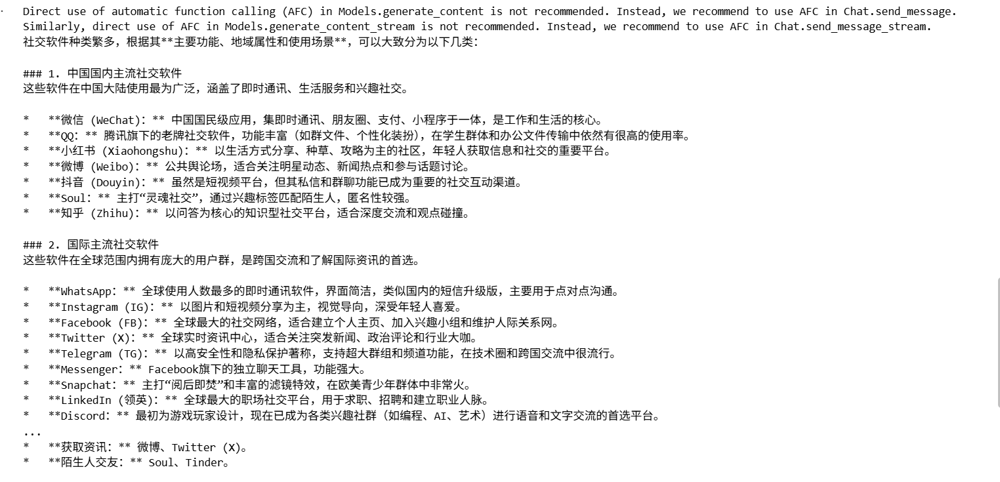

## 我们刷新一些langsmith的页面，又出现我们的测试项目

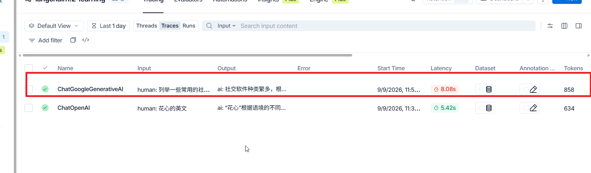

## 演练3，使用带有指定工具的调用测试

```
import os
from langchain.chat_models import init_chat_model
from langchain_core.messages import HumanMessage


llm = init_chat_model(
    model="openai/gpt-oss-120b",  # 指定具体的 Groq 模型名称
    # model="groq/compound-mini",  # 指定具体的 Groq 模型名称，这个模型不支持工具调用
    # model="groq/compound",  # 指定具体的 Groq 模型名称，这个模型不支持工具调用
    model_kwargs={
                "tools":[
                    {
                        "type":"function",
                        "function":{
                            "name":"get_weather",
                            "description":"Get weather of a location,the user should supply the location first.",
                            "parameters":{
                                "type":"object",
                                "properties":{
                                    "location":{
                                        "type":"string",
                                        "description":"The City and state,e.g. San Francisco,CA",
                                    }
                                },
                                "required":["location"]
                            }
                        },
                    }
                ]
            },
    model_provider="groq",    # 明确指定提供商为 groq
    temperature=0.7
)

# 调用模型
messages = [
    HumanMessage(content="今天北京会下雨吗"),
    # HumanMessage(content="什么水果对肾好？"),
]

response = llm.invoke(messages)

# 打印输出结果
response.pretty_print()
```


## 确认模型有正常输出后，我们刷新运行langsmith页面，发现它的确调用了我们的工具，但是没有成功获取到天气信息

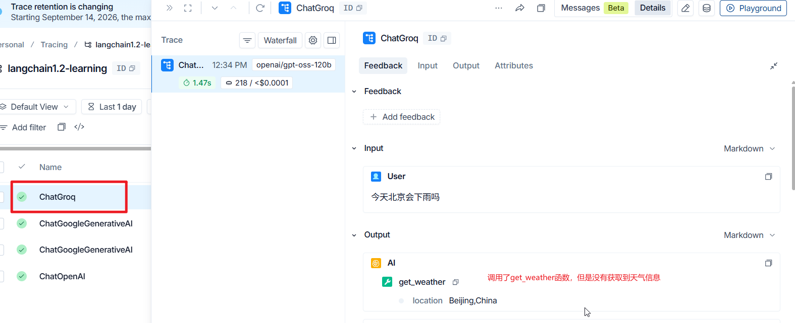

## 我们使用带有config信息的本地部署大模型来测试一下

```
from langchain_ollama import ChatOllama

llm = ChatOllama(
    model='deepseek-r1:8b',
    extra_body={
        "thinking":{"type":"enabled"}
    }
)

question = "接吻法语怎么说"

result = llm.invoke(
    question,
    config={
        "run_name":"my test",
        "tags":["test","development"],
        "metadata":{"user_id":'124'},
        # 暂时不使用callback参数，等到用到的时候才添加
        "configurable":{
            "model":"deepseek-reasoner",
            "temprature":0.7,
             "max_tokens":200
        }
    }

)
print(result.content)
```


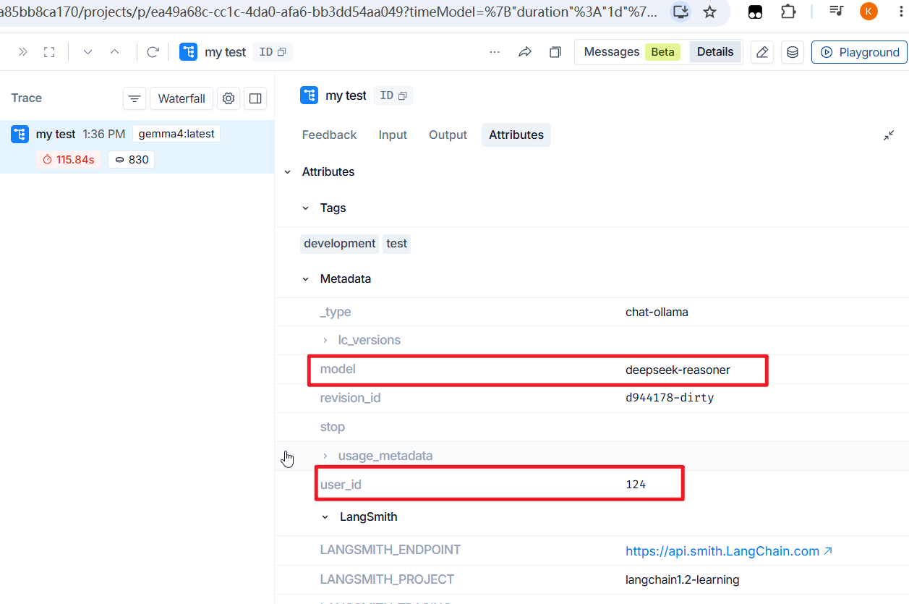

### 运行成功后，我们发现配置生效了。注意：只是修改名称，并没有真正换模型。

# 2.langsmith的主要功能

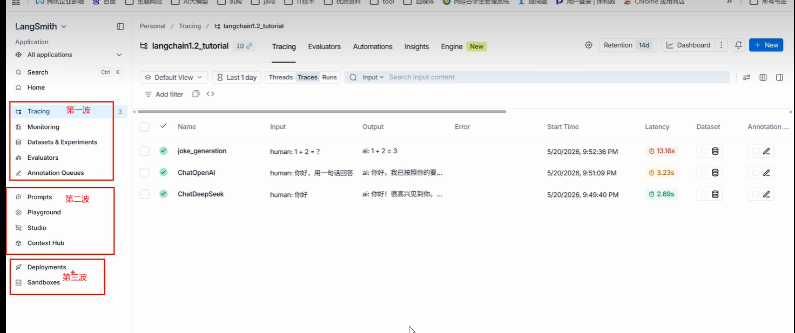

