# 1.认识消息

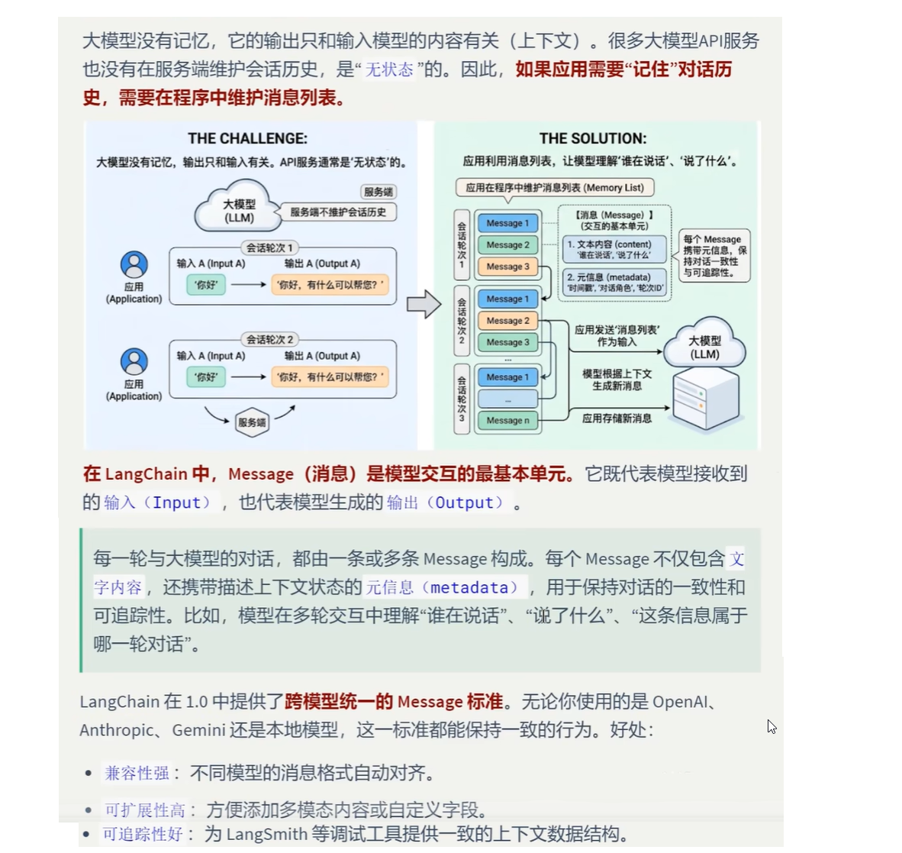

## 1.1消息的内部结构

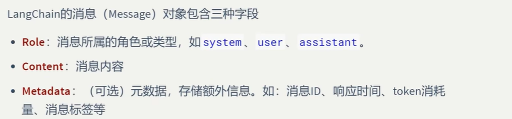

## 1.2消息的类型

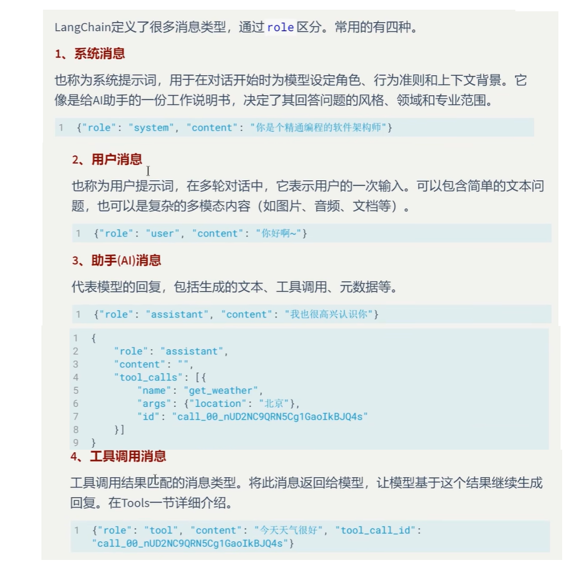

### 为什么使用不同的消息类型？

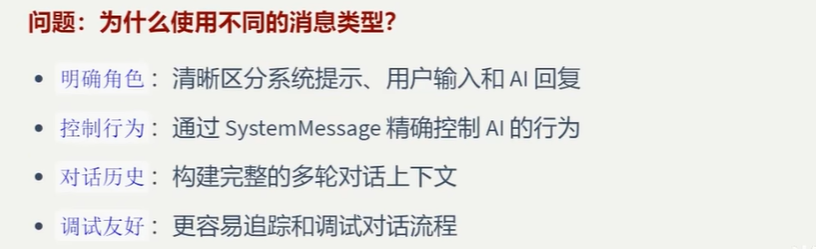

## 1.3消息格式

### 1》JSON格式

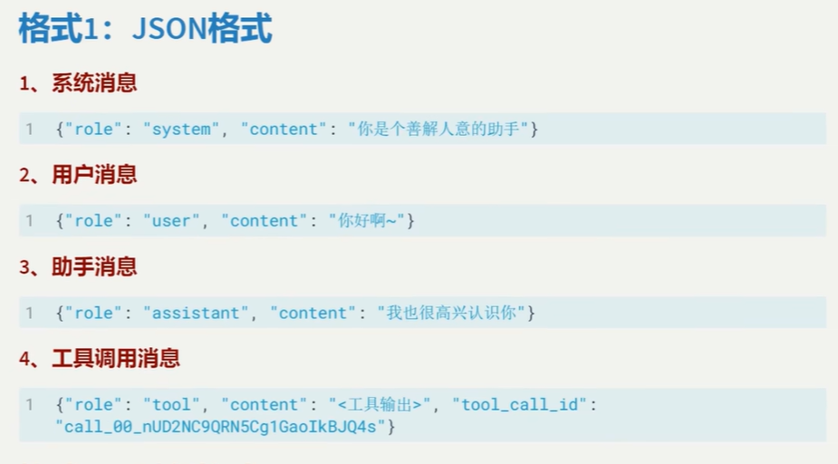

### 2》类的对象格式

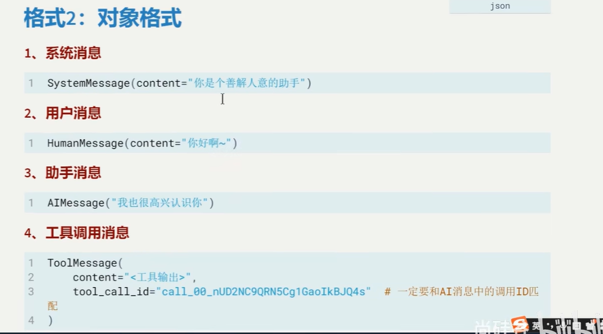

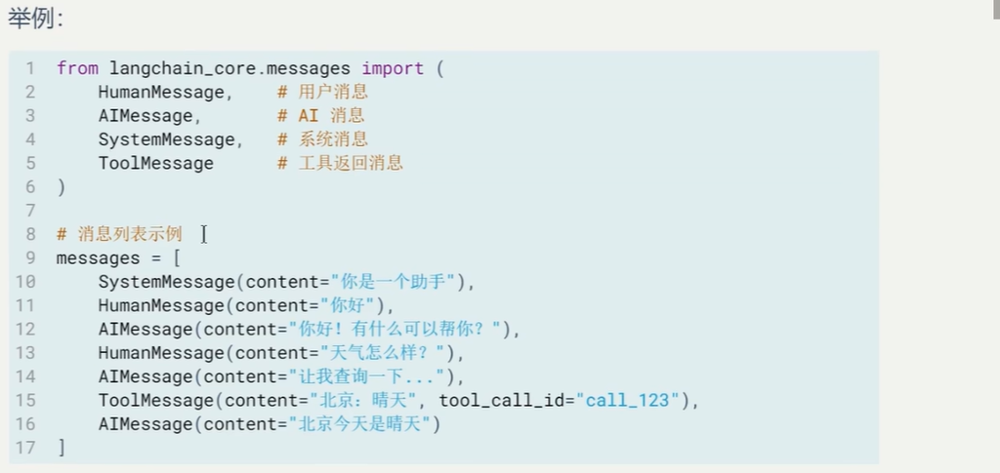

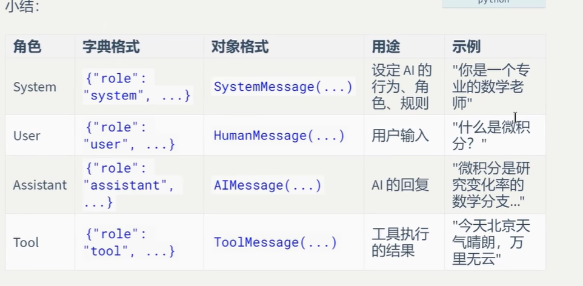

## 1.4案例

### JSON格式的消息列表


```python
from langchain_openai import ChatOpenAI
from dotenv import load_dotenv
import os

load_dotenv(override=True)
gemini_api_key = os.getenv("gemini_api_key")

llm = ChatOpenAI(
    model="gemini-3.1-flash-lite",
    api_key=gemini_api_key,
    base_url="https://generativelanguage.googleapis.com/v1beta/openai/"
)

resp = llm.invoke([{"role":"user","content":"香港有多少人口"}])
print(resp.text)
```

### 模型输出

    根据香港政府统计处最新的数据，截至 **2023年年中**，香港的临时人口数字约为 **749.81万人**。
    
    以下是一些关键信息供参考：
    
    1.  **趋势：** 经过连续几年的下跌后，香港人口在2023年出现回升。这主要得益于疫情后人口流动恢复正常，许多香港居民返回香港，以及部分人才引进计划（如“高才通”等）带来的非本地居民流入。
    2.  **构成：** 该总数包括常住居民和流动居民。
    3.  **预测：** 根据政府的推算，由于人口老龄化和低生育率，香港未来的人口结构将持续面临挑战，劳动力人口预计会进一步缩减。
    
    **建议：** 如果你需要最实时的精确数据，可以访问[香港政府统计处官方网站](https://www.censtatd.gov.hk/)查询最新的《香港人口数字》报告。

### 消息对象列表


```python
from langchain.messages import HumanMessage,AIMessage
from langchain_openai import ChatOpenAI
from dotenv import load_dotenv
import os

load_dotenv(override=True)
gemini_api_key = os.getenv("gemini_api_key")

llm = ChatOpenAI(
    model="gemini-3.1-flash-lite",
    api_key=gemini_api_key,
    base_url="https://generativelanguage.googleapis.com/v1beta/openai/"
)

resp = llm.invoke([HumanMessage("我爱你的法语怎么说")])
resp.pretty_print()
```

### 模型输出

    ==================================[1m Ai Message [0m==================================
    
    法语中表达“我爱你”最标准、最常用的说法是：
    
    **Je t'aime.**
    
    *   **发音提示：**
        *   **Je** (发音类似“惹”，但舌头不用卷，发音短促)
        *   **t'aime** (t'的发音类似“得”，aime的发音类似“爱姆”)
        *   连起来读：**惹-带姆** (Je t'aime)
    
    ---
    
    **其他相关的表达方式：**
    
    1.  **Je t'aime beaucoup.**
        *   字面意思是“我很爱你”，但在法语中，这通常表示“我很喜欢你”（多用于朋友或家人之间，或者作为委婉的表白，比单纯的 Je t'aime 程度要轻）。
    2.  **Je t'adore.**
        *   意为“我崇拜你/我非常喜欢你”。
    3.  **Je suis amoureux / amoureuse de toi.**
        *   意为“我爱上了你”。（如果你是男性说这句话，用 amoureux；如果你是女性，用 amoureuse）。
    
    **最浪漫的用法：** 如果你想表达“我深深地爱着你”，可以说 **"Je t'aime passionnément."**

## 1.5消息对象字段说明

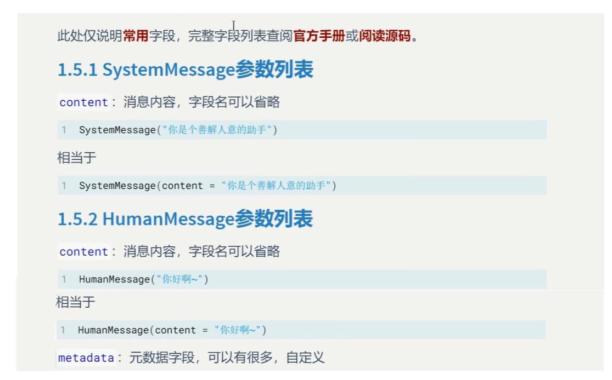

### 举例，带有元数据字段的消息

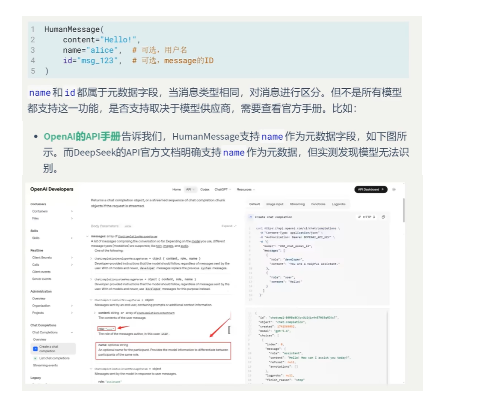

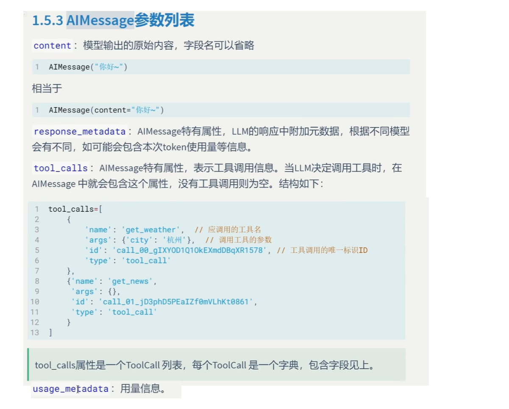

### 演练，看看gpt-oss-120b大模型是否支持name元数据，答案是不支持

```
from langchain.chat_models import init_chat_model
from langchain_core.messages import HumanMessage,SystemMessage


llm = init_chat_model(
    model="openai/gpt-oss-120b",  # 指定具体的 Groq 模型名称
    model_provider="groq",    # 明确指定提供商为 groq
    temperature=0.7
)

# 调用模型
messages = [
  SystemMessage("""你是一个消息抽取器。你会收到来自不同发言者的user消息。每条消息可能带有name字段。
   你的任务是：严格根据每条消息的name提取发言者及其观点，并输出JSON。禁止使用”第一人称/第二人称“这种称呼。
   若某条消息没有name，则输出unknown。输出格式：{\"speakers\":[{\"name\":\"...\",\"claim\":\"}]}"""),
  HumanMessage(
       content="我认为日本的首都是大阪",
       name="Bob"
  ),
  HumanMessage(
      content="我认为日本的首都是东京",
      name="Mary"
  ),
  HumanMessage(
      content="请列出谁说了什么，不要判断对错",
      name="audience"
  )
]

response = llm.invoke(messages)

# 打印输出结果
response.pretty_print()
```


### 模型输出

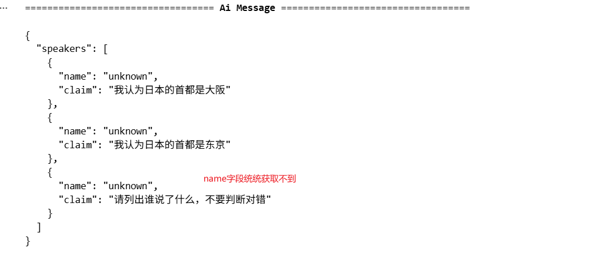

### 演练2.来看看Gemini

```
from langchain_openai import ChatOpenAI
from dotenv import load_dotenv
from langchain_core.messages import HumanMessage,SystemMessage
import os

load_dotenv(override=True)
gemini_api_key = os.getenv("gemini_api_key")

llm = ChatOpenAI(
    model="gemini-3.1-flash-lite",
    api_key=gemini_api_key,
    base_url="https://generativelanguage.googleapis.com/v1beta/openai/"
)

messages = [
  SystemMessage("""你是一个消息抽取器。你会收到来自不同发言者的user消息。每条消息可能带有name字段。
   你的任务是：严格根据每条消息的name提取发言者及其观点，并输出JSON。禁止使用”第一人称/第二人称“这种称呼。
   若某条消息没有name，则输出unknown。输出格式：{\"speakers\":[{\"name\":\"...\",\"claim\":\"}]}"""),
  HumanMessage(
       content="我认为日本的首都是大阪",
       name="Bob"
  ),
  HumanMessage(
      content="我认为日本的首都是东京",
      name="Mary"
  ),
  HumanMessage(
      content="请列出谁说了什么，不要判断对错",
      name="audience"
  )
]

resp = llm.invoke(messages)
resp.pretty_print()
```


### 模型输出：

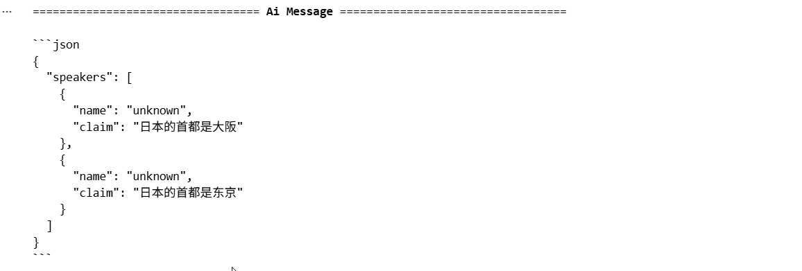