# 1.认识消息


## 1.1消息的内部结构


## 1.2消息的类型


### 为什么使用不同的消息类型？


## 1.3消息格式

### 1》JSON格式


### 2》类的对象格式


## 1.4案例

### JSON格式的消息列表


```python
from langchain_openai import ChatOpenAI
from dotenv import load_dotenv
import os

load_dotenv(override=True)
gemini_api_key = os.getenv("gemini_api_key")

llm = ChatOpenAI(
    model="gemini-3.1-flash-lite",
    api_key=gemini_api_key,
    base_url="https://generativelanguage.googleapis.com/v1beta/openai/"
)

resp = llm.invoke([{"role":"user","content":"香港有多少人口"}])
print(resp.text)
```

### 模型输出

    根据香港政府统计处最新的数据，截至 **2023年年中**，香港的临时人口数字约为 **749.81万人**。
    
    以下是一些关键信息供参考：
    
    1.  **趋势：** 经过连续几年的下跌后，香港人口在2023年出现回升。这主要得益于疫情后人口流动恢复正常，许多香港居民返回香港，以及部分人才引进计划（如“高才通”等）带来的非本地居民流入。
    2.  **构成：** 该总数包括常住居民和流动居民。
    3.  **预测：** 根据政府的推算，由于人口老龄化和低生育率，香港未来的人口结构将持续面临挑战，劳动力人口预计会进一步缩减。
    
    **建议：** 如果你需要最实时的精确数据，可以访问[香港政府统计处官方网站](https://www.censtatd.gov.hk/)查询最新的《香港人口数字》报告。

### 消息对象列表


```python
from langchain.messages import HumanMessage,AIMessage
from langchain_openai import ChatOpenAI
from dotenv import load_dotenv
import os

load_dotenv(override=True)
gemini_api_key = os.getenv("gemini_api_key")

llm = ChatOpenAI(
    model="gemini-3.1-flash-lite",
    api_key=gemini_api_key,
    base_url="https://generativelanguage.googleapis.com/v1beta/openai/"
)

resp = llm.invoke([HumanMessage("我爱你的法语怎么说")])
resp.pretty_print()
```

### 模型输出

    ==================================[1m Ai Message [0m==================================
    
    法语中表达“我爱你”最标准、最常用的说法是：
    
    **Je t'aime.**
    
    *   **发音提示：**
        *   **Je** (发音类似“惹”，但舌头不用卷，发音短促)
        *   **t'aime** (t'的发音类似“得”，aime的发音类似“爱姆”)
        *   连起来读：**惹-带姆** (Je t'aime)
    
    ---
    
    **其他相关的表达方式：**
    
    1.  **Je t'aime beaucoup.**
        *   字面意思是“我很爱你”，但在法语中，这通常表示“我很喜欢你”（多用于朋友或家人之间，或者作为委婉的表白，比单纯的 Je t'aime 程度要轻）。
    2.  **Je t'adore.**
        *   意为“我崇拜你/我非常喜欢你”。
    3.  **Je suis amoureux / amoureuse de toi.**
        *   意为“我爱上了你”。（如果你是男性说这句话，用 amoureux；如果你是女性，用 amoureuse）。
    
    **最浪漫的用法：** 如果你想表达“我深深地爱着你”，可以说 **"Je t'aime passionnément."**

## 1.5消息对象字段说明

### SystemMessage和HumanMessage参数列表


### 举例，带有元数据字段的消息


### AIMessage参数列表


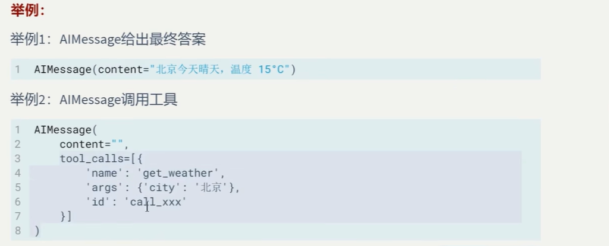

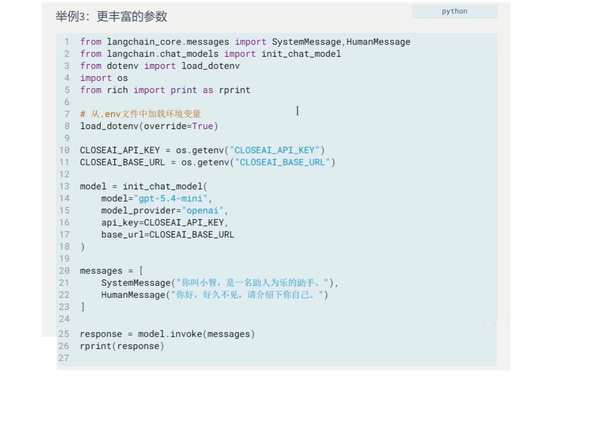

#### 返回的内容分析

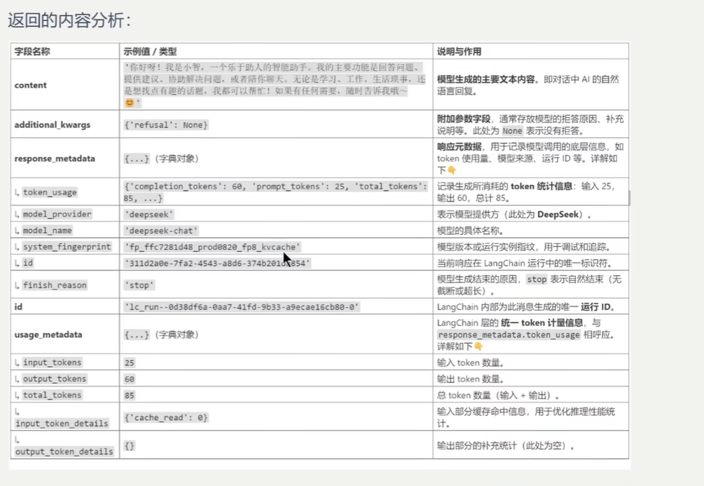

### ToolMessage参数列表

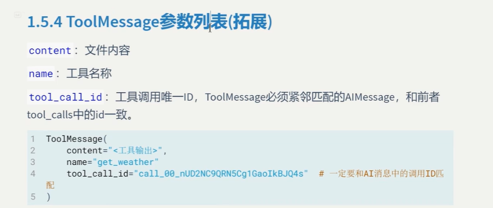


### 演练，看看gpt-oss-120b大模型是否支持name元数据，答案是不支持

```
from langchain.chat_models import init_chat_model
from langchain_core.messages import HumanMessage,SystemMessage


llm = init_chat_model(
    model="openai/gpt-oss-120b",  # 指定具体的 Groq 模型名称
    model_provider="groq",    # 明确指定提供商为 groq
    temperature=0.7
)

# 调用模型
messages = [
  SystemMessage("""你是一个消息抽取器。你会收到来自不同发言者的user消息。每条消息可能带有name字段。
   你的任务是：严格根据每条消息的name提取发言者及其观点，并输出JSON。禁止使用”第一人称/第二人称“这种称呼。
   若某条消息没有name，则输出unknown。输出格式：{\"speakers\":[{\"name\":\"...\",\"claim\":\"}]}"""),
  HumanMessage(
       content="我认为日本的首都是大阪",
       name="Bob"
  ),
  HumanMessage(
      content="我认为日本的首都是东京",
      name="Mary"
  ),
  HumanMessage(
      content="请列出谁说了什么，不要判断对错",
      name="audience"
  )
]

response = llm.invoke(messages)

# 打印输出结果
response.pretty_print()
```


### 模型输出


### 演练2.来看看Gemini

```
from langchain_openai import ChatOpenAI
from dotenv import load_dotenv
from langchain_core.messages import HumanMessage,SystemMessage
import os

load_dotenv(override=True)
gemini_api_key = os.getenv("gemini_api_key")

llm = ChatOpenAI(
    model="gemini-3.1-flash-lite",
    api_key=gemini_api_key,
    base_url="https://generativelanguage.googleapis.com/v1beta/openai/"
)

messages = [
  SystemMessage("""你是一个消息抽取器。你会收到来自不同发言者的user消息。每条消息可能带有name字段。
   你的任务是：严格根据每条消息的name提取发言者及其观点，并输出JSON。禁止使用”第一人称/第二人称“这种称呼。
   若某条消息没有name，则输出unknown。输出格式：{\"speakers\":[{\"name\":\"...\",\"claim\":\"}]}"""),
  HumanMessage(
       content="我认为日本的首都是大阪",
       name="Bob"
  ),
  HumanMessage(
      content="我认为日本的首都是东京",
      name="Mary"
  ),
  HumanMessage(
      content="请列出谁说了什么，不要判断对错",
      name="audience"
  )
]

resp = llm.invoke(messages)
resp.pretty_print()
```


### 模型输出：


### 演练3.ToolMessage的使用1,字典列表格式参数

```
from langchain_ollama import ChatOllama
import rich

llm = ChatOllama(
    model='gemma4:latest'
)

def get_weather(city:str):
    return "~不错哟~~"

t_model = llm.bind_tools([get_weather])

ai_msg = {
    "role":"assistant",
    "content":" ",
    "tool_calls":[{
        "name":"get_weather",
        "args":{"location":"北京"},
        "id":"call_00_nUD2NC9QRN5Cg1GaoIkBJQ4s"
    }]
}

tool_msg = {
    "role":"tool",
    "content":"北京今天天气晴朗，万里无云",
    "tool_call_id":"call_00_nUD2NC9QRN5Cg1GaoIkBJQ4s"
}
messages = [
    {"role":"user","content":"北京天气如何"},
    ai_msg,
    tool_msg
]

# result = t_model.invoke(
#     messages
# )
result = llm.invoke(
    messages
)

rich.print(result)
```


### 模型输出

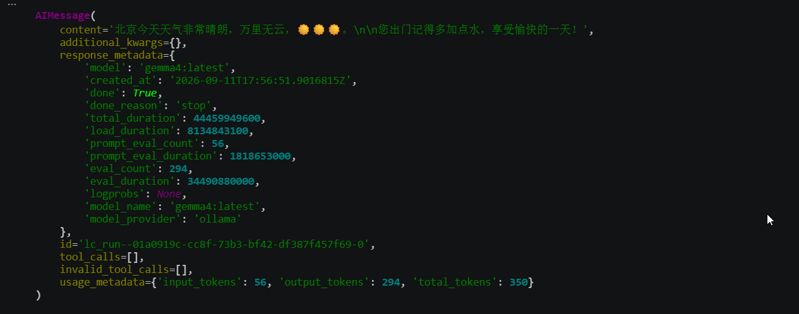

### 演练4.ToolMessage的使用，对象列表参数格式

```
from langchain_ollama import ChatOllama
from langchain_core.messages import AIMessage,HumanMessage,ToolMessage
import rich

llm = ChatOllama(
    model='gemma4:latest'
)

def get_weather(city:str):
    return "~不错哟~~"

t_model = llm.bind_tools([get_weather])


ai_msg = AIMessage(
    content=" ",
    tool_calls=[{
            "name":"get_weather",
            "args":{"location":"北京"},
            "id":"call_00_nUD2NC9QRN5Cg1GaoIkBJQ4s"
        }]
    )

tool_msg = ToolMessage(
    content="北京今天天气晴朗，万里无云",
    tool_call_id="call_00_nUD2NC9QRN5Cg1GaoIkBJQ4s"
    )

messages = [
    HumanMessage(content="北京天气如何"),
    {"role":"user","content":"北京天气如何"},
    ai_msg,
    tool_msg
]

# result = t_model.invoke(
#     messages
# )
result = llm.invoke(
    messages
)

rich.print(result)
```


### 模型输出

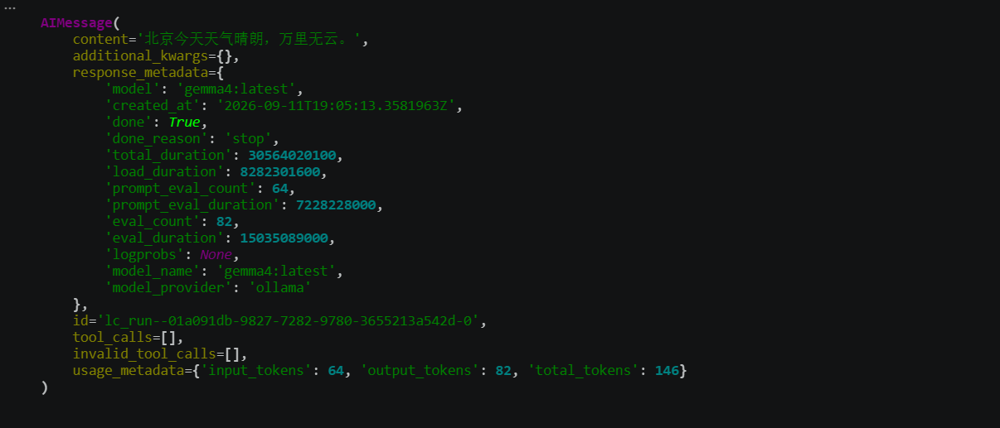

## 1.6实战

### 1.6.1.对话历史管理

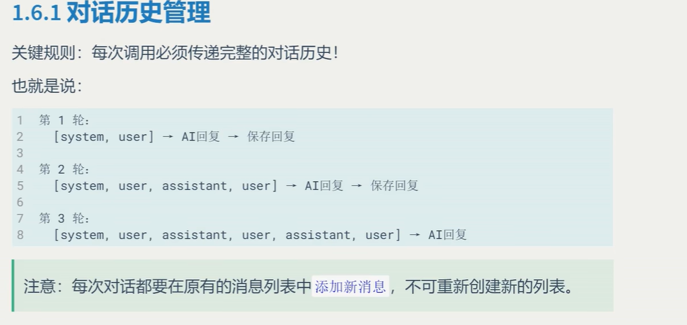

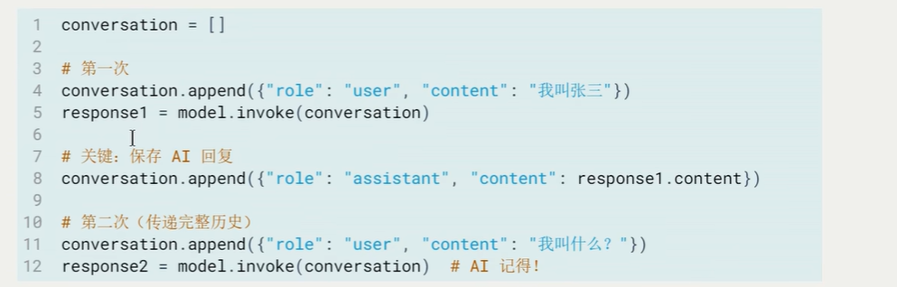

### 演练1，

```
from langchain_ollama import ChatOllama

llm = ChatOllama(
    model='granite3.2:8b'
)

msg=[
        {"role":"system","content":"你是一位非常友好的AI助手"},
        {"role":"user","content":"你好，我叫Kenny"},
]

result1 = llm.invoke(msg)
print(result1.content)
# 添加记忆
msg.append({"role":"assistant","content":result1.content})
msg.append({"role":"user","content":"我叫什么名字？"})
result2 = llm.invoke(msg)
print(result2.content)
```


### 模型回复

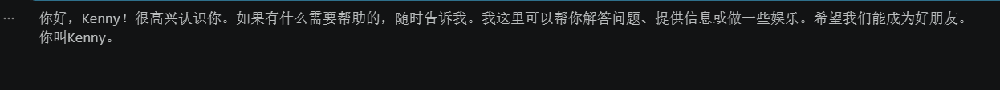

### 演练2，

```
from langchain_ollama import ChatOllama

llm = ChatOllama(
    model='granite3.2:8b'
)

msg=[
        {"role":"system","content":"你是一位非常友好的AI助手"},
        {"role":"user","content":"你好，我叫Kenny"},
]

result1 = llm.invoke(msg)
print(result1.content)
# 添加记忆
msg.append({"role":"assistant","content":result1.content})
msg.append({"role":"user","content":"我叫什么名字？"})
result2 = llm.invoke(msg)
msg.append({"role":"assistant","content":result2.content})
msg.append({"role":"user","content":"Jackline is a nice girl,she has 20 years old,her email is : jackline1234@gmail.com"})
msg.append({"role":"user","content":"Jackline是男还是女?"})
result3 = llm.invoke(msg)
result3.pretty_print()
```


### 模型输出

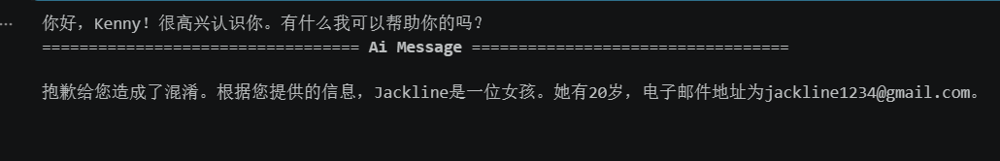

### 1.6.2.对话历史优化

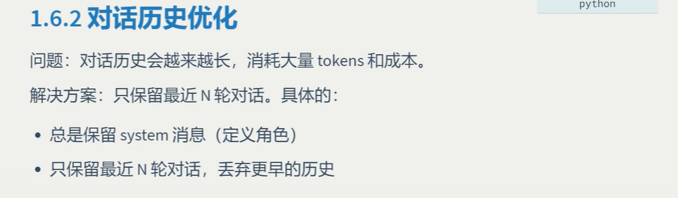

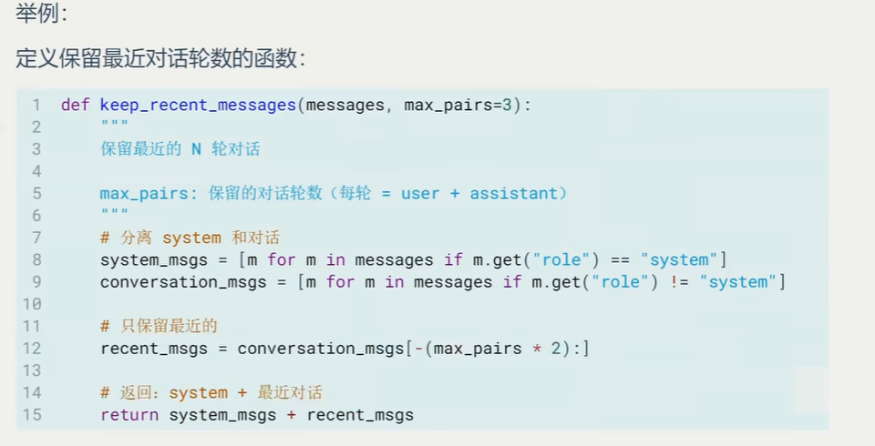

### 1.6.3.多轮对话聊天机器人

#### 示例代码如下,能够一直聊下去，直到用户输入的提示词是quit就会退出，我们使用本地大模型，否则可能会消耗非常多的token，很快就所有的在线模型都用不了。

```
from langchain_ollama import ChatOllama

# 1.基础配置
# MODEL_NAME='gemma4:latest'
MODEL_NAME='qwen2.5vl:latest'
MAX_PAIR_HISTORY = 10
EXIT_WORD = "quit"

# 2.初始化本地大模型对象
model = ChatOllama(
    model=MODEL_NAME
)

# 3.维护一个消息列表
messages = [
    {"role":"system","content":"你叫小美，是一个非常友好的人工智能客服，你回答问题都是非常简明扼要，直奔重点的。"}
]

# 4.用循环来交互
i = 1 #记录对话的轮数
print(f"交互对话开始，请输入提示词(也就是你的问题),输入{EXIT_WORD}结束对话")
while True:
    print(f"\n{'*'*10}第{i}轮交互对话开始{'*'*10}\n")
    prompt = input("提示词：>>>")
    print(f"你的问题是：{prompt}")
    if prompt == EXIT_WORD:
        print("今天暂时聊到这里，我们下一次再见！")
        break
    messages.append({"role":"user","content":prompt})
    r = model.invoke(messages)
    r.pretty_print()
    messages.append({"role":"assistant","content":r.content})
    i+=1

```


#### 效果

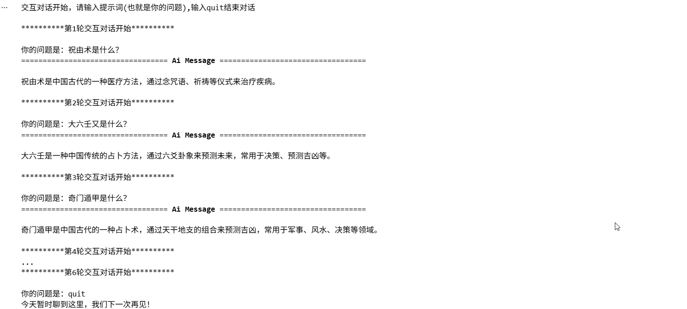

#### 代码优化，如果把每一次的模型输出都添加到消息列表中，列表就会非常大，相互非常多的内存和token，我们定义一个函数来保留最近几次的聊天信息，这样子效果就会好很多

```
def keep_recent_messages(messages,max_pairs=3):
    # 分离system和对话
    sys_msgs = [m for m in messages if m.get("role")=="system"]
    conversation_msgs = [m for m in messages if m.get("role")!="system"]
    # 只保留最佳的
    recent_msgs = conversation_msgs[-(max_pairs*2):] # 对话需要user,assistant,user,assistant,。。。是成对使用的，所以是max_pairs*2

    # 返回：sys_msgs + 最近对话
    return sys_msgs + recent_msgs # 列表+列表=列表
```


#### 然后我们把上面的聊天机器人的代码优化一下

```
from langchain_ollama import ChatOllama

# 1.基础配置
# MODEL_NAME='gemma4:latest'
MODEL_NAME='qwen2.5vl:latest'
MAX_PAIR_HISTORY = 10
EXIT_WORD = "quit"

# 2.初始化本地大模型对象
model = ChatOllama(
    model=MODEL_NAME
)

# 3.维护一个消息列表
messages = [
    {"role":"system","content":"你叫小美，是一个非常友好的人工智能客服，你回答问题都是非常简明扼要，直奔重点的。"}
]

# 4.用循环来交互
i = 1 #记录对话的轮数
print(f"交互对话开始，请输入提示词(也就是你的问题),输入{EXIT_WORD}结束对话")
while True:
    print(f"\n{'*'*10}第{i}轮交互对话开始{'*'*10}\n")
    prompt = input("提示词：>>>")
    # 判断一下提示词是否是退出，如果是就退出
    if prompt == EXIT_WORD:
        print("今天暂时聊到这里，我们下一次再见！")
        break
    # 如果不是，就输出提示词。
    print(f"你：{prompt}")
    messages.append({"role":"user","content":prompt})
    # 在调用模型的时候，需要选取最近n次的消息
    messages1 = keep_recent_messages(messages,max_pairs=MAX_PAIR_HISTORY)
    r = model.invoke(messages1)
    r.pretty_print()
    messages.append({"role":"assistant","content":r.content}) # 但是我们必须保存一个完整的消息列表。
    print(f"\n{'*'*10}第{i}轮交互对话结束{'*'*10}\n")
    i +=1

```


#### 模型输出

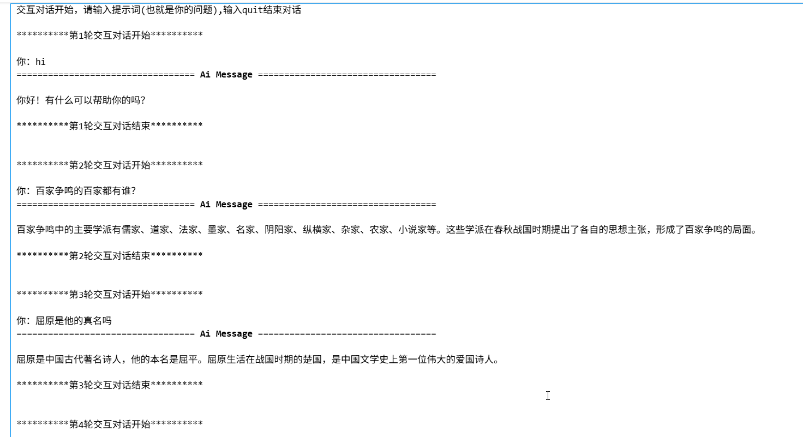

## 1.7拓展：消息属性content,content_blocks

### 1.7.1 content

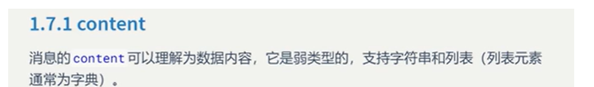

#### 举例1

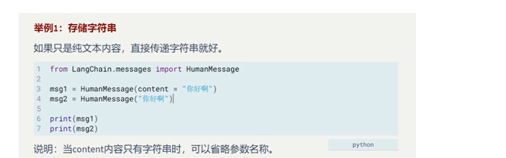

#### 举例2

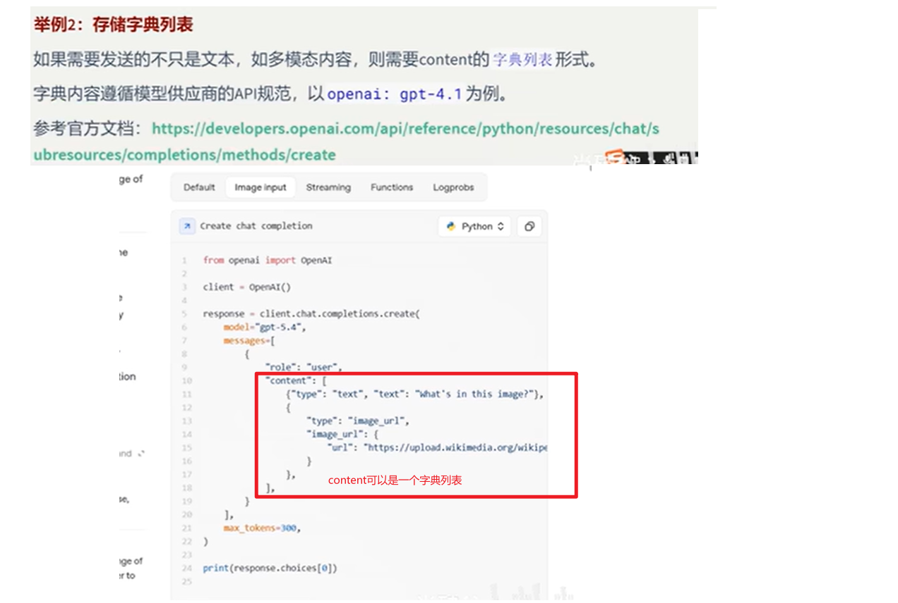

##### 案例2代码，我们可以把一幅图片转化为data uri字符串格式，然后把他作为image_url传递给模型，如果是支持视觉的模型，就可以识别出来

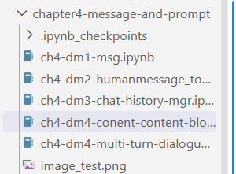

##### 先定义一个图片转为data uri的函数

```
def encode_image(img_path,img_type='jpeg'):
    """将一张本地图片转换为Base64编码的Data URI字符串，方便在文本中嵌入图片数据"""
    with open(img_path,"rb") as img_file:
        return f"data:image/{img_type};base64,{base64.b64encode(img_file.read()).decode('utf-8')}"
```


##### 然后是让模型识别图片的代码，注意，需要先运行上面的代码

```
from  langchain_ollama import ChatOllama
from langchain_core.messages import HumanMessage
import base64

model = ChatOllama(
    model="qwen2.5vl:latest"
)

img_path="image_test.png"
# 获取图片的base64编码数据
base64_img = encode_image(img_path)

resp = model.invoke([
   HumanMessage(
     content=[
        {"type":"text","text":"这张图片里面有什么？"},
        {"type":"image_url","image_url":base64_img}
     ]
   )
])
resp.pretty_print()
```


##### 模型输出

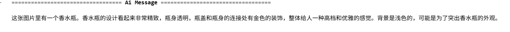

##### 我们可以创建一个函数，读取网上一幅图片的数据，然后把它转化为base64编码的data uri在传递给模型，模型一样可以识别出来

我们的测试图片是（url: https://img.iplaysoft.com/wp-content/uploads/2019/free-images/free_stock_photo_2x.jpg!0x0.webp）： 


##### encode_image_from_web函数的代码如下,需要安装pillow，pip install pillow

```
def encode_image_from_web(imgurl,img_type='jpeg'):
    import requests
    from PIL import Image

    # 2. 发送请求获取图片内容
    response = requests.get(imgurl)

    # 3. 检查请求是否成功
    if response.status_code == 200:
         return f"data:image/{img_type};base64,{base64.b64encode(response.content).decode('utf-8')}"
```

##### 然后我们修改一下代码如下

```
from  langchain_ollama import ChatOllama
from langchain_core.messages import HumanMessage
import base64

model = ChatOllama(
    model="qwen2.5vl:latest"
)

# 识别本地图片
# img_path="image_test.png"
# img_path="pussy.jpg"
# # 获取图片的base64编码数据
# base64_img = encode_image(img_path)
# 识别网络图片
imgurl = "https://img.iplaysoft.com/wp-content/uploads/2019/free-images/free_stock_photo_2x.jpg!0x0.webp"
base64_web_img = encode_image_from_web(imgurl)

resp = model.invoke([
   HumanMessage(
     content=[
        {"type":"text","text":"这张图片里面有什么？"},
        {"type":"image_url","image_url":base64_web_img}
     ]
   )
])
resp.pretty_print()
```


##### 运行程序，分析模型把图片的内容识别出来了

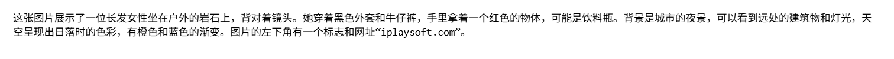

#### 太棒了，我们的程序可以识别网络和本地图片！！！

### 1.7.2 content_block

#### 什么是content_block以及输入的格式化

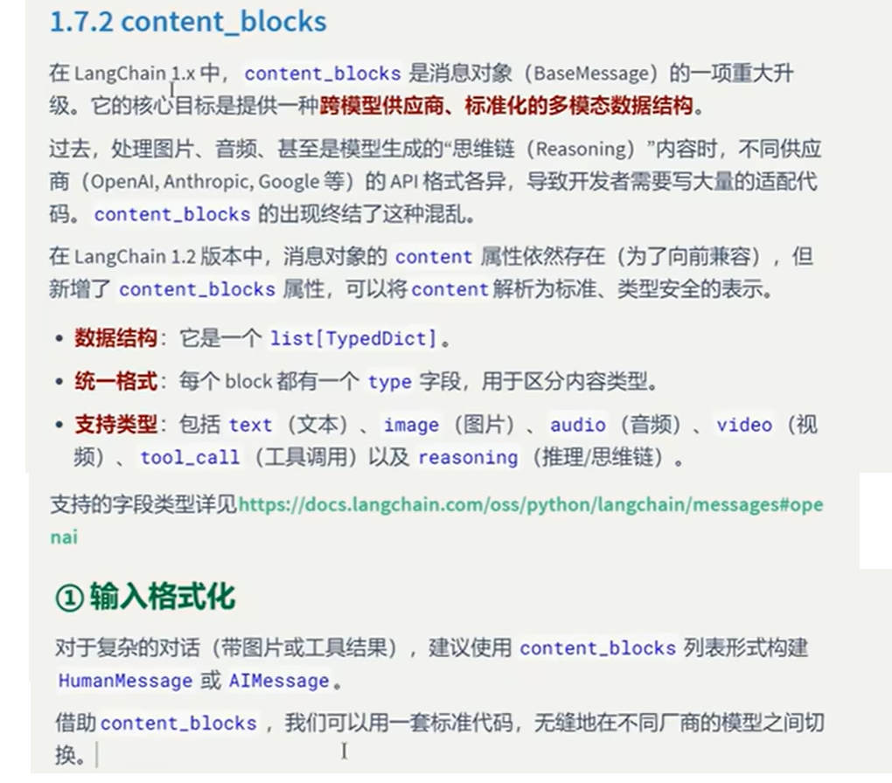

#### 举例1，注意这个教程老师的content_blocks的字段不正确。还是使用上面的自定义函数来加载图片

```
from  langchain_ollama import ChatOllama
from langchain_core.messages import HumanMessage
import base64

model = ChatOllama(
    model="qwen2.5vl:latest"
)

# 识别本地图片
# img_path="image_test.png"
# img_path="pussy.jpg"
# # 获取图片的base64编码数据
# base64_img = encode_image(img_path)
# 识别网络图片
# imgurl = "https://img.iplaysoft.com/wp-content/uploads/2019/free-images/free_stock_photo_2x.jpg!0x0.webp"
imgurl = "https://m.media-amazon.com/images/I/917DlMVdioL._AC_SL1500_.jpg"

base64_web_img = encode_image_from_web(imgurl)

resp = model.invoke([
   HumanMessage(
     content_blocks=[
        {"type":"text","text":"这张图片里面有什么？"},
        # {"type":"image_url","image_url":base64_img,'mime_type':"image/jpg"},
        {"type":"image_url","image_url":base64_web_img,'mime_type':"image/jpg"},
     ]
   )
])
resp.pretty_print()
```


#### 也可以使用ChatOpenAI类来加载本地模型，做一样的事情

```
from langchain_openai import ChatOpenAI

# 构造 ChatOpenAI 实例连接本地大模型
model = ChatOpenAI(
    model="qwen2.5vl:latest",                  # 替换为你本地实际的模型名称
    base_url="http://localhost:11434/v1",  # 本地 OpenAI 兼容接口地址
    api_key="ollama",                 # 本地调用无需真实 Key，但参数不可为空
    temperature=0.7
)

# 识别本地图片
# img_path="image_test.png"
# img_path="pussy.jpg"
# # 获取图片的base64编码数据
# base64_img = encode_image(img_path)
# 识别网络图片
# imgurl = "https://img.iplaysoft.com/wp-content/uploads/2019/free-images/free_stock_photo_2x.jpg!0x0.webp"
imgurl = "https://m.media-amazon.com/images/I/917DlMVdioL._AC_SL1500_.jpg"

base64_web_img = encode_image_from_web(imgurl)

response =model.invoke([
   HumanMessage(
     content_blocks=[
        {"type":"text","text":"这张图片里面有什么？"},
        {"type":"image_url","image_url":base64_img,'mime_type':"image/jpg"}, # 网上教程老师的字段是错误的。
     ]
   )
])

response.pretty_print()
```


#### 模型输出

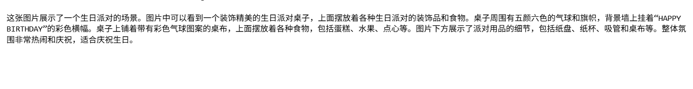

#### 输出格式化

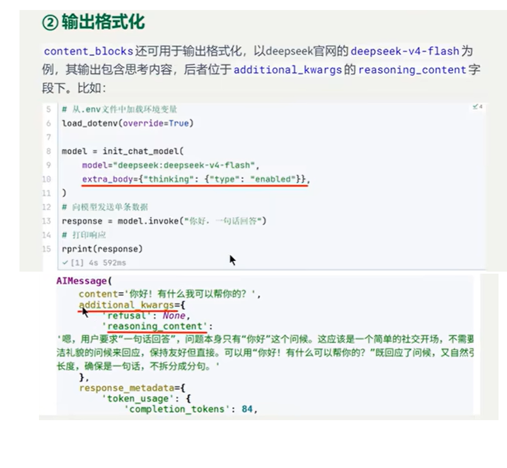

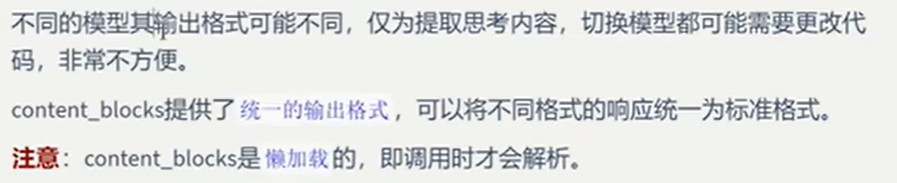

# 2.提示词模板

## 2.1.ChatPromptTemplate的2种实例化和3种调用方式

### 为什么推荐提示词模板？

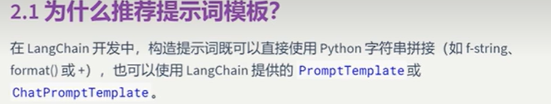

#### 举例1，使用字符串拼接

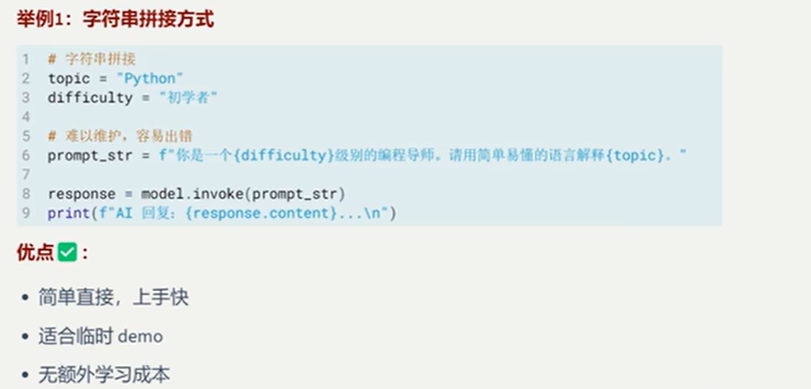

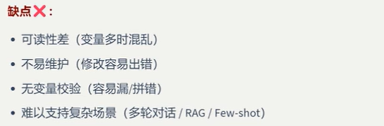

#### 举例2.提示词模板

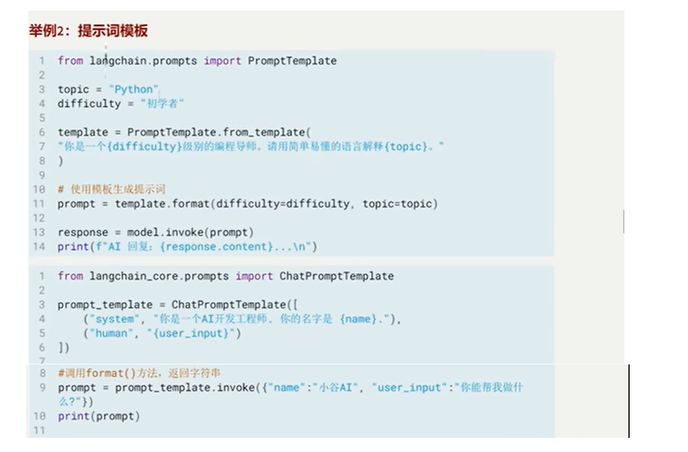

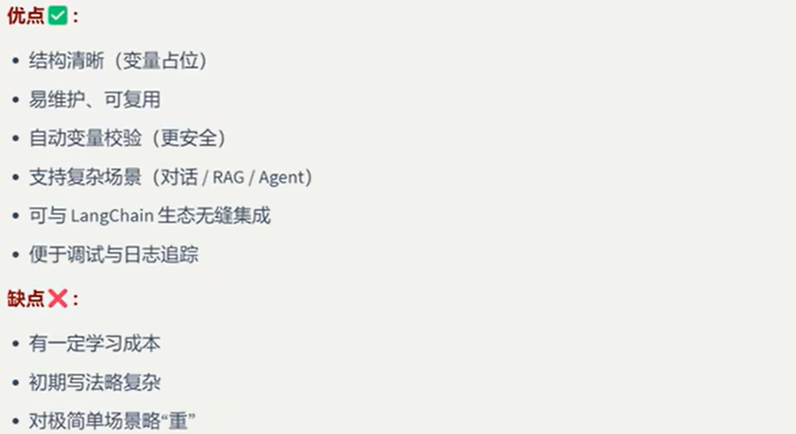

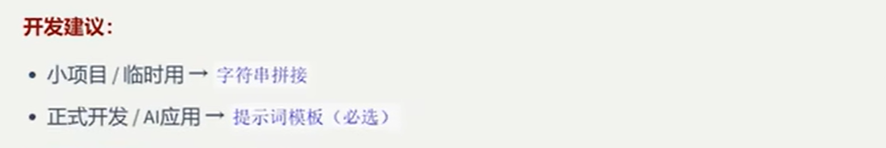

### 提示词机制演进

#### 旧时代：llm+PromptTemplate,现在已经不使用了。

#### 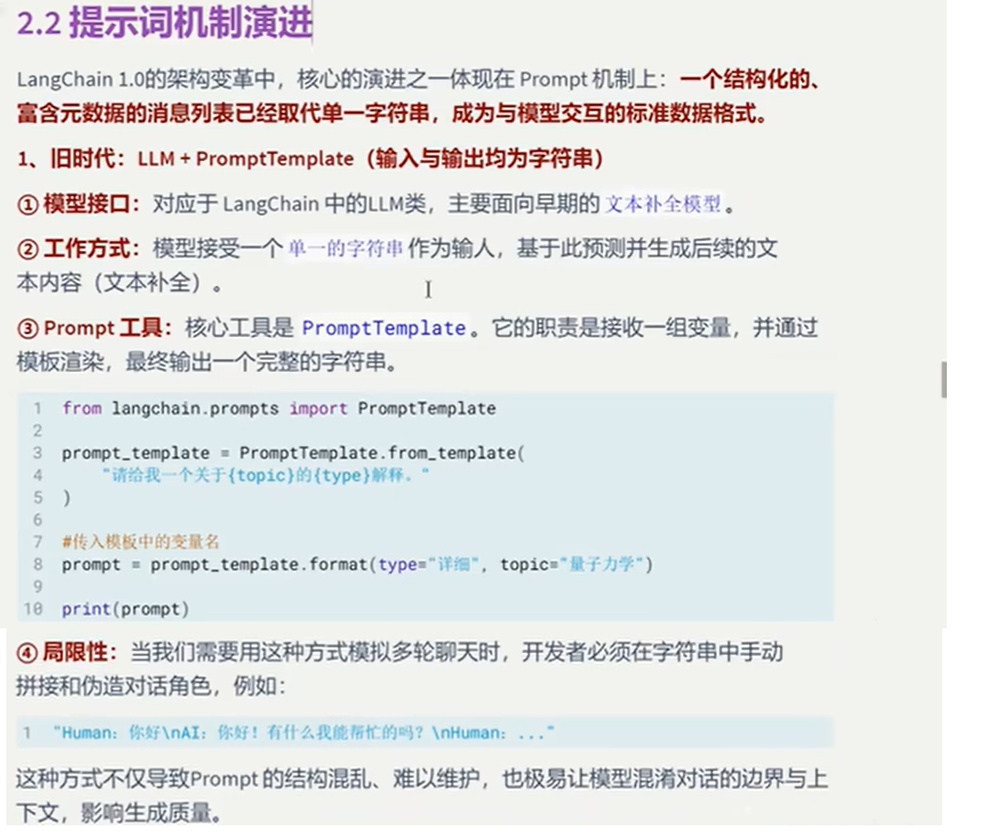

#### 新时代：ChatModel+ChatPromptTemplate

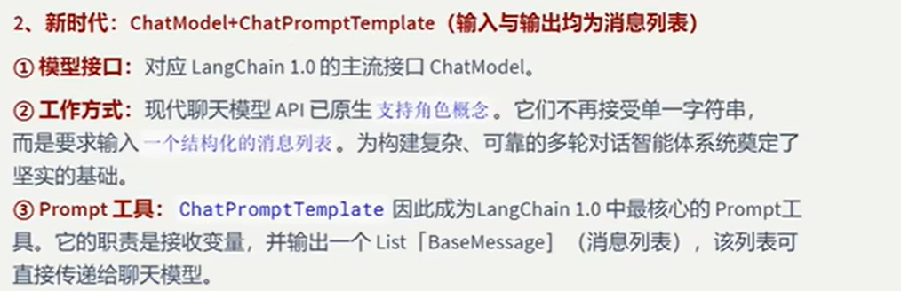

#### 两者对比

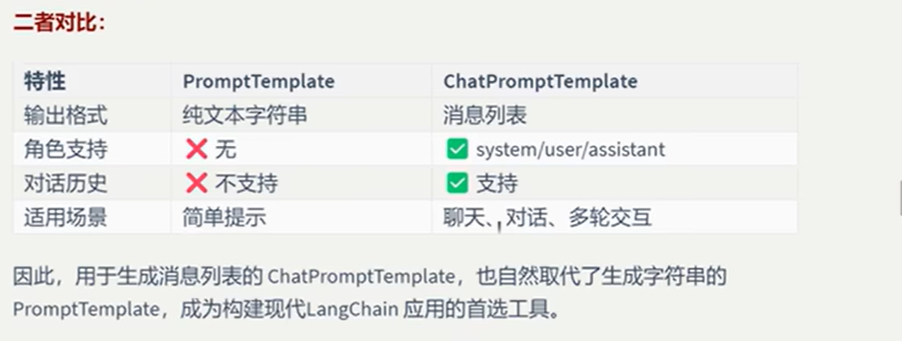


