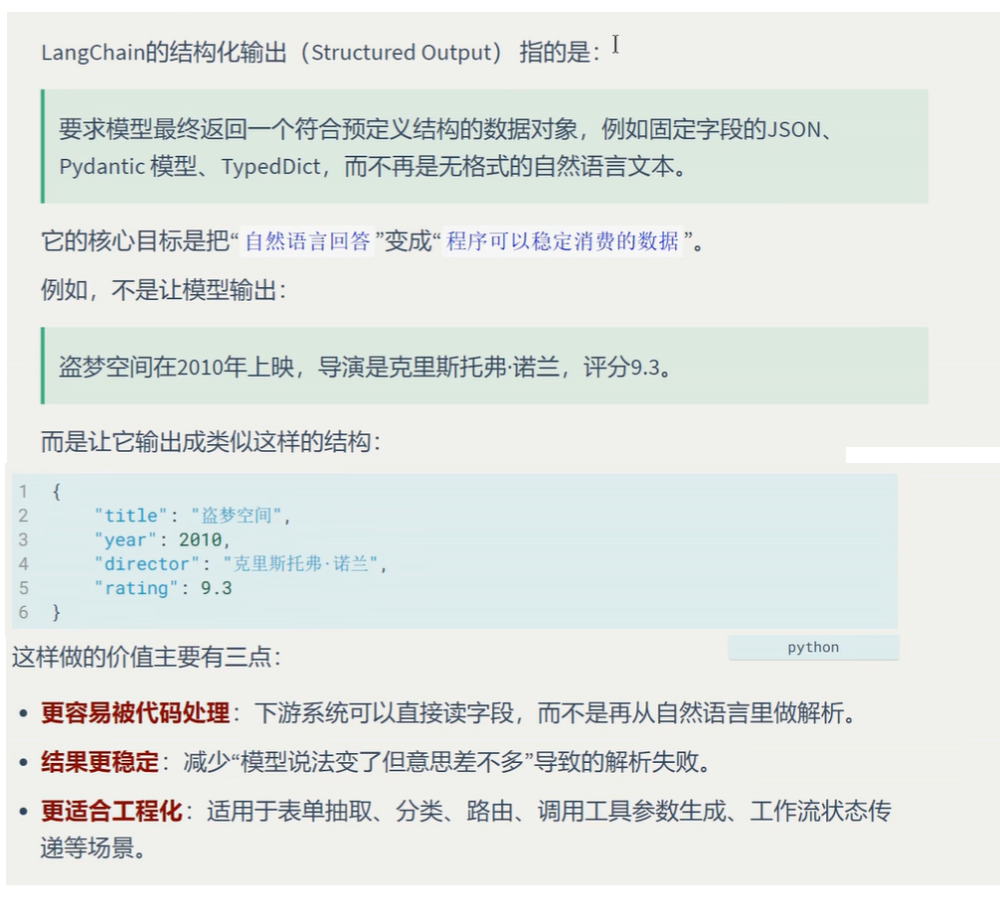
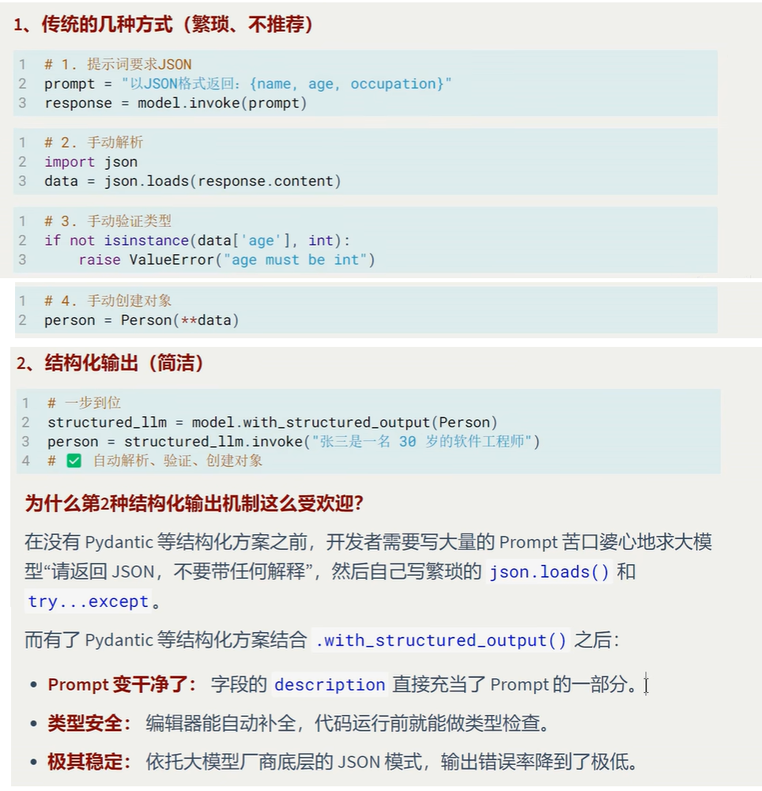
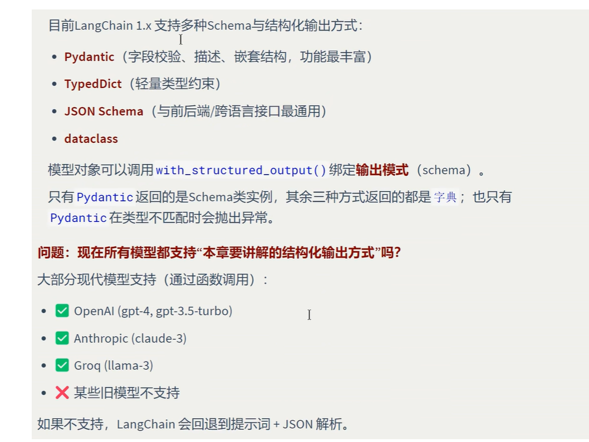
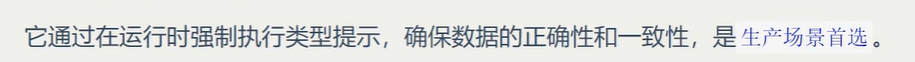
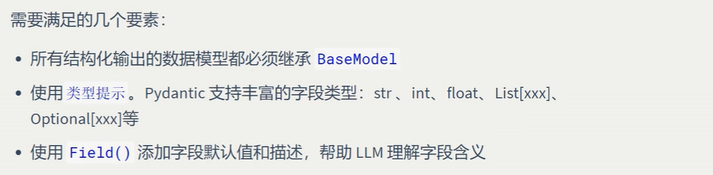
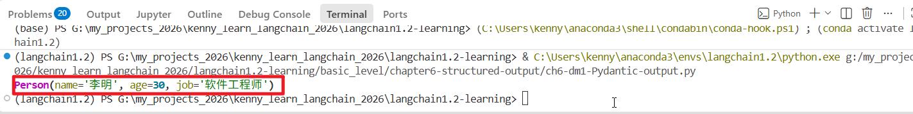
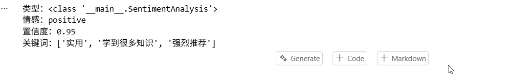
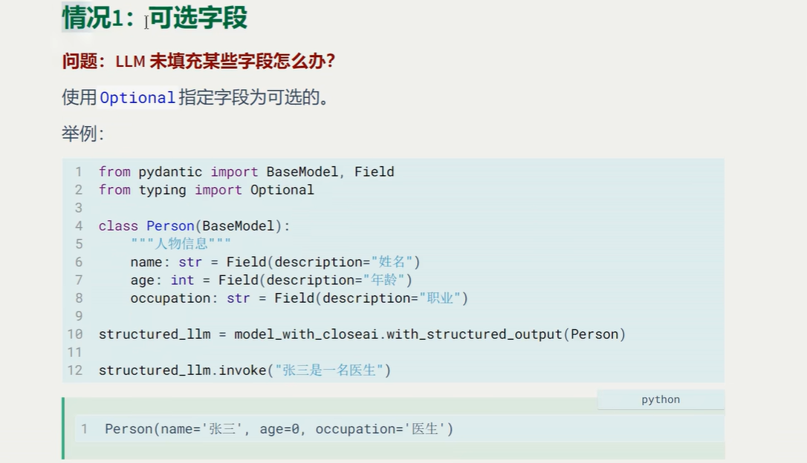
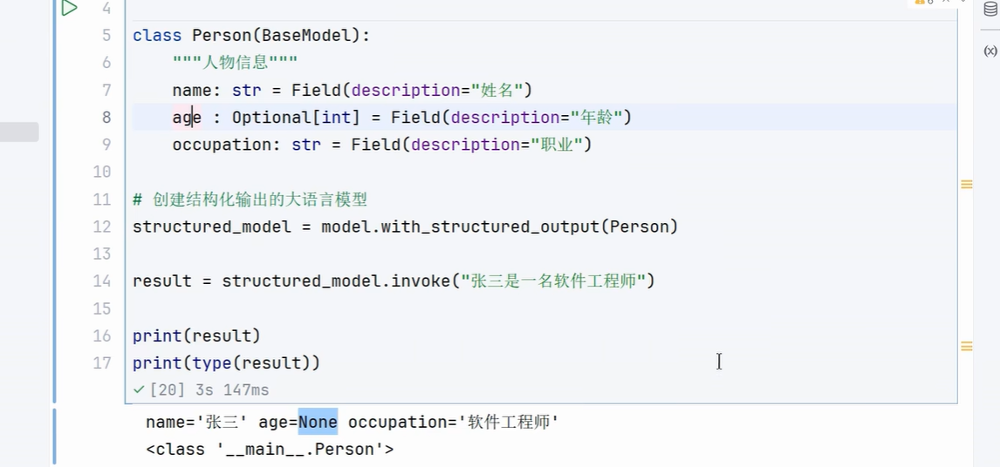

# 1.结构化输出概述

##  1.1 什么是结构化输出



##  1.2 传统方式 vs 结构化输出

   

##  1.3 结构化输出模式

   

# 2.四种模式的使用

## 2.1 模式1：Pydantic



### 2.1.1 基本使用



#### 案例

```
# 1.初始化模型
import sys
from pathlib import Path
from rich import print as rprint
from pydantic import BaseModel, Field

# 获取当前文件的父目录的父目录（即 my_project 根目录）
root_path = Path(__file__).resolve().parent.parent
sys.path.append(str(root_path))

from utils.model_utils import create_qwen3_instance

# 定义输出格式类，需要使用pydantic里面的BaseModel类作为基类
class Person(BaseModel):
    """人物信息"""
    name:str = Field(description="姓名")
    age:int = Field(description="年龄")
    job:str = Field(description="职业")

model = create_qwen3_instance()

# 设置模型输出格式
ret_model = model.with_structured_output(Person)

result = ret_model.invoke("李明是一名30岁的软件工程师")
rprint(result)
```


#### 模型输出



#### 案例2.文本情感分析

```
## 1.初始化模型
# from langchain.messages import HumanMessage, ToolMessage
from langchain_openai import ChatOpenAI
from pydantic import BaseModel, Field

# 创建模型实例
model = ChatOpenAI(
    model="qwen3-vl:latest",
    api_key="sk12345",
    base_url="http://localhost:11434/v1",
    temperature=0.1
)   

# 定义输出格式
class SentimentAnalysis(BaseModel):
    sentiment: str= Field(description="情感倾向:positive/nagative/neutral")
    confidence: float = Field(description="置信度,0-1之间")
    keywords: list[str]= Field(description="关键词列表")
# 设置模型的输出格式
ret_model = model.with_structured_output(SentimentAnalysis)
txt = "这个课程内容很实用，学到很多知识，强烈推荐!"
result = ret_model.invoke(f"分析以下文本的情感：{txt}")

print(f"类型：{type(result)}")
print(f"情感：{result.sentiment}")
print(f"置信度：{result.confidence}")
print(f"关键词：{result.keywords}")
```


#### 模型输出



### 2.1.2 高级特性

#### 情况1：可选字段





##### Optional关键字的用法

```
from langchain_openai import ChatOpenAI
from pydantic import BaseModel, Field
from typing import Optional

# 创建模型实例
model = ChatOpenAI(
    model="qwen3-vl:latest",
    api_key="sk12345",
    base_url="http://localhost:11434/v1",
)   

class Person(BaseModel):
    """人物信息"""
    name:str = Field(description="姓名")
    age:Optional[int] = Field(description="年龄") #设置可选字段
    job:str = Field(description="职业")

from rich import print as rprint
# 设置模型输出格式,我们规定它的输出格式位我们的Person类的对象
ret_model = model.with_structured_output(Person)

result = ret_model.invoke("小利是一名司机") # 我们特意不传递年龄
rprint(result)  
```


#### 其实对应本地大模型来说，有没有Optional都是一样的，模型会自己编造一个年龄

#### 情况2：默认值


#### 情况3：枚举类型


#### 情况4：列表提取

#### 情况5：嵌套结构

#### 情况6：限制条件

### 2.1.3 工作流程图解

## 2.2 模式2：TypeDict

### 2.2.1 什么是TypeDict

### 2.2.2 TypeDict的基本使用

# 3.关于类型校验

## 3.1 fake server

## 3.2 四种模式的校验

### 3.2.1 Pydantic

### 3.2.2 TypeDict

### 3.2.3 JSON schema

### 3.2.4 @dataclass

### 3.2.5 小结

# 4.获取结构化结果的方式


# 扩展：激活pycharm2025

网站：https://blog.idejihuo.com/jetbrains/intellij-idea-2025-2-latest-activation-tutorial-permanent-activation-code-cracking-tool-2099.html

工具下载： https://fileio.lanzouw.com/ibL0z3d03sng

下载后解压缩，然后以管理员的身份运行jetbra-free-windows7-amd64.exe，会打开一个本地网站，我们只需要配置好名字和过期时间，点击submit，然后用鼠标点击我们需要激活的软件，出现cracked，说明激活成功
