# 1.结构化输出概述

##  1.1 什么是结构化输出

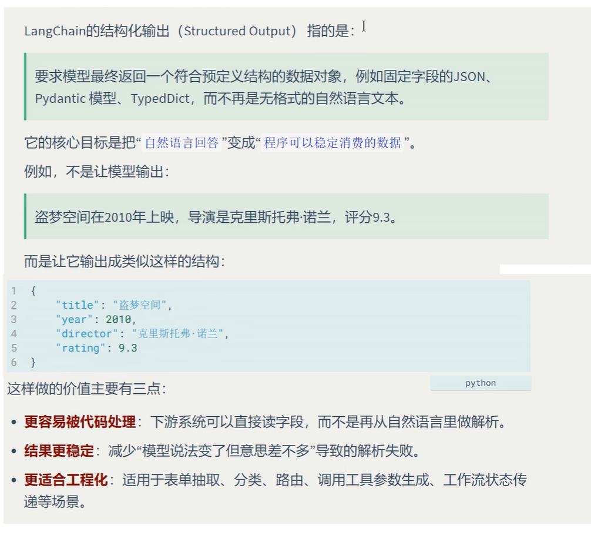

##  1.2 传统方式 vs 结构化输出

   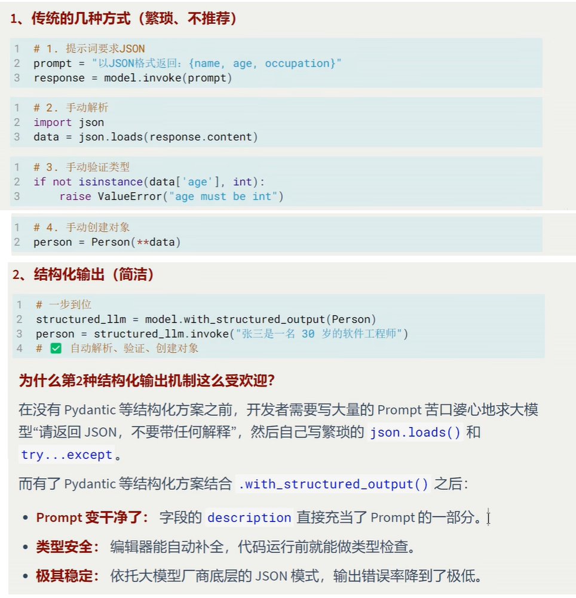

##  1.3 结构化输出模式

   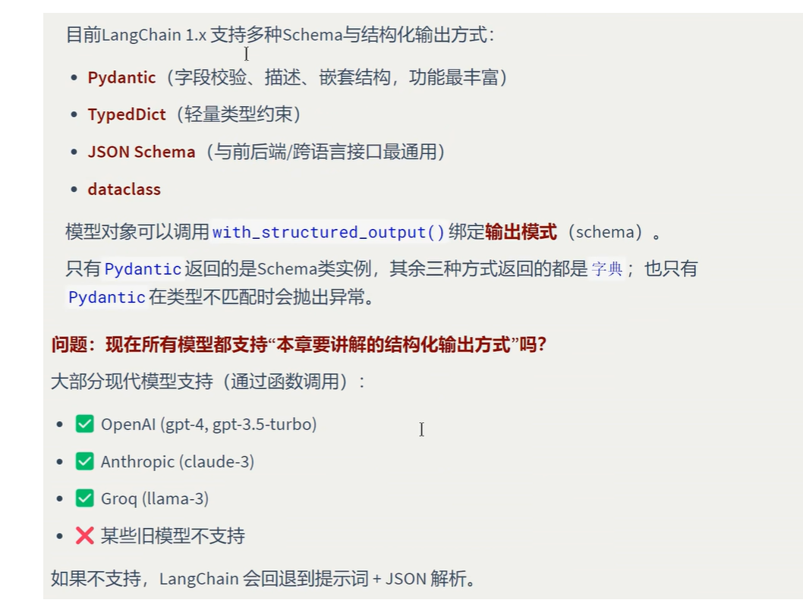

# 2.四种模式的使用

## 2.1 模式1：Pydantic

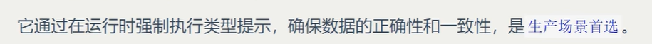

### 2.1.1 基本使用

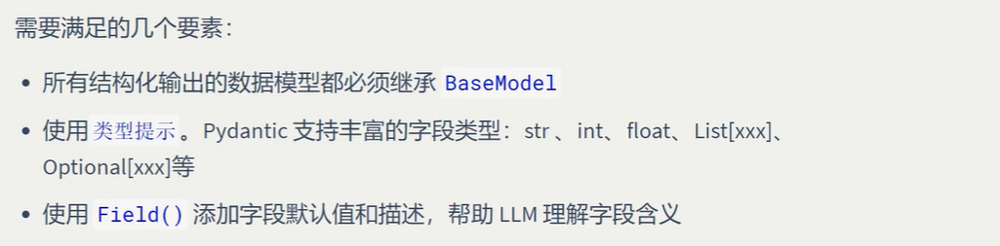

#### 案例

```
# 1.初始化模型
import sys
from pathlib import Path
from rich import print as rprint
from pydantic import BaseModel, Field

# 获取当前文件的父目录的父目录（即 my_project 根目录）
root_path = Path(__file__).resolve().parent.parent
sys.path.append(str(root_path))

from utils.model_utils import create_qwen3_instance

# 定义输出格式类，需要使用pydantic里面的BaseModel类作为基类
class Person(BaseModel):
    """人物信息"""
    name:str = Field(description="姓名")
    age:int = Field(description="年龄")
    job:str = Field(description="职业")

model = create_qwen3_instance()

# 设置模型输出格式
ret_model = model.with_structured_output(Person)

result = ret_model.invoke("李明是一名30岁的软件工程师")
rprint(result)
```


#### 模型输出

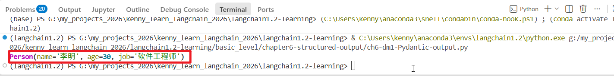

#### 案例2.文本情感分析

```
## 1.初始化模型
# from langchain.messages import HumanMessage, ToolMessage
from langchain_openai import ChatOpenAI
from pydantic import BaseModel, Field

# 创建模型实例
model = ChatOpenAI(
    model="qwen3-vl:latest",
    api_key="sk12345",
    base_url="http://localhost:11434/v1",
    temperature=0.1
)   

# 定义输出格式
class SentimentAnalysis(BaseModel):
    sentiment: str= Field(description="情感倾向:positive/nagative/neutral")
    confidence: float = Field(description="置信度,0-1之间")
    keywords: list[str]= Field(description="关键词列表")
# 设置模型的输出格式
ret_model = model.with_structured_output(SentimentAnalysis)
txt = "这个课程内容很实用，学到很多知识，强烈推荐!"
result = ret_model.invoke(f"分析以下文本的情感：{txt}")

print(f"类型：{type(result)}")
print(f"情感：{result.sentiment}")
print(f"置信度：{result.confidence}")
print(f"关键词：{result.keywords}")
```


#### 模型输出

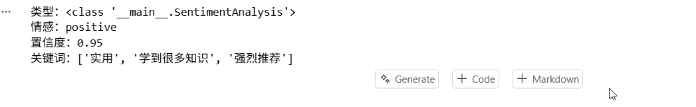

### 2.1.2 高级特性

#### 情况1：可选字段

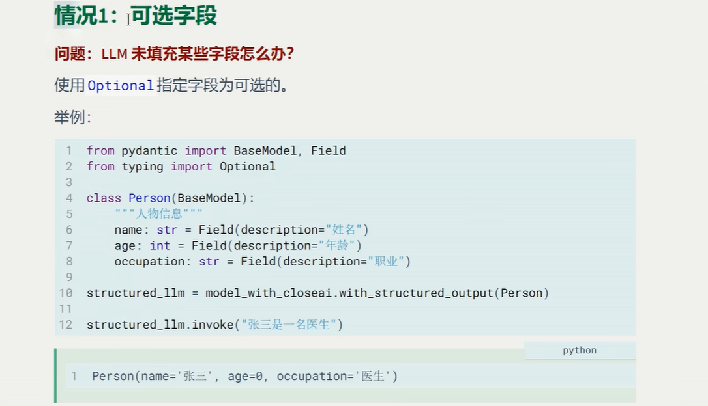

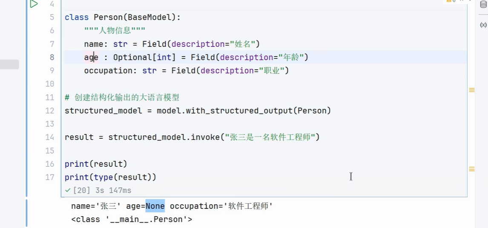

##### Optional关键字的用法

```
from langchain_openai import ChatOpenAI
from pydantic import BaseModel, Field
from typing import Optional

# 创建模型实例
model = ChatOpenAI(
    model="qwen3-vl:latest",
    api_key="sk12345",
    base_url="http://localhost:11434/v1",
)   

class Person(BaseModel):
    """人物信息"""
    name:str = Field(description="姓名")
    age:Optional[int] = Field(description="年龄") #设置可选字段
    job:str = Field(description="职业")

from rich import print as rprint
# 设置模型输出格式,我们规定它的输出格式位我们的Person类的对象
ret_model = model.with_structured_output(Person)

result = ret_model.invoke("小利是一名司机") # 我们特意不传递年龄
rprint(result)  
```


#### 其实对应本地大模型来说，有没有Optional都是一样的，模型会自己编造一个年龄

#### 情况2：默认值

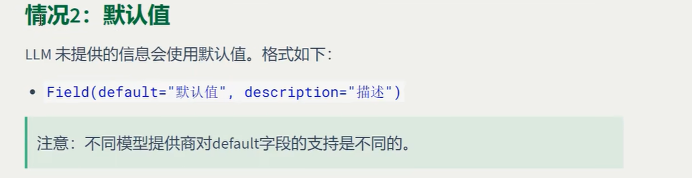

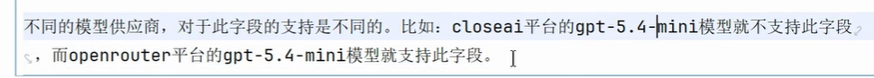

##### 实例代码,默认值的写法

```
默认值
## 1.初始化模型
from langchain_openai import ChatOpenAI
from pydantic import BaseModel, Field
from typing import Optional

# 创建模型实例
model = ChatOpenAI(
    # model="gemma4:latest",
    model="pdurugyan/qwen3.5-9b-deepseek-v4-flash-Q4_K_M-v_2:latest",
    api_key="sk12345",
    base_url="http://localhost:11434/v1",
)

class Person(BaseModel):
    """人物信息"""
    name:str = Field(description="姓名")
    age:int = Field(default=19,description="年龄") #设置可选字段,qwen模型不支持默认值？gemma4也不支持？
    job:str = Field(description="职业")

from rich import print as rprint
# 设置模型输出格式,我们规定它的输出格式位我们的Person类的对象
ret_model = model.with_structured_output(Person)

result = ret_model.invoke("Jack是一名司机") # 我们特意不传递年龄
rprint(result)
```


#### 情况3：枚举类型

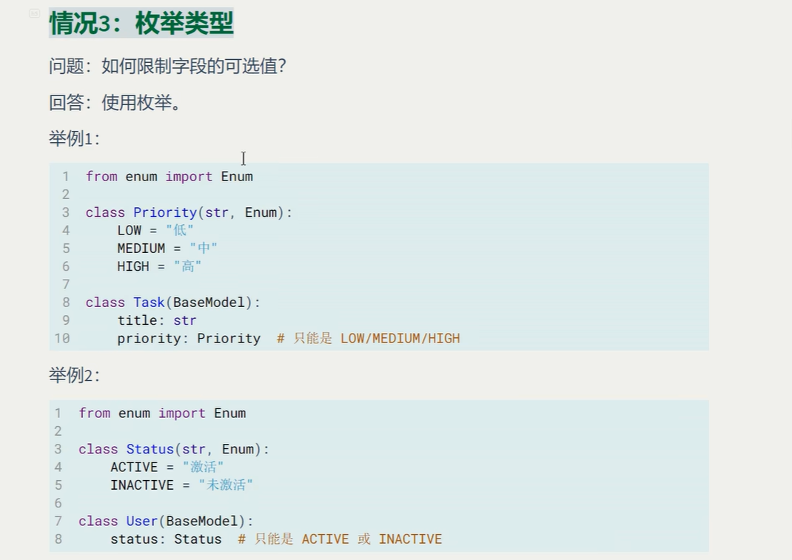

##### 综合实例代码

```
from langchain_openai import ChatOpenAI
from pydantic import BaseModel, Field
from enum import Enum
from rich import print as rprint

# 创建模型实例
model = ChatOpenAI(
    # model="mistral-nemo:latest",
    model="dzgg/gemini-3-pro-preview:latest",
    api_key="sk12345",
    base_url="http://localhost:11434/v1",
)

class Priority(str, Enum):
    LOW = "低"
    MEDIUM = "中"
    HIGH = "高"

class CustomerInfo(BaseModel):
      """客户信息"""
      name: str = Field(description="客户姓名")
      phone: str = Field(description="电话号码")
      email: Optional[str] = Field(description="邮箱")
      issue: str = Field(description="问题描述")
      urgency: Priority = Field(description="紧急程度")

st_model = model.with_structured_output(CustomerInfo)

ask = """
客服: 你好，请问有什么可以帮助你？
客户: 我是小明，电话 138-1234-5678，我的订单一直没有发货，很着急！
客服: 好的，我帮你查一下
"""
msg = st_model.invoke(f"从一下客服对话中提取客户信息\n{ask}")
rprint(msg)

```

##### 模型输出

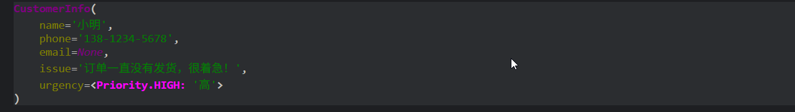

##### Literal

##### 实例代码

```
from langchain_openai import ChatOpenAI
from pydantic import BaseModel, Field
from rich import print as rprint
from  typing import Literal

# 创建模型实例
model = ChatOpenAI(
    # model="mistral-nemo:latest",
    model="dzgg/gemini-3-pro-preview:latest",
    api_key="sk12345",
    base_url="http://localhost:11434/v1",
)

class CustomerInfo(BaseModel):
      """客户信息"""
      name: str = Field(description="客户姓名")
      phone: str = Field(description="电话号码")
      email: Optional[str] = Field(description="邮箱")
      issue: str = Field(description="问题描述")
      urgency: Literal["低","中","高"] = Field(description="紧急程度")

st_model = model.with_structured_output(CustomerInfo)

ask = """
客服: 你好，请问有什么可以帮助你？
客户: 我是小明，电话 138-1234-5678，我的订单一直没有发货，很着急！
客服: 好的，我帮你查一下
"""
msg = st_model.invoke(f"从一下客服对话中提取客户信息\n{ask}")
rprint(msg)
```


##### 模型输出：

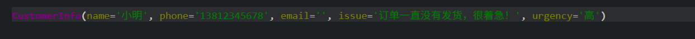

#### 

#### 情况4：列表提取，

##### 举例1

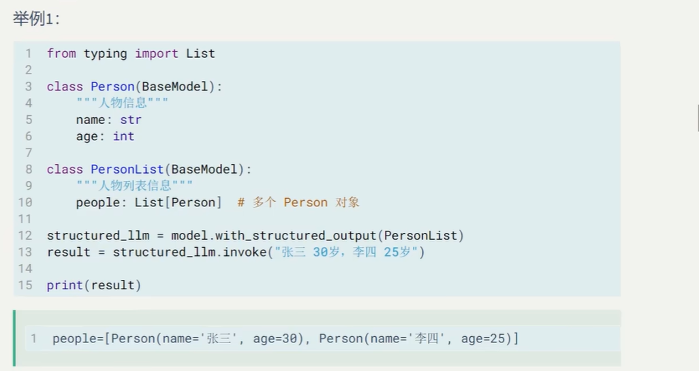

##### 实现代码

```
from langchain_openai import ChatOpenAI
from pydantic import BaseModel, Field
from rich import print as rprint
from  typing import Literal,List

# 创建模型实例
model = ChatOpenAI(
    # model="mistral-nemo:latest",
    model="dzgg/gemini-3-pro-preview:latest",
    api_key="sk12345",
    base_url="http://localhost:11434/v1",
)

class Person(BaseModel):
    """人物信息"""
    name:str
    age:int

class PersonList(BaseModel):
    people: List[Person]

stru_model = model.with_structured_output(PersonList)
result = stru_model.invoke("小李 30岁，小王 25岁，小张 23岁")
rprint(result)

```

##### 

##### 模型输出

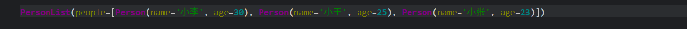

##### 举例2，产品评论

```
from langchain_openai import ChatOpenAI
from pydantic import BaseModel, Field
from rich import print as rprint
from  typing import Literal,List

# 创建模型实例
model = ChatOpenAI(
    # model="mistral-nemo:latest",
    model="dzgg/gemini-3-pro-preview:latest",
    api_key="sk12345",
    base_url="http://localhost:11434/v1",
)

class Review(BaseModel):
    """产品评论"""
    product: str
    rating:int = Field(description="评分 1-5")
    pros:List[str] = Field(description="优点列表")
    cons:List[str] = Field(description="缺点列表")

stru_model = model.with_structured_output(Review)
res = stru_model.invoke("""
Iphone 17很棒！摄像头强大，手感好。但是价格贵，没有充电器。4分
""")

rprint(res)
```


##### 模型输出

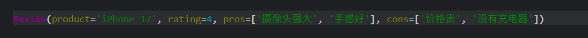

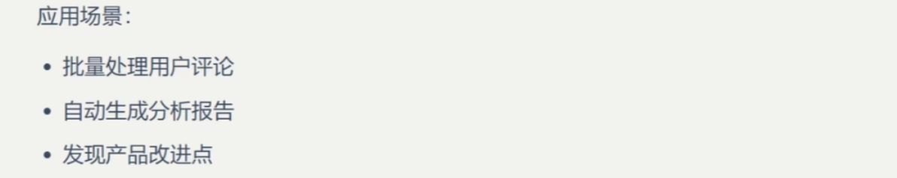

##### 举例3，

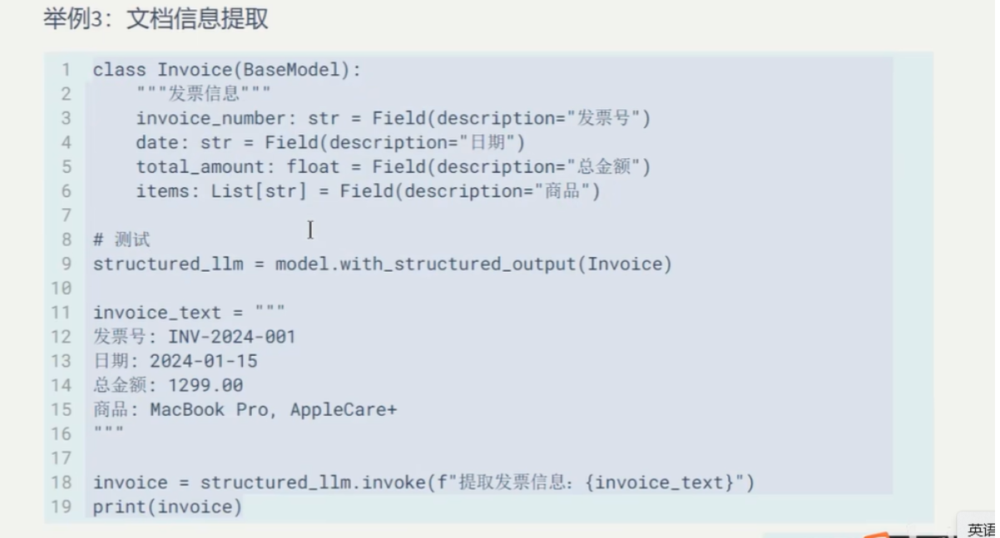

##### 实现代码

```
from langchain_openai import ChatOpenAI
from pydantic import BaseModel, Field
from rich import print as rprint
from  typing import Literal,List

# 创建模型实例
model = ChatOpenAI(
    # model="mistral-nemo:latest",
    model="dzgg/gemini-3-pro-preview:latest",
    api_key="sk12345",
    base_url="http://localhost:11434/v1",
)

class Invoice(BaseModel):
    """发票信息"""
    inv_num:str = Field(description="发票号")
    date: str = Field(description="日期")
    total:float = Field(description="总金额")
    items:List[str] = Field(description="商品")

stru_model = model.with_structured_output(Invoice)
inv_str = """
发票号: inv2024-001
日期: 2024-01-15
总金额: 1299
商品: MacBook Pro, AppleCare+
"""
msg = stru_model.invoke(f"提取发票信息：\n{inv_str}")
rprint(msg)


```


##### 模型输出

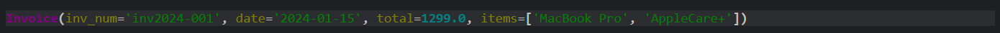

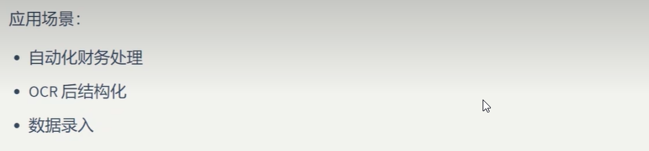

#### 情况5：嵌套结构

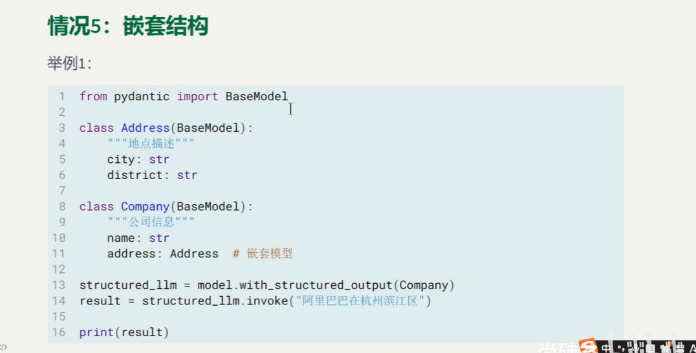

##### 举例1代码

```
from langchain_openai import ChatOpenAI
from pydantic import BaseModel, Field
from rich import print as rprint


# 创建模型实例
model = ChatOpenAI(
    model="mistral-nemo:latest", # ok
    api_key="sk12345",
    base_url="http://localhost:11434/v1",
)

class Address(BaseModel):
    """地点描述"""
    city:str = Field(description="城市")
    district:str = Field(description="区域")

class Company(BaseModel):
    """概述信息"""
    name:str = Field(description="公司名称")
    address:Address = Field(description="地址")

stru_model = model.with_structured_output(Company)
msg = stru_model.invoke("阿里巴巴位于杭州滨江区")
rprint(msg)

```


##### 模型输出

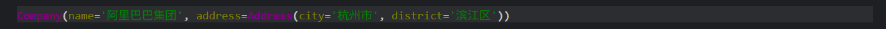

##### 举例2代码

```
from langchain_openai import ChatOpenAI
from pydantic import BaseModel, Field
from rich import print as rprint
from  typing import Literal,List

# 创建模型实例
model = ChatOpenAI(
    # model="mistral-nemo:latest",
    # model="dzgg/gemini-3-pro-preview:latest",
    model="mo-shakib/gemma4-e4b-uncensored:q4_k_m",
    api_key="sk12345",
    base_url="http://localhost:11434/v1",
)

class Actor(BaseModel):
    """演员信息"""
    name: str = Field(description="姓名")
    role: str = Field(description="饰演的角色")

class Movie(BaseModel):
    """电影信息"""
    title: str = Field(description="电影标题")
    year: int = Field(description="上映年份")
    director: str = Field(description="导演")
    cast: List[Actor] = Field(description="演员列表")
    rating: float = Field(description="评分")

stru_model = model.with_structured_output(Movie)
msg = stru_model.invoke("请介绍电影《盗梦空间》")
rprint(msg)


```


##### 模型输出

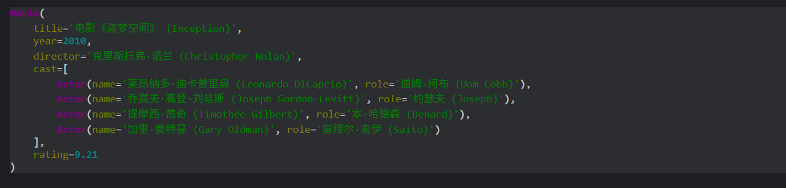

###### 注意：

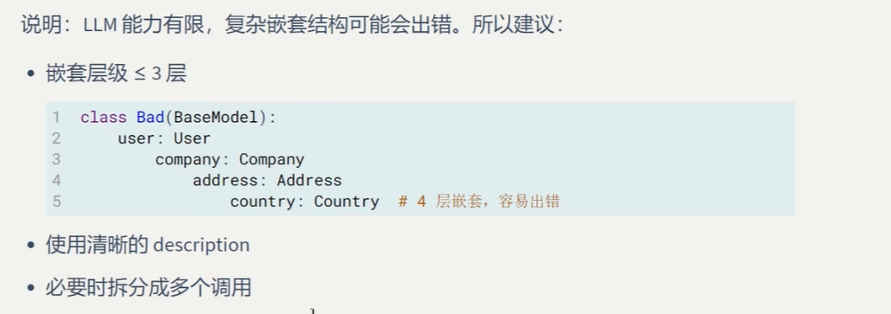

##### 举例3代码

```
from langchain_openai import ChatOpenAI
from pydantic import BaseModel, Field
from rich import print as rprint
from  typing import Literal,List

# 创建模型实例
model = ChatOpenAI(
    # model="mistral-nemo:latest",
    model="dzgg/gemini-3-pro-preview:latest", # 这个案例用这个模型的效果挺好
    # model="mo-shakib/gemma4-e4b-uncensored:q4_k_m",
    api_key="sk12345",
    base_url="http://localhost:11434/v1",
)

class Aspect(BaseModel):
    """评论维度"""
    name: str = Field(description="维度名称，如：质量、价格、服务")
    score: int = Field(description="评分，1-5")
    comment: str = Field(description="具体评论")

class ProductReview(BaseModel):
    """产品评论分析"""
    overall_sentiment: str = Field(description="整体情感: positive/negative/neutral")
    overall_score: int = Field(description="综合评分：1-5")
    aspects: List[Aspect] = Field(description="各维度评价")
    summary: str = Field(description="一句话总结")

comment= """
这款笔记本电脑的性能非常强大，运行大型软件毫无压力。
屏幕色彩鲜艳，看视频很舒服。
不过价格有点贵，而且风扇噪声比较大。
客服态度很好，物流也快。
总体来说，还是值得购买的。
"""

stru_model = model.with_structured_output(ProductReview)
result = stru_model.invoke(f"分析以下产品评论：\n{comment}")
rprint(result)
```


##### 模型输出

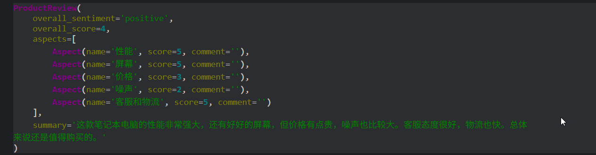

#### 情况6：限制条件

在定义Pydantic类的时候，可以在Field类的构造方法里面添加限制条件，如果不满足这些条件就会抛异常

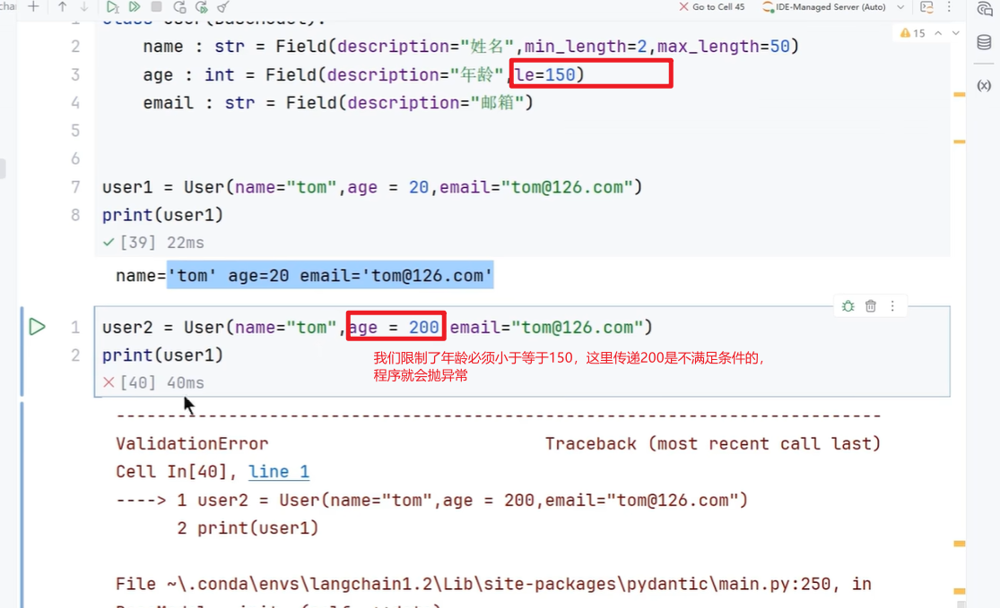

##### 举例代码

```
from pydantic import BaseModel, Field,ValidationError
from rich import print as rprint
from  typing import Literal,List
from langchain_openai import ChatOpenAI

# 创建模型实例
model = ChatOpenAI(
    # model="mistral-nemo:latest",
    model="dzgg/gemini-3-pro-preview:latest", # 这个案例用这个模型的效果挺好
    # model="mo-shakib/gemma4-e4b-uncensored:q4_k_m",
    api_key="sk12345",
    base_url="http://localhost:11434/v1",
)

class Product(BaseModel):
    """产品信息"""
    name: str = Field(description="产品名称(字符串类型)",min_length=2)
    price: float = Field(description="价格 数字类型",gt=0) # 价格必须是正数
    stock: int = Field(description="库存 整数类型",ge=0) # 库存可以为0，但是不可以是负数

stru_model = model.with_structured_output(Product)
resp = stru_model.invoke("华为 mate80 promax 价格是-7999,库存-100")
print(resp)


```


##### 模型输出

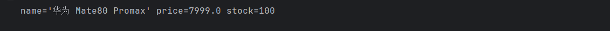

##### 注意：不同模型厂商对这个限制功能的支持是不一样的


### 2.1.3 工作流程图解

#### 流程图

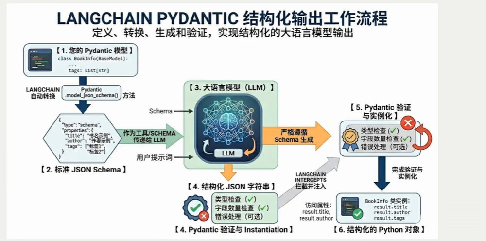


## 2.2 模式2：TypeDict

### 2.2.1 什么是TypeDict

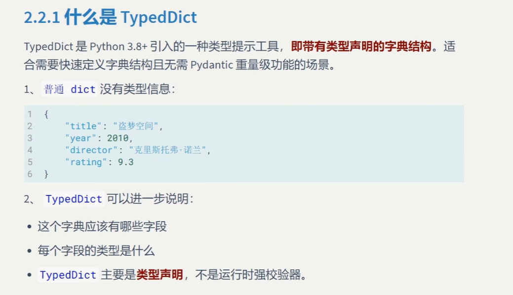

#### 使用案例

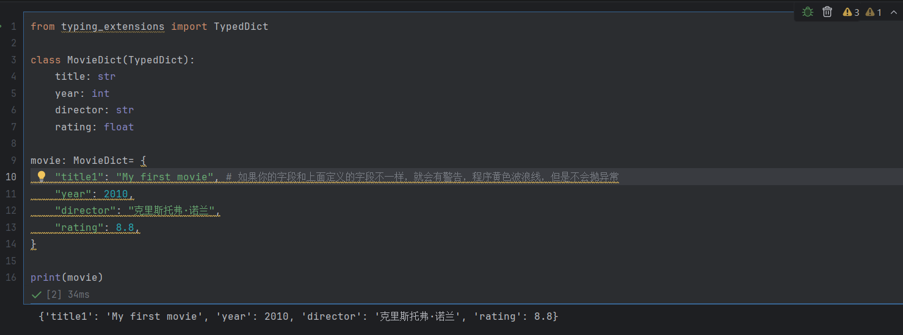

### 2.2.2 TypeDict的基本使用

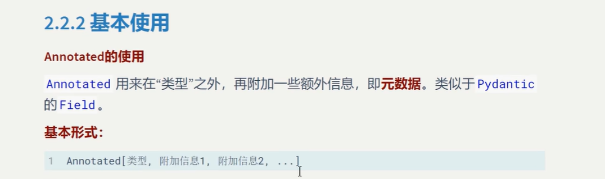

#### 举例1代码

```
from langchain_openai import ChatOpenAI
from typing_extensions import TypedDict, Annotated

# 创建模型实例
model = ChatOpenAI(
    model="mistral-nemo:latest",
    # model="dzgg/gemini-3-pro-preview:latest", # 这个案例用这个模型的效果挺好
    # model="mo-shakib/gemma4-e4b-uncensored:q4_k_m",
    api_key="sk12345",
    base_url="http://localhost:11434/v1",
)

class MovieDict(TypedDict):
    title: Annotated[str, "电影名称"]
    year: Annotated[int, "上映年份，四位数"]
    director: Annotated[str, "导演"]
    rating: Annotated[float, "评分，满分10分，可以包含一位小数"]

smodel = model.with_structured_output(MovieDict)
result = smodel.invoke("请介绍一下《星际穿越》这部电影")
print(result)

```


#### 模型输出，这个案例用mistral-nemo:latest模型比较好

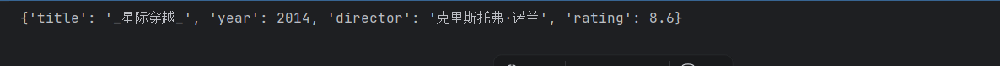

#### 举例2代码

```
from langchain_openai import ChatOpenAI
from typing_extensions import TypedDict, Annotated
from typing import List
# 创建模型实例
model = ChatOpenAI(
    model="mistral-nemo:latest",
    # model="dzgg/gemini-3-pro-preview:latest", # 这个案例用这个模型的效果挺好
    # model="mo-shakib/gemma4-e4b-uncensored:q4_k_m",
    api_key="sk12345",
    base_url="http://localhost:11434/v1",
)

class Actor(TypedDict):
    """演员信息"""
    name: Annotated[str,"演员姓名"]
    role: Annotated[str,"饰演的角色"]


class MovieDict(TypedDict):
    title: Annotated[str, "电影名称"]
    year: Annotated[int, "上映年份，四位数"]
    director: Annotated[str, "导演"]
    rating: Annotated[float, "评分，满分10分，可以包含一位小数"]
    cast: Annotated[List[Actor],"演员列表"]

smodel = model.with_structured_output(MovieDict)
result = smodel.invoke("请介绍一下《星际穿越》这部电影")
print(result)

```


#### 模型输出

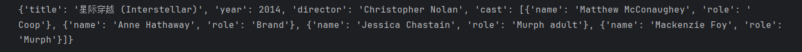

### ...的使用

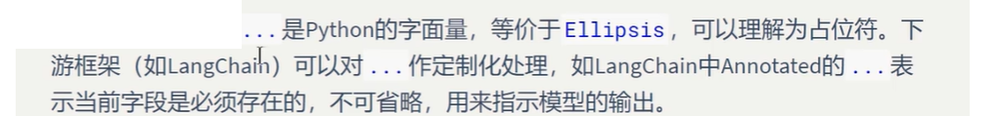

#### 举例3...使用代码

```
from langchain_openai import ChatOpenAI
from typing_extensions import TypedDict, Annotated
from typing import List
# 创建模型实例
model = ChatOpenAI(
    model="mistral-nemo:latest",
    api_key="sk12345",
    base_url="http://localhost:11434/v1",
)

class MovieDict(TypedDict):
    title: Annotated[str,..., "电影名称"]  # ...的意思是必须要填写
    year: Annotated[int, ...,"上映年份，四位数"]
    director: Annotated[str, ...,"导演"]
    rating: Annotated[float, ...,"评分，满分10分，可以包含一位小数"]

smodel = model.with_structured_output(MovieDict)
result = smodel.invoke("根据这段话抽取盗梦空间的信息，不包含的信息可以留空： 盗梦空间在2010年上映，导演是克里斯托弗.诺兰")
print(result)
```


#### 模型输出

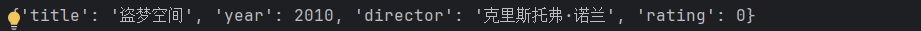

## 2.3 模式3： JSON_Schema

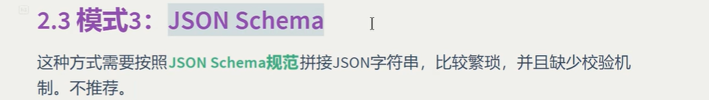

### 举例1代码

```
from langchain_openai import ChatOpenAI
from pydantic_core.core_schema import json_schema
from typing_extensions import TypedDict, Annotated
from typing import List
# 创建模型实例
model = ChatOpenAI(
    model="mistral-nemo:latest",
    api_key="sk12345",
    base_url="http://localhost:11434/v1",
)

json_schema = {
    "title": "Movie",
    "description":"A Movie with detail",
    "type": "object",
    "properties": {
        "title": {
            "type": "string",
            "description":" The title of the movie",
        },
        "year": {
            "type": "integer",
            "description":" The year of the movie released",
        },
        "director": {
            "type": "string",
            "description":" The director of the movie",
        },
        "rating": {
            "type": "number",
            "description":" The rating of the movie",
        },
    },
    "required": ["title", "year", "director", "rating"],
}

s_model = model.with_structured_output(json_schema,method="json_schema")
result = s_model.invoke("给我电影盗梦空间的信息")
print(result)
```

### 模型输出

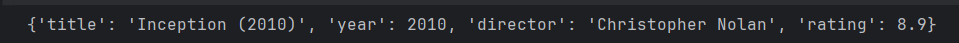

### 举例2代码

```
from langchain_openai import ChatOpenAI
from pydantic_core.core_schema import json_schema
from typing_extensions import TypedDict, Annotated
from typing import List
# 创建模型实例
model = ChatOpenAI(
    model="mistral-nemo:latest",
    api_key="sk12345",
    base_url="http://localhost:11434/v1",
)

project_schema = {
    "title": "MovieInfo",
    "description":"包含电影标题，上映年份，导演，演员和评分的电影对象",
    "type": "object",
    "properties": {
        "title": {
            "type": "string",
            "description":"电影标题",
        },
        "year": {
            "type": "integer",
            "description":"上映年份",
        },
        "director": {
            "type": "string",
            "description":" 导演",
        },
        "cast": {
           "type": "array",
           "description":"演员列表",
            "items":{
                "type": "object",
                "properties":{
                    "name":{"type": "string","description":"演员姓名",},
                    "role":{"type": "string","description":"角色",},
                },
                "required":["name","role"],
            }
        }
        ,
        "rating": {
            "type": "number",
            "description":"评分(10分制)",
        },
    },
    "required": ["title", "year", "director", "rating"],
}

s_model = model.with_structured_output(project_schema,method="json_schema")
result = s_model.invoke("生成一个关于《星际穿越》的电影信息，包含导演，演员，评分")
print(result)
```


### 模型输出

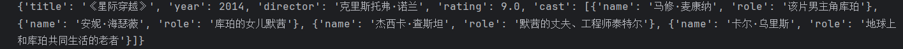

## 2.4 模式4：@dataclass

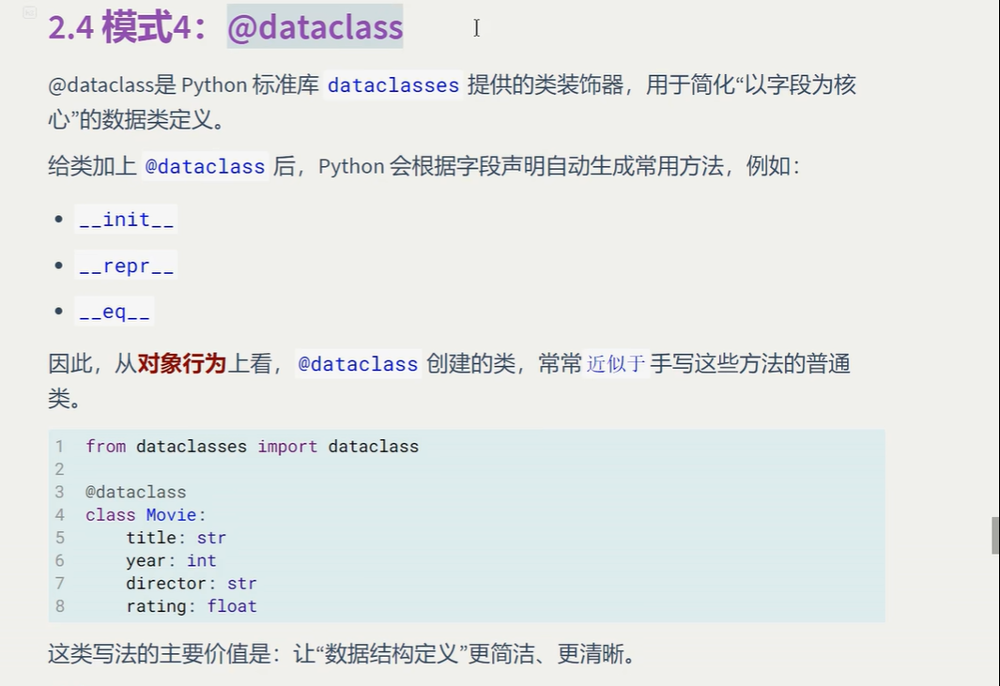

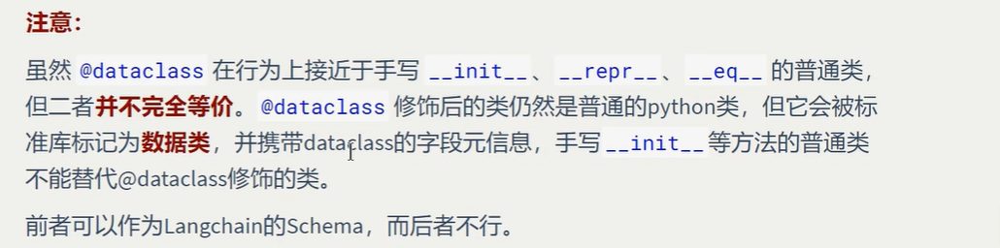

### 举例代码

```
from dataclasses import dataclass
from langchain_openai import ChatOpenAI
from pydantic import Field

# 创建模型实例
model = ChatOpenAI(
    model="mistral-nemo:latest",
    api_key="sk12345",
    base_url="http://localhost:11434/v1",
)

@dataclass
class Movie:
    """电影详细信息"""
    title: str = Field(description="电影标题")
    year: int = Field(description="上映年份")
    director: str = Field(description="导演")
    rating: float = Field(description="评分满分10分")

s_model = model.with_structured_output(Movie)
result = s_model.invoke("给我电影盗梦空间的信息")
print(result)


```


### 模型输出

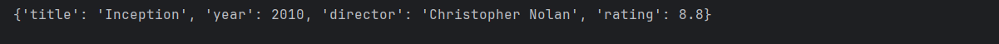

# 3.关于类型校验

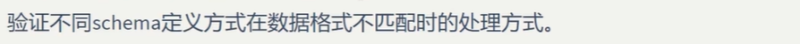

## 3.1 fake server

#### 创建一个fake_server.py,内容如下

```
import json
import time
from http.server import HTTPServer, BaseHTTPRequestHandler

class FakeDeepSeekHandler(BaseHTTPRequestHandler):
    def do_POST(self):
        content_length = int(self.headers.get('Content-Length',0))
        raw_body = self.rfile.read(content_length).decode('utf-8')
        print("\n"+"="*100)
        json_body=None
        try:
            json_body = json.loads(raw_body)
            print("[JSON Body]")
            print(json.dumps(json_body,ensure_ascii=False,indent=2))
        except Exception as e:
            print("[JSON Parse Error]")
            print(e)
        response = {
            "id":"chatcmp-test",
            "object":"chat.completion",
            "created":int(time.time()),
            "model":"any",
            "choices":[
                {
                   "index":0,
                    "message":{
                        "role":"assistant",
                        "content":"",
                        "tool_calls":[
                            {
                                "id":"call_1",
                                "type":"function",
                                "function":{
                                    "name":json_body["tools"][0]["function"]["name"],
                                    "arguments":json.dumps({
                                        "title1":"盗梦空间","year2":2010,"director":"克里斯托弗.诺兰",
                                        "rating":9.3
                                    },ensure_ascii=False),
                                }
                            }
                        ]
                    },
                    "finish_reason":"stop"
                }
            ],
            "usage":{
                "prompt_tokens":1,
                "completion_tokens":1,
                "total_tokens":2,
            },
        }

        print("\n"+"="*100)
        print("[RESPONSE]")
        print(json.dumps(response,ensure_ascii=False,indent=2))
        body = json.dumps(response,ensure_ascii=False).encode("utf-8")

        self.send_response(200)
        self.send_header("Content-Type","application/json;charset=utf-8")
        self.send_header("Content-Length",str(len(body)))
        self.end_headers()
        self.wfile.write(body)

    def log_message(self, format, *args):
        pass
def main():
    server = HTTPServer(('127.0.0.1', 8889), FakeDeepSeekHandler)
    print("Deep Seek Server running on http://127.0.0.1:8889")
    server.serve_forever()
if __name__ == '__main__':
    main()
```

## 然后我们就可以用这个服务器来进行下面的验证

## 3.2 四种模式的校验

### 3.2.1 Pydantic

略

### 3.2.2 TypeDict

略

### 3.2.3 JSON schema

略

### 3.2.4 @dataclass

略

### 3.2.5 小结

以上这几个无法验证

当我们的传递的类型和要求的类型不一致，只有pydantic会报错，建议使用pydantic模式


# 4.获取结构化结果的方式

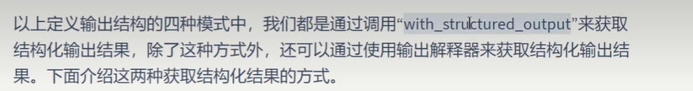

## 4.1 使用with_structured_output函数

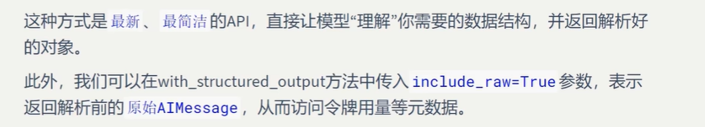

### 实例代码

```
from dataclasses import dataclass
from langchain_openai import ChatOpenAI
from pydantic import Field, BaseModel
from rich import print as rprint

# 创建模型实例
model = ChatOpenAI(
    # model="mistral-nemo:latest",
    model="qwen3-vl:latest",
    api_key="sk12345",
    base_url="http://localhost:11434/v1",
)

class Movie(BaseModel):
    """电影详细信息"""
    title: str = Field(description="电影标题")
    year: int = Field(description="上映年份")
    director: str = Field(description="导演")
    rating: float = Field(description="评分(10分制)")

s_model = model.with_structured_output(Movie,include_raw=True) # 使用了这个参数，输出格式会变，不再是class Movie而是dict
resp = s_model.invoke("给我介绍下电影《星际穿越》")
print(type(resp))
rprint(resp)


```


### 模型输出

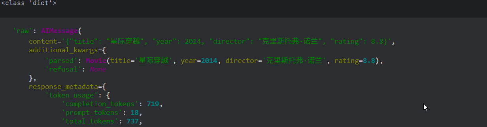

#### 注意，添加了include_raw参数后，输出的类型就从pydantic类变为dict。仔细查看输出内容，它有一个“raw” key，值是一个AIMessage对象，然后下面有一个“parsed” key，值就是pydantic类

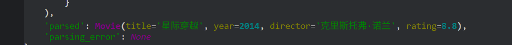

## 4.2 使用输出解析器，不推荐

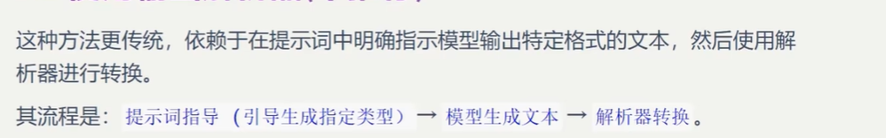

### 实例代码

```
from langchain_core.output_parsers import JsonOutputParser
from langchain_core.prompts import ChatPromptTemplate
from langchain_openai import ChatOpenAI
from pydantic import Field, BaseModel
from rich import print as rprint

# 1.创建提示词模板
prompt_template = ChatPromptTemplate.from_messages([
      ("system","回答优化问题，必须始终输出一个包含title(电影标题)和year(上映年份)的JSON对象"),
      ("human", "问题: {question} ")
])
# 2.创建模型实例
model = ChatOpenAI(
    # model="mistral-nemo:latest",
    model="qwen3-vl:latest",
    api_key="sk12345",
    base_url="http://localhost:11434/v1",
)
# 3.定义结构
class Movie(BaseModel):
    """电影详细信息"""
    title: str = Field(description="电影标题")
    year: int = Field(description="上映年份")

# 4.创建解析器
parser = JsonOutputParser(pydantic_object=Movie)

# 5.创建链
chain = prompt_template | model | parser
# 6.调用，返回字典
resp = chain.invoke({"question":"请介绍电影盗梦空间"})
print(resp)
```


### 模型输出：

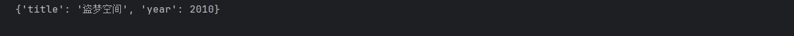


# 扩展：激活pycharm2025

网站：https://blog.idejihuo.com/jetbrains/intellij-idea-2025-2-latest-activation-tutorial-permanent-activation-code-cracking-tool-2099.html

工具下载： https://fileio.lanzouw.com/ibL0z3d03sng

下载后解压缩，然后以管理员的身份运行jetbra-free-windows7-amd64.exe，会打开一个本地网站，我们只需要配置好名字和过期时间，点击submit，然后用鼠标点击我们需要激活的软件，出现cracked，说明激活成功
