# 1.理解Agent

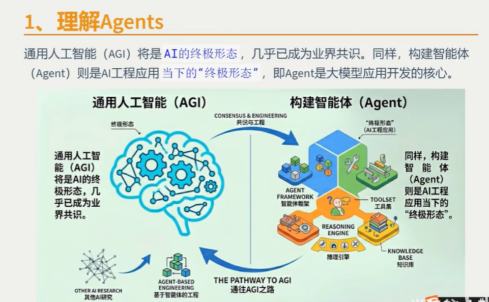

## 1.1 什么是Agent？

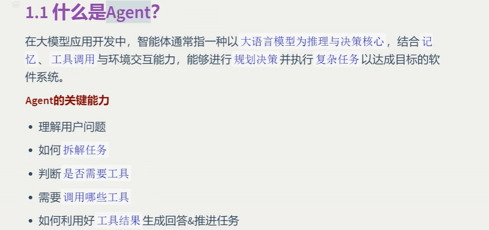

## 1.2 Agent的核心组件

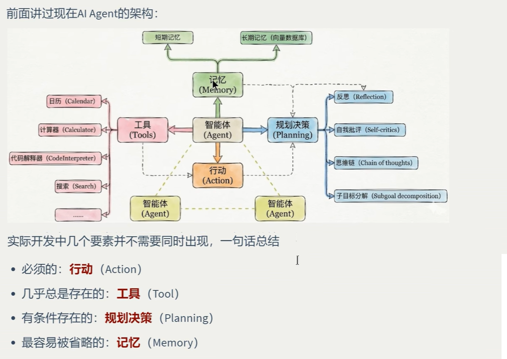

### 1.3 Agent的创建与调用

### 1.3.1 历史上的调用

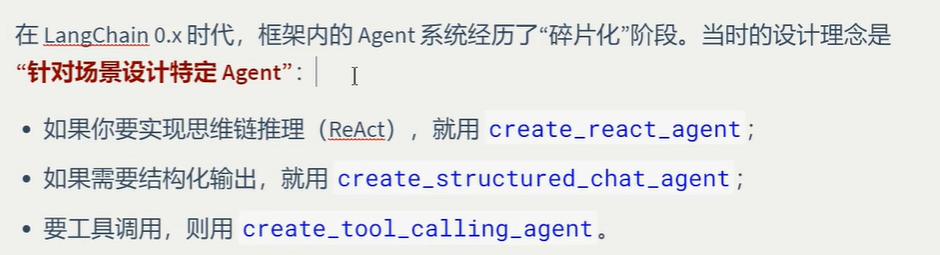

  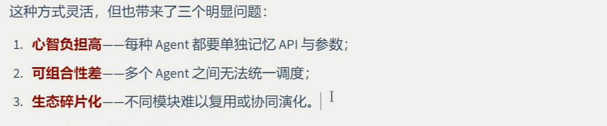

### 1.3.2 全新调用

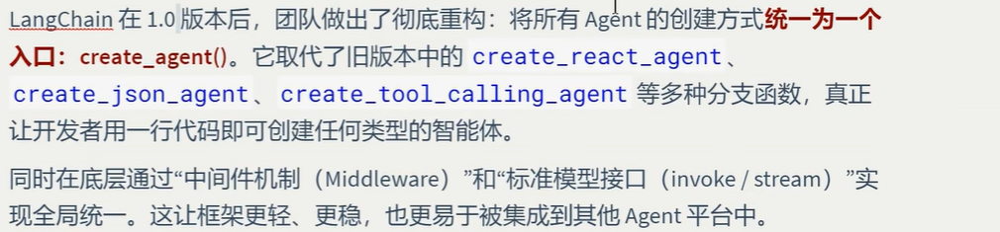

#### 实例

```
from langchain_openai import ChatOpenAI
from langchain.agents import create_agent
from rich import print as rprint
# 1.初始化模型
model = ChatOpenAI(
    # model="mistral-nemo:latest",
    model="qwen3-vl:latest",
    api_key="sk12345",
    base_url="http://localhost:11434/v1",
)
# 2.创建agent
agent = create_agent(
    model=model,
    tools=[],
    system_prompt="Agent的行为指令" # 可选
)
# 3.调用
result = agent.invoke({
    "messages":[{"role":"user","content":"介绍一下你自己"}]
})

rprint(result)
```


#### Agent输出：

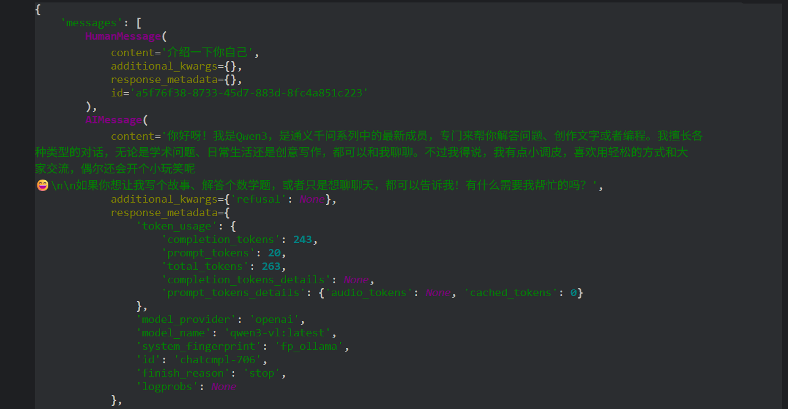

### 注意：Agent是会使用工具的。我们把一些工具封装到一个tool_utils.py文件中，内容如下

```
## 定义工具
from langchain_core.tools import tool
from dotenv import load_dotenv
import requests
import os


# 工具1
@tool(parse_docstring=True)
def get_stock_price(company:str,timeframe: str="today") ->str:
    """ 
    获取指定公司的股票在指定时间的价格

    Args:
         company : 具体的公司名称
         timeframe : 时间范围 (today-今日,week-本周,month-本月)

    """
    print(timeframe)
    stock_data = {
        "苹果公司":{"today":185.2,"week":183.5,"month":180.75},
        "谷歌公司":{"today":15.42,"week":15.2,"month":14.85},
        "微软公司":{"today":415.86,"week":412.30,"month":405.42},
    }

    if company in stock_data:
        price = stock_data[company].get(timeframe,"")
        return f"{company} {timeframe}的股价是{price}美元"
    else:
        return f"没有找到{company}的股票信息。"

## 工具2
@tool(parse_docstring=True)
def search_news(company:str) ->str:
    """ 
    搜索指定公司的新闻

    Args:
         company : 公司名称，如：谷歌公司

    Returns:
         指定公司的新闻     
    """
    news_data = {
        "苹果公司":[
            "发布新款Iphone，股价上涨3%","苹果与欧盟达成反垄断和解协议","苹果将在印度扩大生产规模"
        ],

        "谷歌公司":[
           "谷歌发布AI新模型，性能提升20%","谷歌与OpenAI合作，开发AI新模型","谷歌在欧洲开展AI新研究项目",
        ],

        "微软公司":[
           "微软Azuze云业务季度增长超预期","微软完成对Nuance公司的收购","微软推出新一代AI助手Copilot"
        ],
    }

    if company in news_data:
        return "\n".join(news_data[company])
    else:
        return f"找不到关于{company}的新闻"

## 使用docstring方式不需要arg_schema
@tool(parse_docstring=True)
def get_weather2(city:str="北京",if_forecast:bool=False):
    """ 
    查询当天的天气，可以包含明天的天气预报

    Args:
         city : 具体的城市
         if_forecast : 是否包含明天的天气预报

    Returns:
         城市的当天的天气，可以包含明天的天气预报     
    """
    res = f"{city}明天天气不错"
    if if_forecast:
        res += f"\n{city}明天有大到暴雨"
    return res 

    
## 真正可以查询天气的工具
@tool
def query_weather_from_web(city="Beijing", aqi="no", language="zh_cn"):
     """ 
             获取指定城市的天气信息
             参数：
             city：城市的名称，如"上海"
             api_key: OpenWeather的api key
             返回值：
                         天气信息字符串
          
    """ 
     load_dotenv(override=True)
     appid = os.getenv("Weather_api_key")
     # 构建请求URL
     url = "https://api.weatherapi.com/v1/current.json"
     # 设置查询参数
     params = {
         "q": city,                 # 查询的城市，默认为北京
         "key": appid,          # API密钥
         "aqi": aqi,            # 测量单位，默认为摄氏度
         "lang": language           # 输出语言，默认为简体中文
     }
     # 发送GET请求
     response = requests.get(url, params=params)
     # 检查响应状态
     if response.status_code == 200:
         # 解析响应数据
         data = response.json()
         return data
     
     else:
         print(f"查询失败，状态码：{response.status_code}")
         print("响应数据：", response.text)
         return {"error":"weather api 调用失败。。。"}
         


```


### 里面有一个工具函数可以调用webapi查询天气，我们把它以工具的发送传递给agent

```
## agent会使用工具？
from langchain_openai import ChatOpenAI
from langchain.agents import create_agent
from rich import print as rprint
from tool_utils import  query_weather_from_web
# 1.初始化模型
model = ChatOpenAI(
    # model="mistral-nemo:latest",
    model="qwen3-vl:latest",
    api_key="sk12345",
    base_url="http://localhost:11434/v1",
)
# 2.创建agent
agent = create_agent(
    model=model,
    tools=[query_weather_from_web],
    system_prompt="Agent的行为指令" # 可选
)
# 3.调用
result = agent.invoke({
    "messages":[{"role":"user","content":"北京明天的天气如何？"}]
})

rprint(result)
```


### agent输出

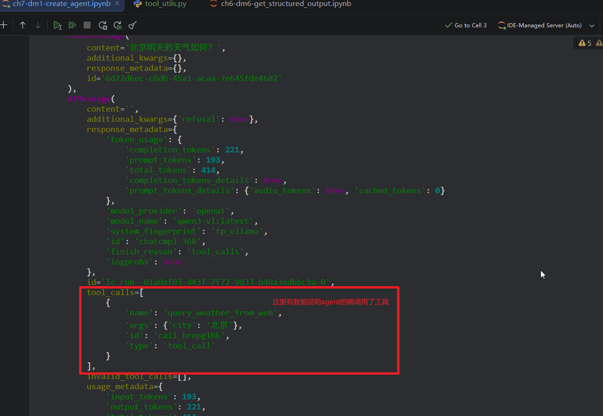

# 2.Agent的基本用法1：模型的传入方式

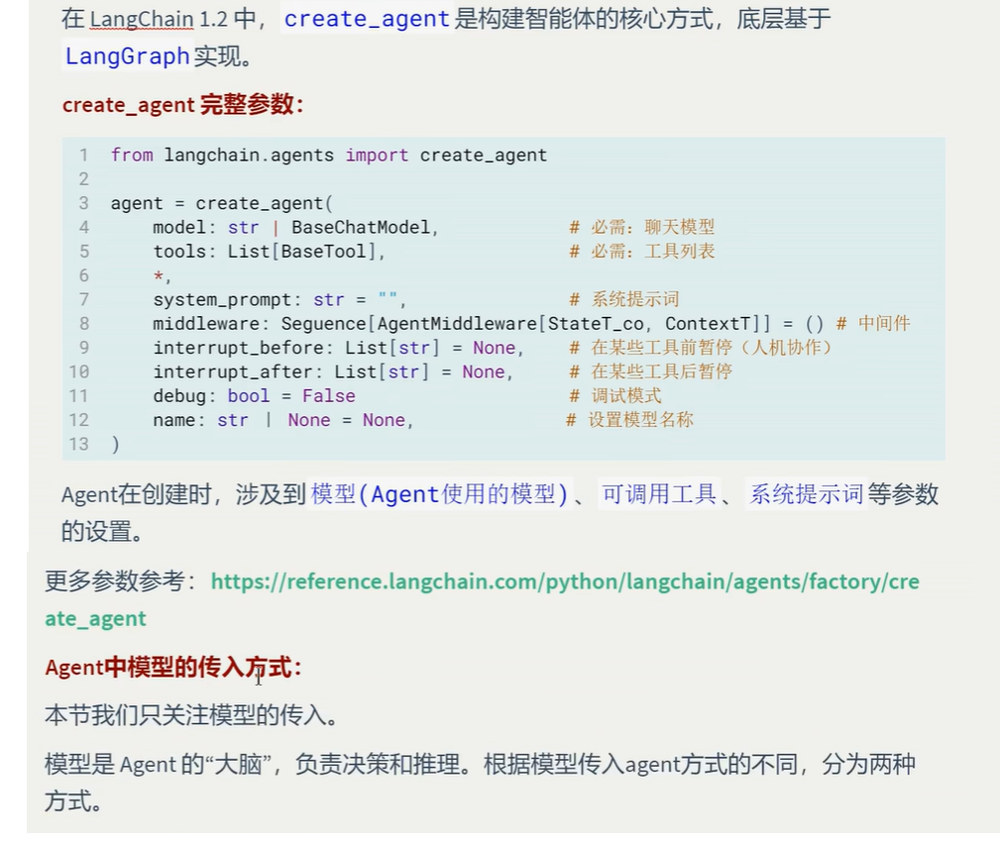

## 2.1 传入模型字符串

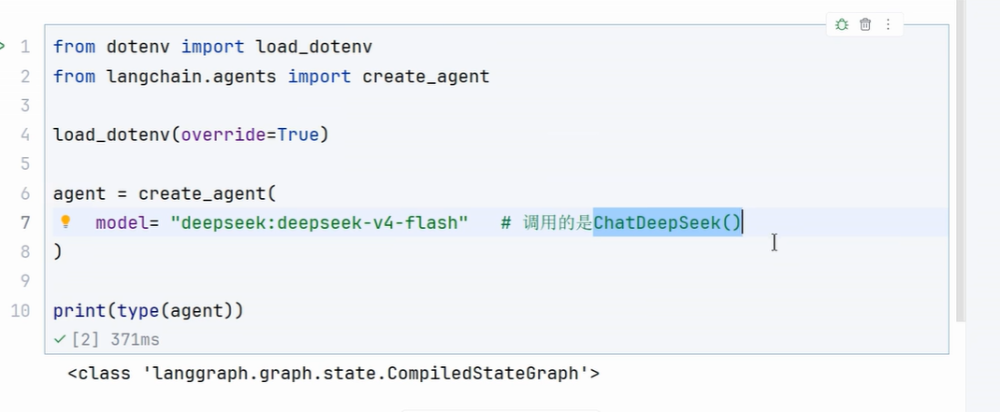

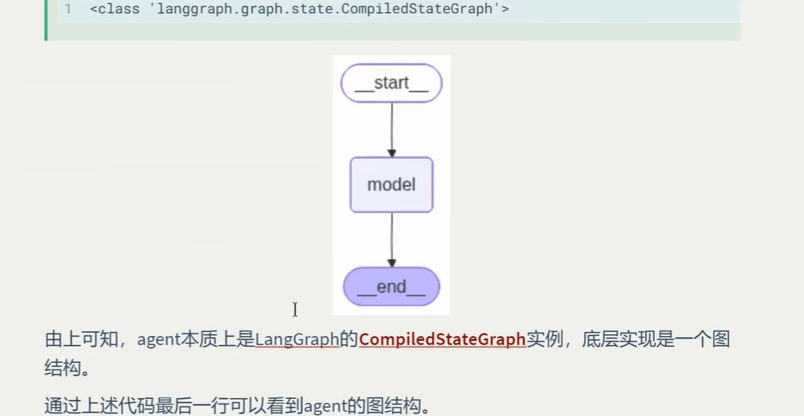

### 注意：创建agent是需要langgraph支持的。

### 举例代码1，在线模型

```
from langchain.agents import create_agent
from dotenv import load_dotenv

load_dotenv(override=True)

agent = create_agent(
    "groq:openai/gpt-oss-120b", # 必须给出模型提供商比,如这里的groq:
)
print(type(agent))

from IPython.display import Image,display
display(Image(agent.get_graph().draw_mermaid_png()))
```

### 运行结果

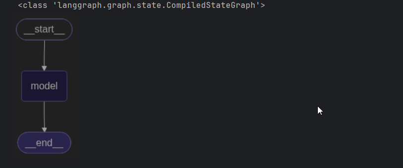

### 举例2，本地大模型

```
from langchain.agents import create_agent
from dotenv import load_dotenv

load_dotenv(override=True)

agent = create_agent(
    "ollama:qwen3-vl:latest", # 必须给出模型提供商比,如这里的groq:
)
print(type(agent))

from IPython.display import Image,display
display(Image(agent.get_graph().draw_mermaid_png()))
```

### 运行结果

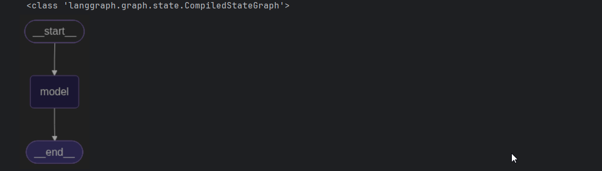

## 2.2 传入模型对象

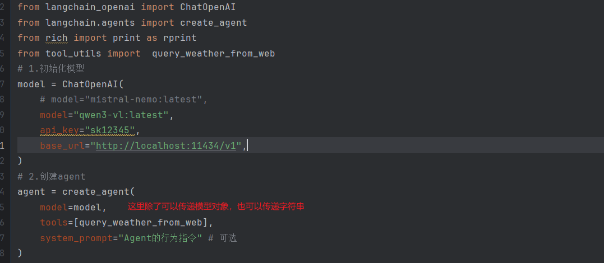

# 3.Agent的基本用法2：如何调用Agent

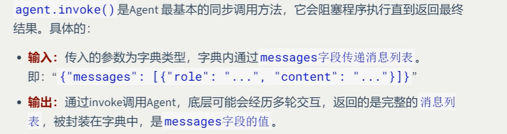

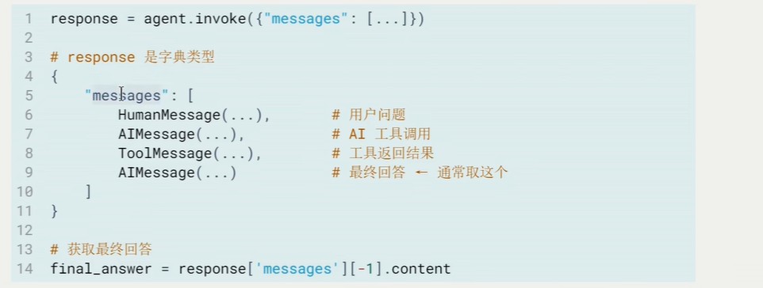

#### 实例代码参考上面的例子

# 4.Agent的基本用法3：绑定工具

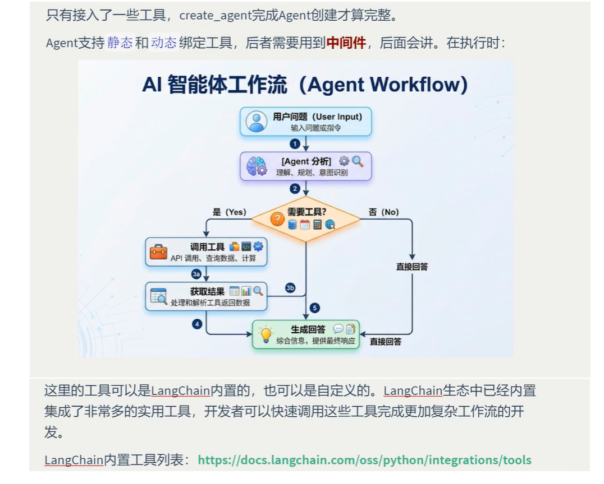

## 查看langchain的内置工具，网址： https://www.langchain.com.cn/docs/integrations/tools/


## 4.1 基本用法：

### 举例1：绑定一个工具

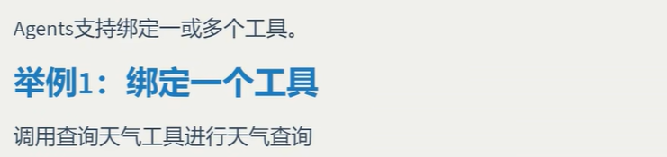

### 实例代码

```

from langchain_openai import ChatOpenAI
from langchain.agents import create_agent
from rich import print as rprint
from tool_utils import  query_weather_from_web
# 1.初始化模型
model = ChatOpenAI(
    # model="mistral-nemo:latest",
    model="qwen3-vl:latest",
    api_key="sk12345",
    base_url="http://localhost:11434/v1",
)
# 2.创建agent
agent = create_agent(
    model=model,
    tools=[query_weather_from_web],
    system_prompt="Agent的行为指令" # 可选
)
# 3.调用
result = agent.invoke({
    "messages":[{"role":"user","content":"北京明天的天气如何？"}]
})

rprint(result)
```


### agent输出

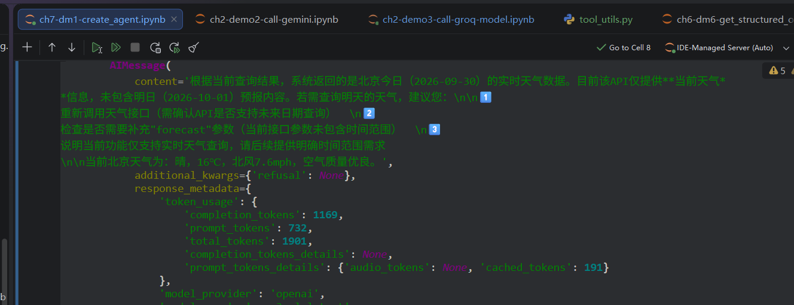

### 举例2：接入内置工具

#### 这里我们使用TavilyResearch，我们需要先获取他的api key保存到.env文件中。

```
import os

from langchain.agents import create_agent
from dotenv import load_dotenv
from langchain_tavily import TavilyResearch

load_dotenv(override=True)

tavily_api_key = os.getenv("Tavily_api_key")
# 创建langchain内置工具实例
tavily = TavilyResearch(
    max_results=2,
    tavily_api_key=tavily_api_key,
)

agent = create_agent(
    "ollama:carstenuhlig/omnicoder-9b:latest",  # 必须给出模型提供商比,如这里的ollama，这个模型还好
    tools=[tavily]
)
# print(type(agent))
resp = agent.invoke({
    "messages":[
        {"role":"user","content":"请帮我查一下2024年诺贝尔物理学奖得主是谁？"}
    ]
})


from IPython.display import Image, display

display(Image(agent.get_graph().draw_mermaid_png()))

```

### agent输出

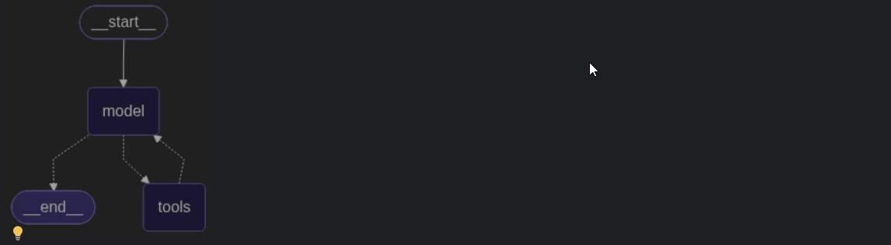

```
print(resp)
```


### agent 输出

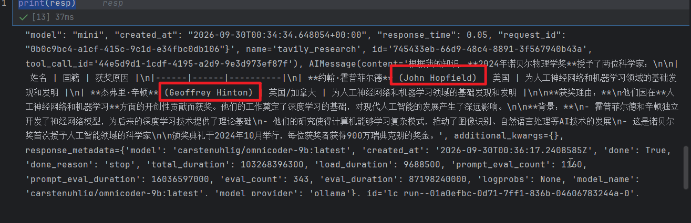

### 举例3：绑定多个工具

```
from langchain_core.tools import tool
import os

from langchain.agents import create_agent
from dotenv import load_dotenv
from langchain_tavily import TavilyResearch


load_dotenv(override=True)


@tool(parse_docstring=True)
def get_weather(city:str="广州"):
    """
    查询具体城市的天气

    Args:
          city : 城市名称，如北京

    Returns:
            城市当天的天气
    """
    return f"{city}今天天气很好，阳光明媚，适合郊游~~"


@tool(parse_docstring=True)
def get_news() ->str:
    """
    获取新闻

    Returns:
             返回当前的热点新闻
    """
    return "最近AI智能体非常火爆，有大量的工作岗位缺口，需求量非常大!!!"

agent = create_agent(
    # "ollama:mistral-nemo:latest",  # 必须给出模型提供商比,如这里的ollama:
    # "ollama:granite3.2:8b",  # 必须给出模型提供商比,如这里的ollama:
    "ollama:qwen3-vl:latest",  # 必须给出模型提供商比,如这里的ollama:
    tools=[get_weather,get_news]
)
# print(type(agent))
resp = agent.invoke({
    "messages":[
        {"role":"user","content":"广州今天天气怎么样？最近有什么新闻？"}
    ]
})

print(resp["messages"][-1])

```


### agent输出

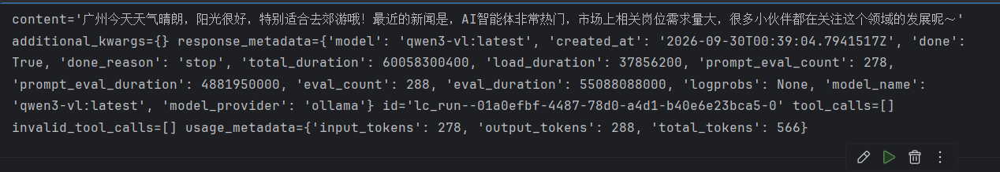

## 4.2工具调用流程分析

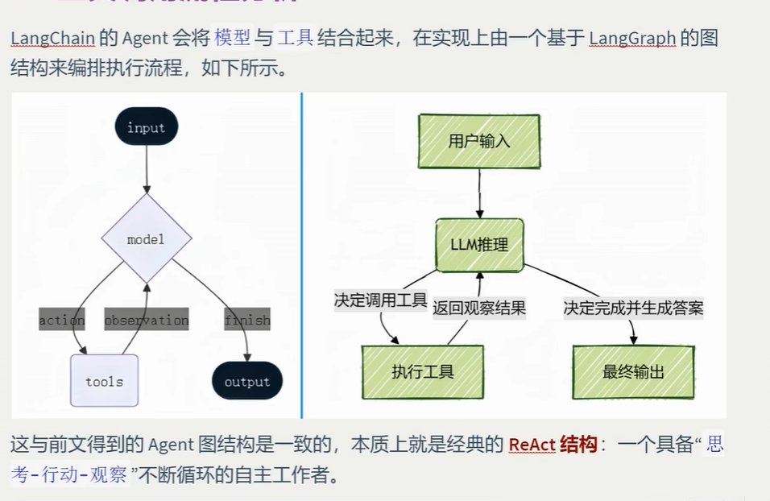

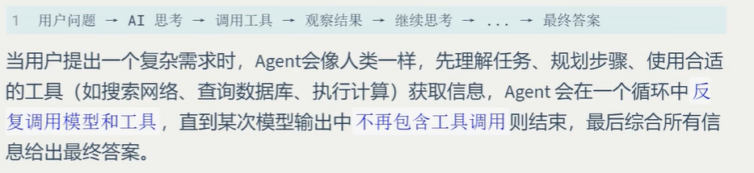

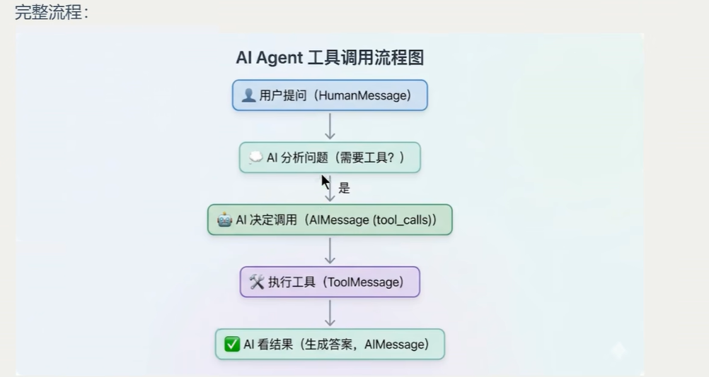

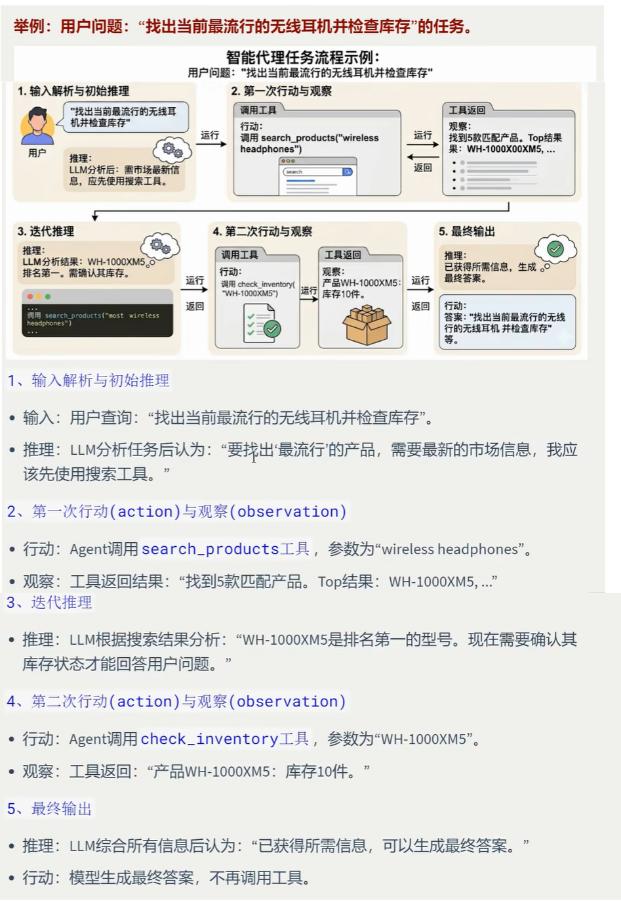

## 4.3 重试机制


### 举例代码

```
from langchain_core.messages import SystemMessage, HumanMessage
from langchain_core.tools import tool
import os

from langchain.agents import create_agent
from dotenv import load_dotenv
from rich import print as rprint


load_dotenv(override=True)

flag = 0
@tool(parse_docstring=True)
def get_weather(city:str="广州"):
    """
    查询具体城市的天气

    Args:
          city : 城市名称，如北京

    Returns:
            城市当天的天气
    """
    global flag
    flag += 1
    if flag < 3:
        return "TEMP_UNAVAILABLE:天气服务暂时不可用，请稍后重试"
    return f"{city}今天天气很好，阳光明媚，适合郊游~~"

agent = create_agent(
    # "ollama:mistral-nemo:latest",  # 必须给出模型提供商比,如这里的ollama:
    # "ollama:granite3.2:8b",  # 必须给出模型提供商比,如这里的ollama:
    "ollama:qwen3-vl:latest",  # 必须给出模型提供商比,如这里的ollama:
    tools=[get_weather]
)
msgs = [
    SystemMessage("""
    你是一个天气助手。
    当工具返回以'TEMP_UNAVAILABLE:' 开头的结果时，
    你应该再次调用同一个工具，最多重试3次。
    如果3次后仍然失败，再向用户说明服务暂时不可用。
    """),
    HumanMessage("杭州今天的天气如何？")
]
resp = agent.invoke({"messages":msgs})

rprint(resp)
```


### agent输出,有点长，但是agent的确重试了3次，最后得到结果了

```
{
    'messages': [
        SystemMessage(
            content="\n    你是一个天气助手。\n    当工具返回以'TEMP_UNAVAILABLE:' 开头的结果时，\n    
你应该再次调用同一个工具，最多重试3次。\n    如果3次后仍然失败，再向用户说明服务暂时不可用。\n    ",
            additional_kwargs={},
            response_metadata={},
            id='4ac16108-5bfd-45cf-8ea0-9bc83eed8c85'
        ),
        HumanMessage(
            content='杭州今天的天气如何？',
            additional_kwargs={},
            response_metadata={},
            id='de9bc1cc-5a07-46ac-b0ba-4d88185b31a0'
        ),
        AIMessage(
            content='',
            additional_kwargs={},
            response_metadata={
                'model': 'qwen3-vl:latest',
                'created_at': '2026-09-30T02:12:43.880292Z',
                'done': True,
                'done_reason': 'stop',
                'total_duration': 40245963400,
                'load_duration': 10443900,
                'prompt_eval_count': 210,
                'prompt_eval_duration': 9708206000,
                'eval_count': 152,
                'eval_duration': 30447709000,
                'logprobs': None,
                'model_name': 'qwen3-vl:latest',
                'model_provider': 'ollama'
            },
            id='lc_run--01a0f015-4faf-7312-82d3-e1f2e9ba5ec9-0',
            tool_calls=[
                {
                    'name': 'get_weather',
                    'args': {'city': '杭州'},
                    'id': '64c9c089-ce3a-4652-909e-c3ca81497002',
                    'type': 'tool_call'
                }
            ],
            invalid_tool_calls=[],
            usage_metadata={'input_tokens': 210, 'output_tokens': 152, 'total_tokens': 362}
        ),
        ToolMessage(
            content='TEMP_UNAVAILABLE:天气服务暂时不可用，请稍后重试',
            name='get_weather',
            id='20a8f296-4cba-4fd3-81d4-a28263897f7f',
            tool_call_id='64c9c089-ce3a-4652-909e-c3ca81497002'
        ),
        AIMessage(
            content='',
            additional_kwargs={},
            response_metadata={
                'model': 'qwen3-vl:latest',
                'created_at': '2026-09-30T02:13:18.019742Z',
                'done': True,
                'done_reason': 'stop',
                'total_duration': 34122387100,
                'load_duration': 9664100,
                'prompt_eval_count': 257,
                'prompt_eval_duration': 3375635000,
                'eval_count': 141,
                'eval_duration': 30727596000,
                'logprobs': None,
                'model_name': 'qwen3-vl:latest',
                'model_provider': 'ollama'
            },
            id='lc_run--01a0f015-ecf6-77d1-b487-ed03c9f87b46-0',
            tool_calls=[
                {
                    'name': 'get_weather',
                    'args': {'city': '杭州'},
                    'id': '879565e3-0525-45ce-80a3-3fbea989ce78',
                    'type': 'tool_call'
                }
            ],
            invalid_tool_calls=[],
            usage_metadata={'input_tokens': 257, 'output_tokens': 141, 'total_tokens': 398}
        ),
        ToolMessage(
            content='TEMP_UNAVAILABLE:天气服务暂时不可用，请稍后重试',
            name='get_weather',
            id='5ccf8308-50c1-4244-9d42-96e43dadd355',
            tool_call_id='879565e3-0525-45ce-80a3-3fbea989ce78'
        ),
        AIMessage(
            content='',
            additional_kwargs={},
            response_metadata={
                'model': 'qwen3-vl:latest',
                'created_at': '2026-09-30T02:14:11.9049592Z',
                'done': True,
                'done_reason': 'stop',
                'total_duration': 53874336100,
                'load_duration': 4831900,
                'prompt_eval_count': 304,
                'prompt_eval_duration': 3384616000,
                'eval_count': 227,
                'eval_duration': 50472155000,
                'logprobs': None,
                'model_name': 'qwen3-vl:latest',
                'model_provider': 'ollama'
            },
            id='lc_run--01a0f016-724c-78c2-8a4a-261f941de77b-0',
            tool_calls=[
                {
                    'name': 'get_weather',
                    'args': {'city': '杭州'},
                    'id': 'f31e21b1-f326-4f98-8fa7-4e69fd72db65',
                    'type': 'tool_call'
                }
            ],
            invalid_tool_calls=[],
            usage_metadata={'input_tokens': 304, 'output_tokens': 227, 'total_tokens': 531}
        ),
        ToolMessage(
            content='杭州今天天气很好，阳光明媚，适合郊游~~',
            name='get_weather',
            id='d12eb27d-3c45-4a49-9273-b207ee1ff912',
            tool_call_id='f31e21b1-f326-4f98-8fa7-4e69fd72db65'
        ),
        AIMessage(
            content='杭州今天天气很好，阳光明媚，适合郊游~~',
            additional_kwargs={},
            response_metadata={
                'model': 'qwen3-vl:latest',
                'created_at': '2026-09-30T02:14:45.3170612Z',
                'done': True,
                'done_reason': 'stop',
                'total_duration': 33399604100,
                'load_duration': 13671800,
                'prompt_eval_count': 349,
                'prompt_eval_duration': 3632446000,
                'eval_count': 159,
                'eval_duration': 29728191000,
                'logprobs': None,
                'model_name': 'qwen3-vl:latest',
                'model_provider': 'ollama'
            },
            id='lc_run--01a0f017-44cb-7773-87dc-6e453ca9595b-0',
            tool_calls=[],
            invalid_tool_calls=[],
            usage_metadata={'input_tokens': 349, 'output_tokens': 159, 'total_tokens': 508}
        )
    ]
}
```


## 4.4 常见问题

### 1.agent如何选择工具？

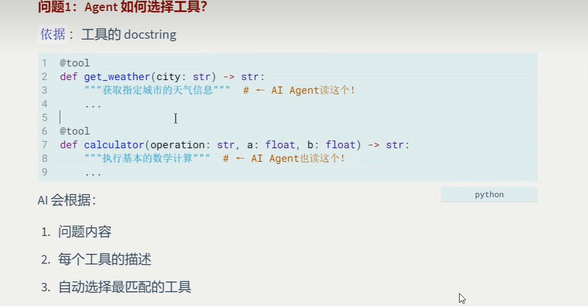

### 2.agent为什么没有调用工具？

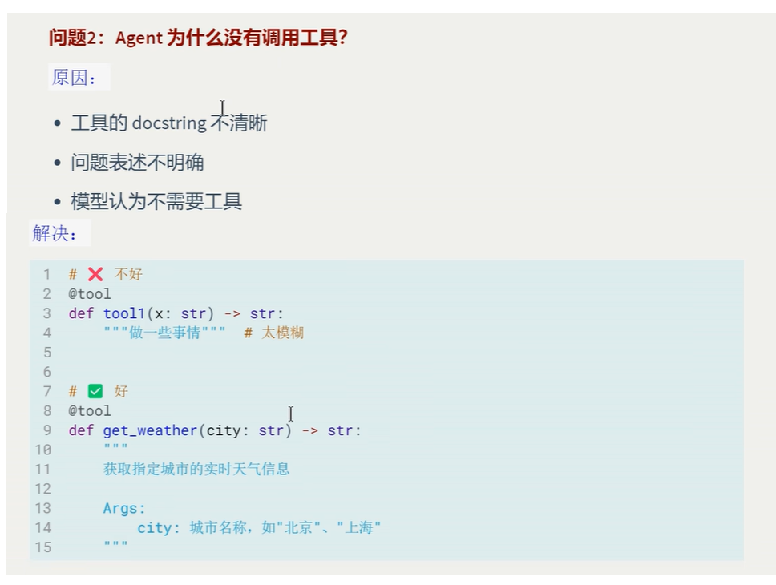

### 3.agent选错工具？

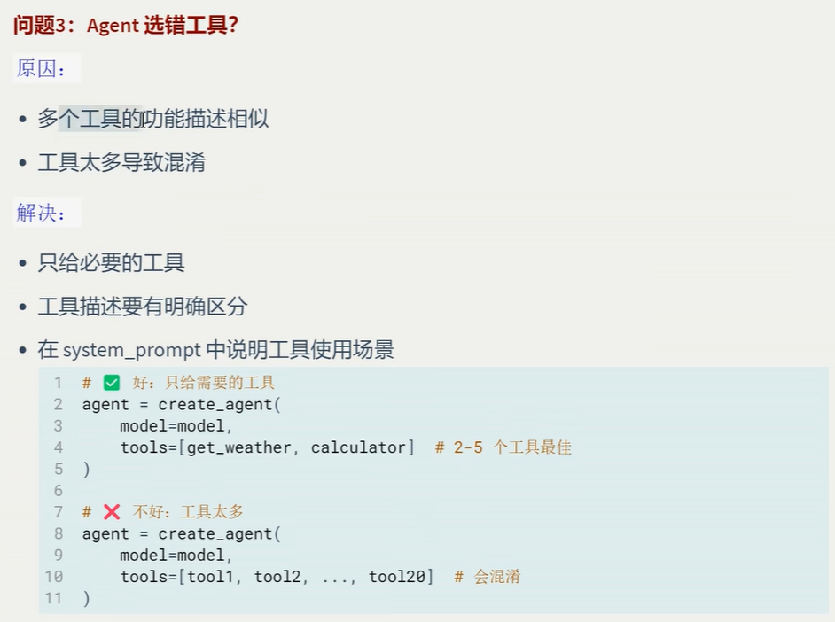

### 4.如何知道Agent何时完成？

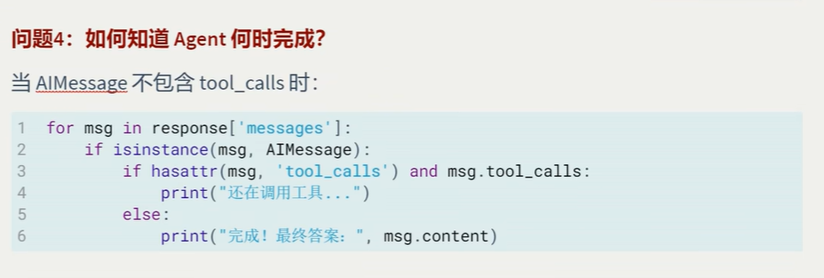

### 5.Agent可以调用多少次工具？

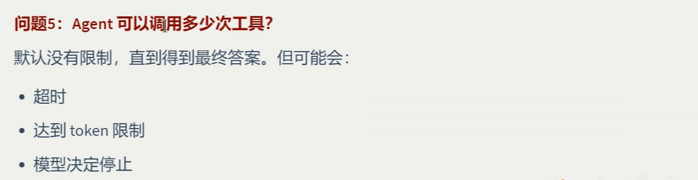

### 6.如何限制工具调用次数

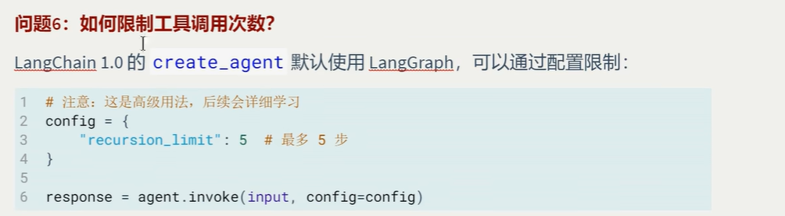


# 5.Agent的高级用法1：实战Agent名称


## 5.1用法

### 实例代码

```
from langchain_core.messages import SystemMessage, HumanMessage
from langchain.agents import create_agent
from rich import print as rprint

agent = create_agent(
    "ollama:qwen3-vl:latest",  # 必须给出模型提供商比,如这里的ollama:
    name="Linda", #给agent起名字
    tools=[]
)

msgs = [
    SystemMessage("""
    你是一个非常友好的ai助手。
    """),
    HumanMessage("中国古代的四大美女都有谁？")
]
resp = agent.invoke({"messages":msgs})

rprint(resp)

```


### 然后我们可以在agent的输出中找到我们给它的名字

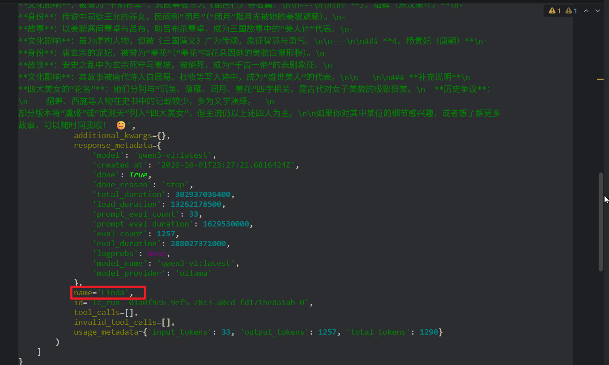

## 5.2 经典使用场景，其实只是在多智能体的场景中有用

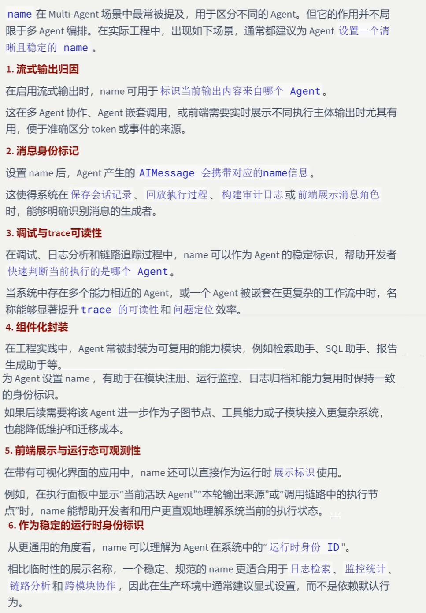

# 6.Agent的高级用法2：系统提示词

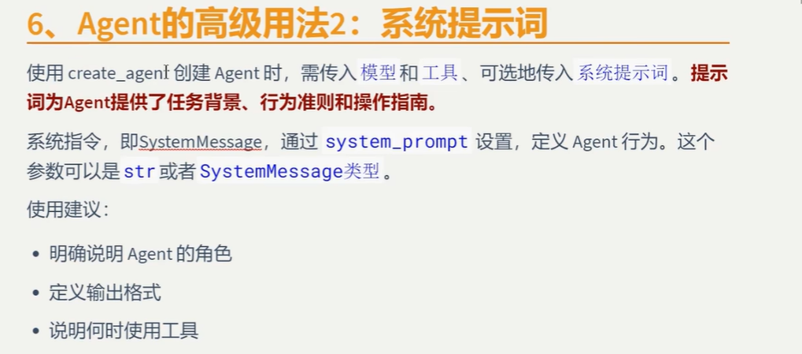

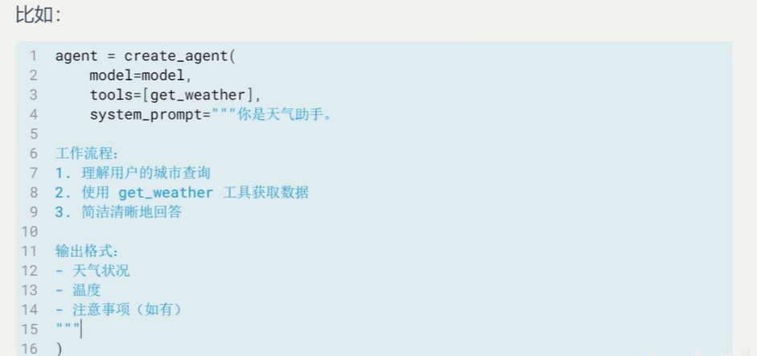

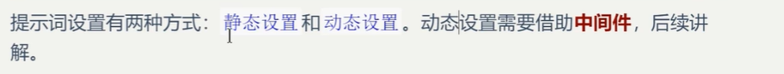

### 实例代码1，这里我们结合system_prompt参数和DuckDuckGo搜索工具来举例，需要先安装这两个工具

```
pip install -U duckduckgo-search <br>
pip install -U ddgs
```

#### 举例1代码,使用DuckDuckGoSearchRun

```
from langchain_community.tools import DuckDuckGoSearchRun
import os

from langchain.agents import create_agent
from dotenv import load_dotenv
from rich import print as rprint

load_dotenv(override=True)
ddg = DuckDuckGoSearchRun()

agent = create_agent(
    "ollama:carstenuhlig/omnicoder-9b:latest",  # 必须给出模型提供商比,如这里的ollama，这个模型还好
    tools=[ddg],
    system_prompt="你是一个全能的AI助手，你很擅长使用DuckDuckGo来搜索"
)
# print(type(agent))
resp = agent.invoke({
    "messages":[
        {"role":"user","content":"请帮我查一下2025诺贝尔和平奖的得主？"}
    ]
})

rprint(resp)

```


#### agent输出

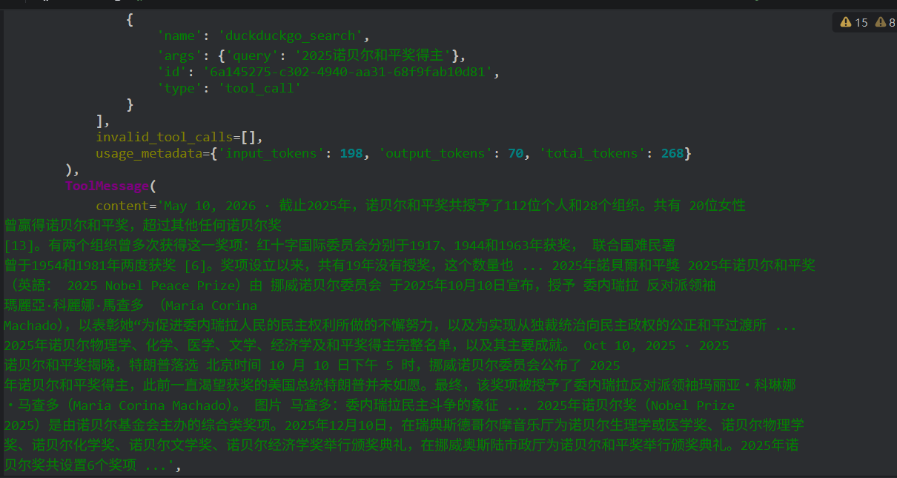

#### 举例代码2.使用DuckDuckGoSearchResults

```
from langchain_community.tools import DuckDuckGoSearchRun, DuckDuckGoSearchResults
import os

from langchain.agents import create_agent
from dotenv import load_dotenv
from langchain_tavily import TavilyResearch

load_dotenv(override=True)
ddg = DuckDuckGoSearchResults()

agent = create_agent(
    "ollama:carstenuhlig/omnicoder-9b:latest",  # 必须给出模型提供商比,如这里的ollama，这个模型还好
    tools=[ddg],
    system_prompt="你是一个全能的AI助手，你很擅长使用DuckDuckGo来搜索"
)
# print(type(agent))
resp = agent.invoke({
    "messages":[
        {"role":"user","content":"请帮我查一下2026年足球世界杯的主办国是那个国家？"}
    ]
})


for msg in resp['messages']:
    msg.pretty_print()
```


#### agent输出

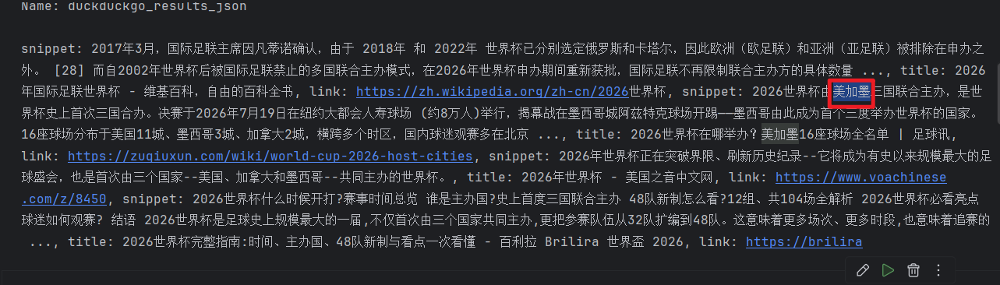

#### 举例3.使用DuckDuckGoSearchResults来查询新闻

```
from langchain_community.tools import DuckDuckGoSearchRun, DuckDuckGoSearchResults
import os

from langchain.agents import create_agent
from dotenv import load_dotenv
from langchain_tavily import TavilyResearch

load_dotenv(override=True)
ddg = DuckDuckGoSearchResults(backend='news') # 设置DuckDuckGo专注于新闻

agent = create_agent(
    "ollama:carstenuhlig/omnicoder-9b:latest",  # 必须给出模型提供商比,如这里的ollama，这个模型还好
    tools=[ddg],
    system_prompt="你是一个全能的AI助手，你很擅长使用DuckDuckGo来搜索"
)
# print(type(agent))
resp = agent.invoke({
    "messages":[
        {"role":"user","content":"华为最近有什么新闻？"}
    ]
})


# from IPython.display import Image, display
#
# display(Image(agent.get_graph().draw_mermaid_png()))
rprint(resp)
```


#### agent 输出

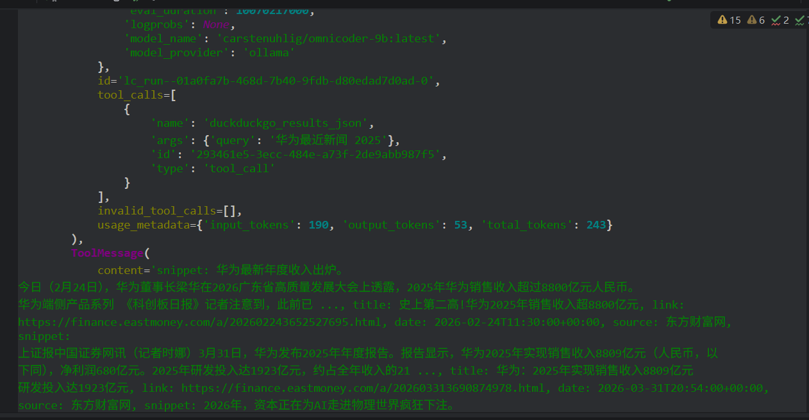

#### DuckDuckGo官方文档

#### https://duckduckgo.com/duckduckgo-help-pages/

# 7.Agent的高级用法3：结构化输出

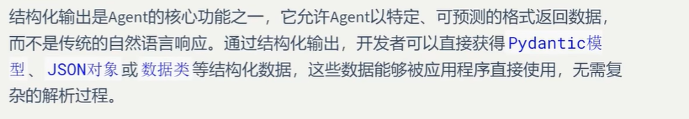

## 7.1模型与Agent的结构化输出对比

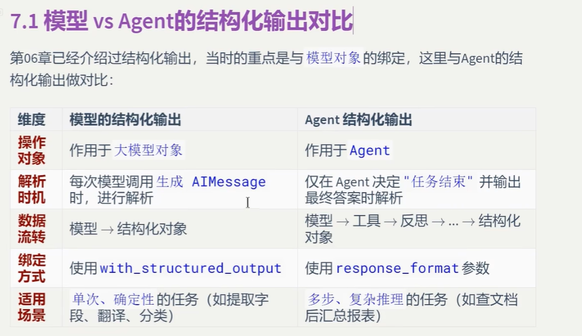

## 7.2 结构化输出的4种策略

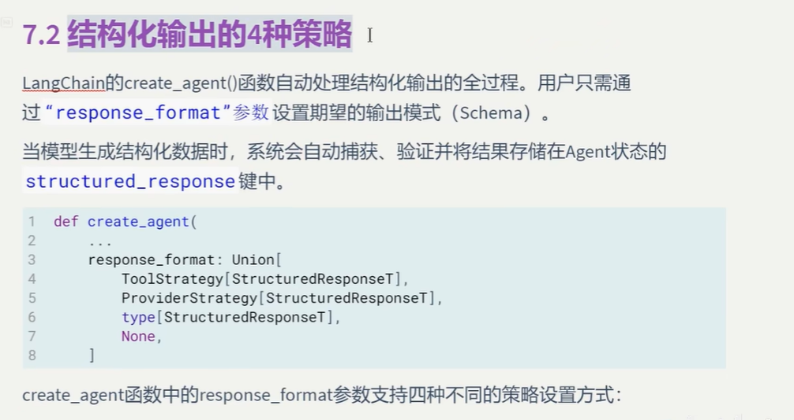

### ①ProviderStrategy

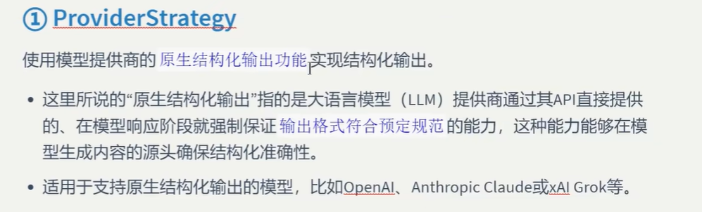

#### 举例代码

```
from pydantic import BaseModel, Field
from langchain.agents.structured_output import ProviderStrategy
from langchain_openai import ChatOpenAI
from langchain.agents import create_agent
from rich import print as rprint
# 1.初始化模型
model = ChatOpenAI(
    # model="mistral-nemo:latest",
    model="qwen3-vl:latest",
    api_key="sk12345",
    base_url="http://localhost:11434/v1",
)
# 2.使用Pydantic结构方式来定义一个类
class ContactInfo(BaseModel):
    """用户的联系方式"""
    name: str = Field(description="用户姓名")
    email: str = Field(description="用户邮箱")
    phone: str = Field(description="用户电话")


# 3.创建agent
agent = create_agent(
    model=model,
    tools=[],
    response_format=ProviderStrategy(ContactInfo), # 结构化输出的第一种方式
    system_prompt="Agent的行为指令" # 可选
)
# 3.调用
result = agent.invoke({
    "messages":[{"role":"user","content":"请提取项目文本的用户信息：王小明的email是 wxm1234@gmail.com,电话是13532677677"}]
})

rprint(result)
```


#### agent输出：

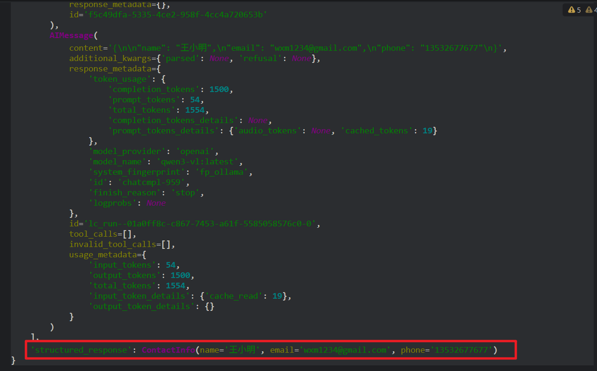

### ②ToolStrategy,前提是模型支持工具调用

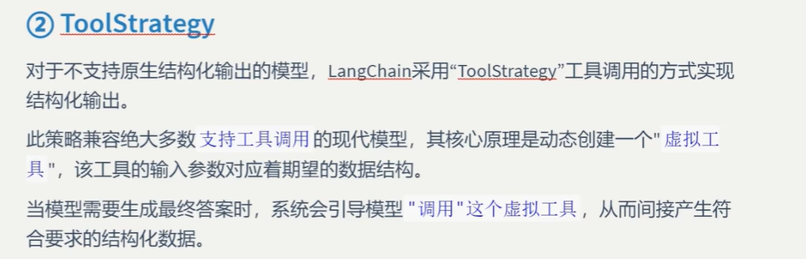

#### 举例代码

```
from pydantic import BaseModel, Field
from langchain.agents.structured_output import ToolStrategy
from langchain_openai import ChatOpenAI
from langchain.agents import create_agent
from rich import print as rprint
# 1.初始化模型
model = ChatOpenAI(
    # model="mistral-nemo:latest",
    model="qwen3-vl:latest",
    api_key="sk12345",
    base_url="http://localhost:11434/v1",
)
# 2.使用Pydantic结构方式来定义一个类
class ContactInfo(BaseModel):
    """用户的联系方式"""
    name: str = Field(description="用户姓名")
    email: str = Field(description="用户邮箱")
    phone: str = Field(description="用户电话")


# 3.创建agent
agent = create_agent(
    model=model,
    tools=[],
    response_format=ToolStrategy(ContactInfo), # 结构化输出的第一种方式
    system_prompt="Agent的行为指令" # 可选
)
# 3.调用
result = agent.invoke({
    "messages":[{"role":"user","content":"请提取项目文本的用户信息：王小明的email是 wxm1234@gmail.com,电话是13532677677"}]
})

rprint(result)
```


#### agent输出

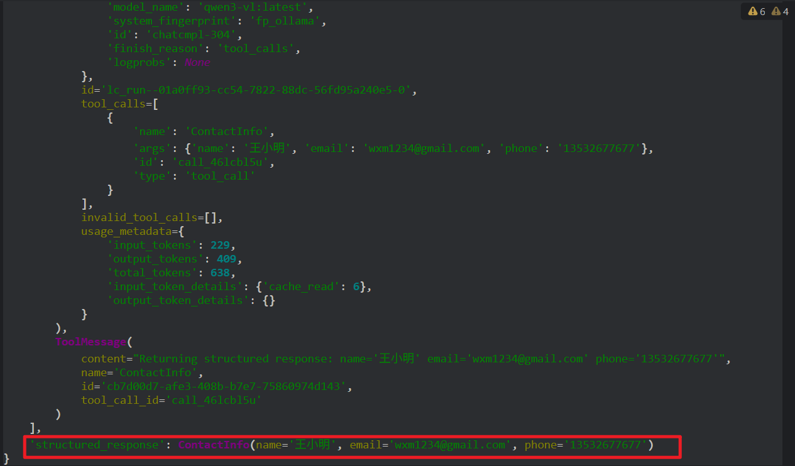

### ③type/AutoStrategy

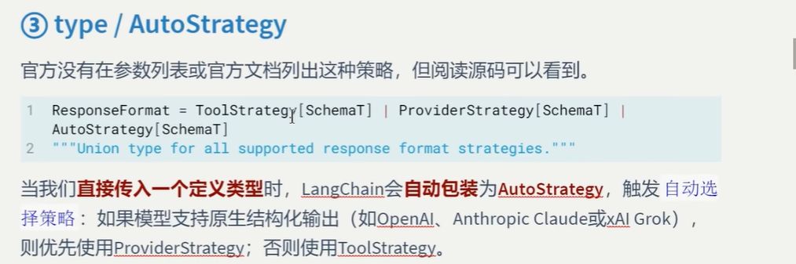

#### 举例代码

```
from pydantic import BaseModel, Field
from langchain.agents.structured_output import AutoStrategy
from langchain_openai import ChatOpenAI
from langchain.agents import create_agent
from rich import print as rprint
# 1.初始化模型
model = ChatOpenAI(
    # model="mistral-nemo:latest",
    model="qwen3-vl:latest",
    api_key="sk12345",
    base_url="http://localhost:11434/v1",
)
# 2.使用Pydantic结构方式来定义一个类
class ContactInfo(BaseModel):
    """用户的联系方式"""
    name: str = Field(description="用户姓名")
    email: str = Field(description="用户邮箱")
    phone: str = Field(description="用户电话")


# 3.创建agent
agent = create_agent(
    model=model,
    tools=[],
    response_format=AutoStrategy(ContactInfo), # 结构化输出的第一种方式
     # response_format=ContactInfo, # 也可以这么写，这就是所谓的type，也就是我们的自定义类型，不过将来会不支持这种方式
    system_prompt="Agent的行为指令" # 可选
)
# 3.调用
result = agent.invoke({
    "messages":[{"role":"user","content":"请提取项目文本的用户信息：王小明的email是 wxm1234@gmail.com,电话是13532677677"}]
})

rprint(result)
```


#### agent输出

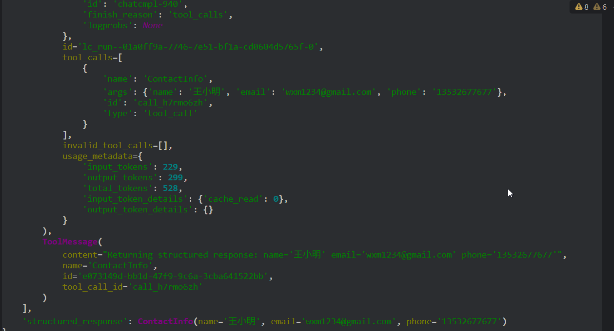

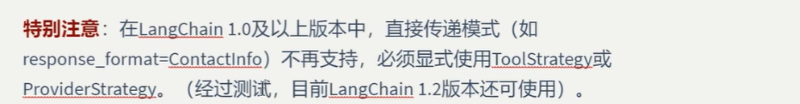

### ④None

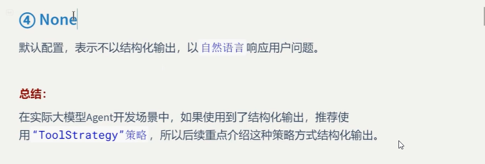

## 7.3ToolStrategy详解

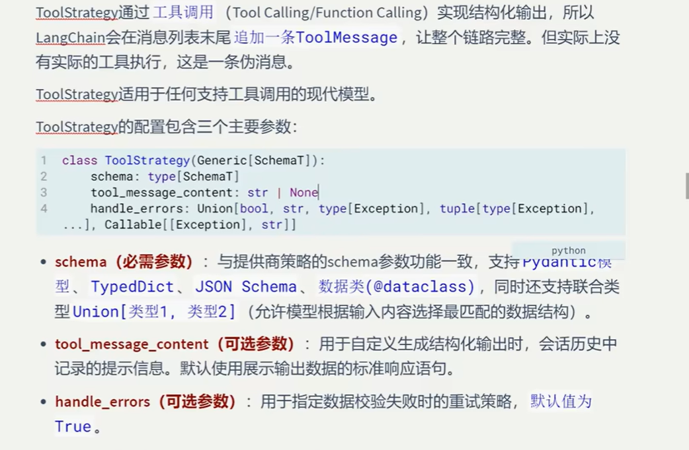

### 7.3.1 结构化输出：schema参数

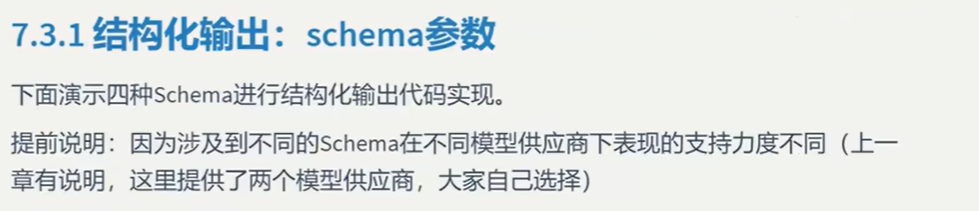

#### 输出模式1： Pydantic

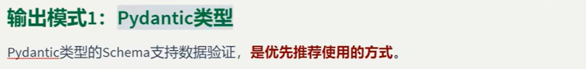

##### 举例代码

```
from pydantic import BaseModel, Field
from langchain.agents.structured_output import AutoStrategy
from langchain_openai import ChatOpenAI
from langchain.agents import create_agent
from rich import print as rprint
# 1.初始化模型
model = ChatOpenAI(
    model="carstenuhlig/omnicoder-9b:latest",
    # model="qwen3-vl:latest",
    api_key="sk12345",
    base_url="http://localhost:11434/v1",
)
# 2.使用Pydantic结构方式来定义一个类
class ContactInfo(BaseModel):
    """用户的联系方式"""
    name: str = Field(description="用户姓名")
    email: str = Field(description="用户邮箱")
    phone: str = Field(description="用户电话")

# 3.创建agent
agent = create_agent(
    model=model,
    tools=[],
    response_format=AutoStrategy(schema=ContactInfo), # 结构化输出的第3种方式
    system_prompt="Agent的行为指令" # 可选
)
# 3.调用
result = agent.invoke({
    "messages":[{"role":"user","content":"请提取项目文本的用户信息：小李的email是 wxm1234@gmail.com,电话是13532677677"}]
})

rprint(result)
```

##### agent输出

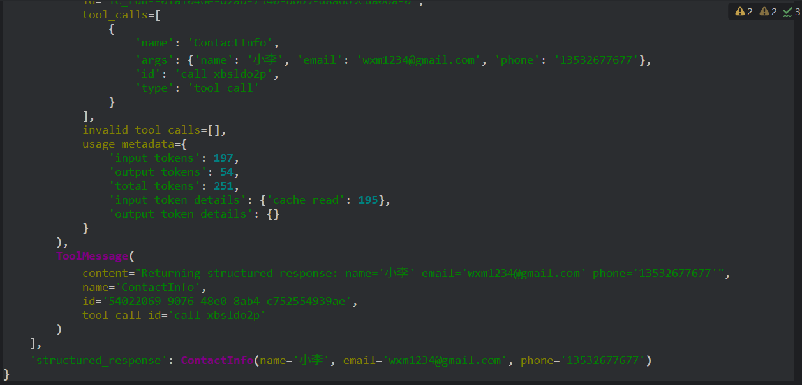

##### 举例2代码

```
from langchain_core.tools import tool
from langchain_core.messages import SystemMessage
from pydantic import BaseModel, Field
from langchain.agents.structured_output import AutoStrategy, ToolStrategy
from langchain_openai import ChatOpenAI
from langchain.agents import create_agent
from rich import print as rprint
from typing import Literal

## 1.定义工具
@tool(parse_docstring=True)
def search_customer_database(query: str)->str:
     """
      在客户数据库搜索信息

     Args:
            query: str,客户查询字符串，如："张三" 或 "李四"

     Returns:
            str: 客户记录字符串，包括客户姓名、等级、最近购买日期和累计消费
     """
     if "张三" in query.lower():
          return "客户记录: 张三，VIP客户，最近购买日期：2026-01-15，累计消费：$15,000"
     elif "李四" in query.lower():
          return "客户记录: 李四，普通客户，最近购买日期：2025-12-20，累计消费：$3,200"
     else:
         return f"关于客户{query}，无记录"

@tool(parse_docstring=True)
def send_email(customer: str)->str:
    """
      发送感谢邮件

     Args:
            customer: str,客户名字，如："张三" 或 "李四"

     Returns:
            str: 确认消息，保护已发送的客户名称
     """
    return f"已向客户：{customer}发送感谢邮件"

# 2.初始化模型
model = ChatOpenAI(
    # model="carstenuhlig/omnicoder-9b:latest", # 在这里不好用
    model="qwen3-vl:latest", # ok
    api_key="sk12345",
    base_url="http://localhost:11434/v1",
)

# 3.定义Pydantic结构类
class CustomerAnalysis(BaseModel):
    """客户分析报告"""
    customer_name: str = Field(None,description="客户姓名")
    customer_tier: Literal["潜在客户","普通客户","VIP客户","流失风险"] = Field("潜在客户",
                                    description="客户只能是：潜在客户、普通客户、VIP客户和流失风险")
    recent_activity: str = Field(None,description="最近活动")
    spending_level: Literal["低","中","高"] = Field(None,description="消费水平")
    send_email: bool = Field(False,description="是否已发送感谢邮件")


# 4.定义agent
agent = create_agent(
    model=model,
    tools=[search_customer_database,send_email],
    response_format=ToolStrategy(schema=CustomerAnalysis), # 结构化输出的第3种方式
    system_prompt=SystemMessage(content="""
    请分析知道客户的情况:
    1.先搜索客户数据库了解最新情况
    2.如果是VIP客户，则发送感谢邮件
    3.基于搜索结果生成结构化分析报告
    4.如果用户提问与客户记录无关或者找不到客户信息，
    则返回空对象，不发送感谢邮件。
    """)
)
# 3.调用
result = agent.invoke({
    "messages":[{"role":"user","content":"请分析客户张三"}]
})

rprint(result)

```


##### agent输出

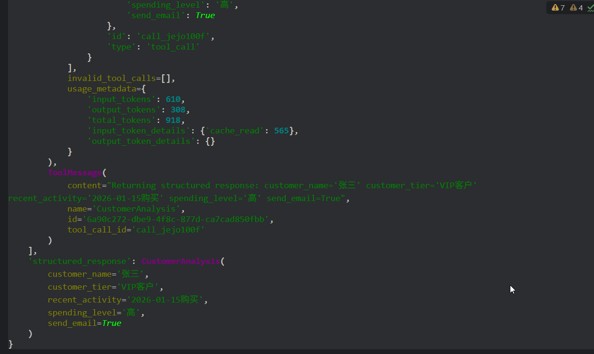

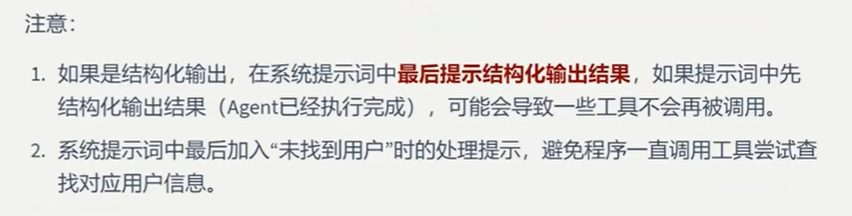

#### 输出模式2 TypeDict

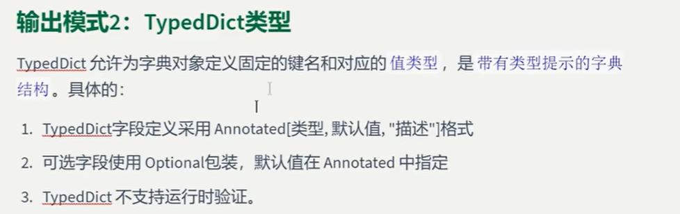

##### 举例代码1

```
from typing import TypedDict,Annotated
from langchain.agents.structured_output import AutoStrategy
from langchain_openai import ChatOpenAI
from langchain.agents import create_agent
from rich import print as rprint
# 1.初始化模型
model = ChatOpenAI(
    model="carstenuhlig/omnicoder-9b:latest",
    # model="qwen3-vl:latest",
    api_key="sk12345",
    base_url="http://localhost:11434/v1",
)
# 2.使用TypeDict结构方式来定义一个类
class ContactInfo(TypedDict):
    """用户的联系方式"""
    name:  Annotated[str ,...,"用户姓名"]
    email: Annotated[str ,...,"用户邮箱"]
    phone: Annotated[str ,...,"用户电话"]


# 3.创建agent
agent = create_agent(
    model=model,
    tools=[],
    response_format=AutoStrategy(schema=ContactInfo), # 结构化输出的第3种方式
    system_prompt="Agent的行为指令" # 可选
)
# 3.调用
result = agent.invoke({
    "messages":[{"role":"user","content":"请提取项目文本的用户信息：小李的email是 wxm1234@gmail.com,电话是13532677677"}]
})

rprint(result)

```

##### agent输出

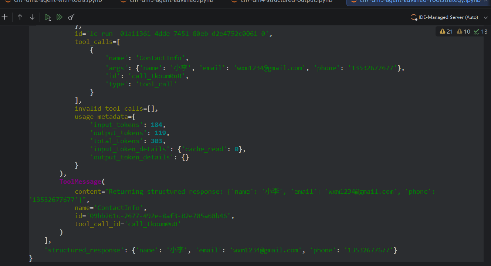

##### 举例代码2

```
from langchain_core.tools import tool
from langchain_core.messages import SystemMessage
from pydantic import BaseModel, Field
from langchain.agents.structured_output import AutoStrategy, ToolStrategy
from langchain_openai import ChatOpenAI
from langchain.agents import create_agent
from rich import print as rprint
from typing import Literal,TypedDict,Annotated,Optional

## 1.定义工具
@tool(parse_docstring=True)
def search_customer_database(query: str)->str:
     """
      在客户数据库搜索信息

     Args:
            query: str,客户查询字符串，如："张三" 或 "李四"

     Returns:
            str: 客户记录字符串，包括客户姓名、等级、最近购买日期和累计消费
     """
     if "张三" in query.lower():
          return "客户记录: 张三，VIP客户，最近购买日期：2026-01-15，累计消费：$15,000"
     elif "李四" in query.lower():
          return "客户记录: 李四，普通客户，最近购买日期：2025-12-20，累计消费：$3,200"
     else:
         return f"关于客户{query}，无记录"

@tool(parse_docstring=True)
def send_email(customer: str)->str:
    """
      发送感谢邮件

     Args:
            customer: str,客户名字，如："张三" 或 "李四"

     Returns:
            str: 确认消息，保护已发送的客户名称
     """
    return f"已向客户：{customer}发送感谢邮件"

# 2.初始化模型
model = ChatOpenAI(
    # model="carstenuhlig/omnicoder-9b:latest", # 在这里不好用
    model="qwen3-vl:latest", # ok
    api_key="sk12345",
    base_url="http://localhost:11434/v1",
)

# 3.定义TypedDict结构类
class CustomerAnalysis(TypedDict):
    """客户分析报告"""
    customer_name:Annotated[Optional[str],None,"客户姓名"]
    customer_tier:Annotated[Literal["潜在客户","普通客户","VIP客户","流失风险"],"潜在客户","客户等级"]
    recent_activity:Annotated[Optional[str],None,"最近活动"]
    spending_level:Annotated[Optional[Literal["低","中","高"]],None,"消费水平"]
    send_email:Annotated[bool,False,"是否已发送感谢邮件"]

# 4.定义agent
agent = create_agent(
    model=model,
    tools=[search_customer_database,send_email],
    response_format=ToolStrategy(schema=CustomerAnalysis), # 结构化输出的第3种方式
    system_prompt=SystemMessage(content="""
    请分析知道客户的情况:
    1.先搜索客户数据库了解最新情况
    2.如果是VIP客户，则发送感谢邮件
    3.基于搜索结果生成结构化分析报告
    4.如果用户提问与客户记录无关或者找不到客户信息，
    则返回空对象，不发送感谢邮件。
    """)
)
# 3.调用
result = agent.invoke({
    # "messages":[{"role":"user","content":"请分析客户张三"}]
    "messages":[{"role":"user","content":"请分析客户李四"}]
})

rprint(result)

```

##### agent输出

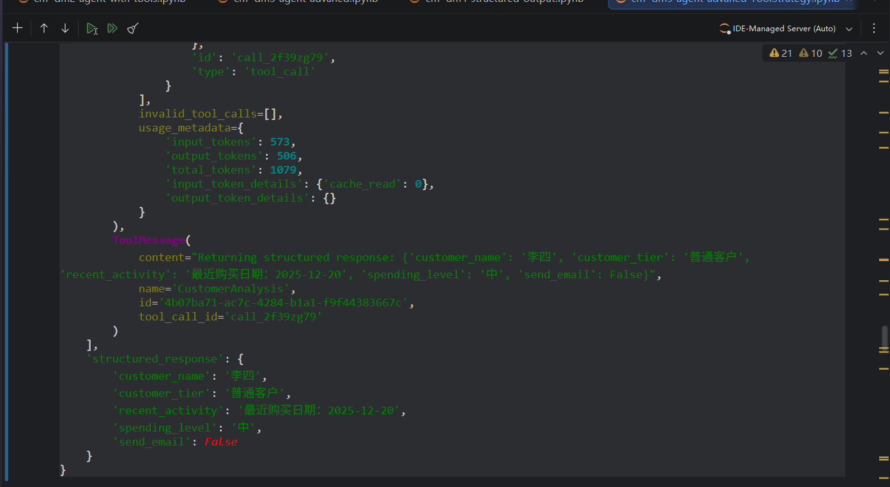

#### 输出模式3 JsonSchema，这种方式比较麻烦，不建议在实际开发项目中使用

##### JsonSchema举例1

```
from typing import TypedDict,Annotated
from langchain.agents.structured_output import AutoStrategy
from langchain_openai import ChatOpenAI
from langchain.agents import create_agent
from rich import print as rprint
# 1.初始化模型
model = ChatOpenAI(
    model="carstenuhlig/omnicoder-9b:latest",
    # model="qwen3-vl:latest",
    api_key="sk12345",
    base_url="http://localhost:11434/v1",
)
# 2.使用JsonSchema结构方式来定义一个类
json_schema = {
    "title":"ContactInfo",
    "description":"用户的联系方式",
    "type":"object",
    "properties":{
        "name":{
            "description":"用户姓名",
            "type":"string"
        },
        "email":{
             "description":"用户邮箱",
             "type":"string"
        },
        "phone":{
             "description":"用户手机号",
             "type":"string"
        }
    },
    "required":["name","email","phone"]
}


# 3.创建agent
agent = create_agent(
    model=model,
    tools=[],
    response_format=AutoStrategy(schema=json_schema), # 结构化输出的第3种方式
    system_prompt="Agent的行为指令" # 可选
)
# 3.调用
result = agent.invoke({
    "messages":[{"role":"user","content":"请提取项目文本的用户信息：小李的email是 wxm1234@gmail.com,电话是13532677677"}]
})

rprint(result)

```

##### agent输出

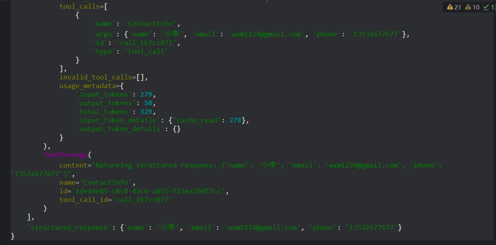

##### JsonSchema举例2

```
from langchain_core.tools import tool
from langchain_core.messages import SystemMessage
from pydantic import BaseModel, Field
from langchain.agents.structured_output import AutoStrategy, ToolStrategy
from langchain_openai import ChatOpenAI
from langchain.agents import create_agent
from rich import print as rprint
from typing import Literal,TypedDict,Annotated,Optional

## 1.定义工具
@tool(parse_docstring=True)
def search_customer_database(query: str)->str:
     """
      在客户数据库搜索信息

     Args:
            query: str,客户查询字符串，如："张三" 或 "李四"

     Returns:
            str: 客户记录字符串，包括客户姓名、等级、最近购买日期和累计消费
     """
     if "张三" in query.lower():
          return "客户记录: 张三，VIP客户，最近购买日期：2026-01-15，累计消费：$15,000"
     elif "李四" in query.lower():
          return "客户记录: 李四，普通客户，最近购买日期：2025-12-20，累计消费：$3,200"
     else:
         return f"关于客户{query}，无记录"

@tool(parse_docstring=True)
def send_email(customer: str)->str:
    """
      发送感谢邮件

     Args:
            customer: str,客户名字，如："张三" 或 "李四"

     Returns:
            str: 确认消息，保护已发送的客户名称
     """
    return f"已向客户：{customer}发送感谢邮件"

# 2.初始化模型
model = ChatOpenAI(
    # model="carstenuhlig/omnicoder-9b:latest", # 在这里不好用
    model="qwen3-vl:latest", # ok
    api_key="sk12345",
    base_url="http://localhost:11434/v1",
)

# 3.定义JsonSchema结构类
json_schema = {
    "title":"CustomerAnalysis",
    "description":"客户分析报告",
    "type":"object",
    "properties":{
        "customer_name":{
            "description":"客户姓名",
            "default":"",
            "type":"string"
        },
        " customer_tier":{
             "description":"客户等级",
             "enum": ["潜在客户","普通客户","VIP客户","流失风险"],
             "default":"潜在客户",
             "type":"string"
        },
        "recent_activity":{
             "description":"最近活动",
             "default":"",
             "type":"string"
        },
        "spending_level":{
            "type":"string",
            "enum":["低","中","高"],
            "default":"",
            "description":"消费水平"
        },
        "send_email":{
            "type":"boolean",
            "default":False,
            "description":"是否已发送感谢邮件"
        }
    },
    "required":["customer_name","customer_tier","recent_activity","spending_level"],
}

# 4.定义agent
agent = create_agent(
    model=model,
    tools=[search_customer_database,send_email],
    response_format=ToolStrategy(schema=json_schema), # 结构化输出的第3种方式
    system_prompt=SystemMessage(content="""
    请分析知道客户的情况:
    1.先搜索客户数据库了解最新情况
    2.如果是VIP客户，则发送感谢邮件
    3.基于搜索结果生成结构化分析报告
    4.如果用户提问与客户记录无关或者找不到客户信息，
    则返回空对象，不发送感谢邮件。
    """)
)
# 3.调用
result = agent.invoke({
    "messages":[{"role":"user","content":"请分析客户张三"}]
    # "messages":[{"role":"user","content":"请分析客户李四"}]
})

rprint(result)

```

##### agent输出

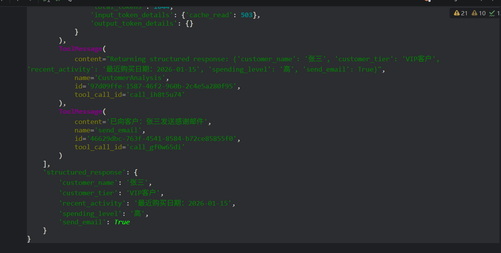

#### 输出模式4 @dataclass

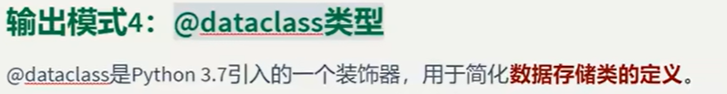

##### 举例1代码

```
from dataclasses import dataclass
from pydantic import BaseModel, Field
from langchain.agents.structured_output import AutoStrategy
from langchain_openai import ChatOpenAI
from langchain.agents import create_agent
from rich import print as rprint
# 1.初始化模型
model = ChatOpenAI(
    model="carstenuhlig/omnicoder-9b:latest",
    # model="qwen3-vl:latest",
    api_key="sk12345",
    base_url="http://localhost:11434/v1",
)
# 2.使用@dataclass注解来定义一个类
@dataclass
class ContactInfo(BaseModel):
    """用户的联系方式"""
    name: str
    email: str
    phone: str

# 3.创建agent
agent = create_agent(
    model=model,
    tools=[],
    response_format=AutoStrategy(schema=ContactInfo), # 结构化输出的第3种方式
    system_prompt="Agent的行为指令" # 可选
)
# 3.调用
result = agent.invoke({
    "messages":[{"role":"user","content":"请提取项目文本的用户信息：小李的email是 wxm1234@gmail.com,电话是13532677677"}]
})

rprint(result)

```

##### agent输出

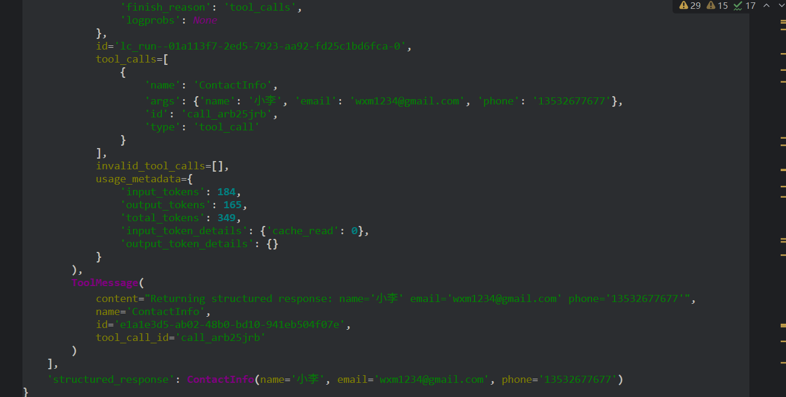

##### 举例2代码

```
from langchain_core.tools import tool
from langchain_core.messages import SystemMessage
from pydantic import BaseModel, Field
from langchain.agents.structured_output import AutoStrategy, ToolStrategy
from langchain_openai import ChatOpenAI
from langchain.agents import create_agent
from rich import print as rprint
from typing import Literal

## 1.定义工具
@tool(parse_docstring=True)
def search_customer_database(query: str)->str:
     """
      在客户数据库搜索信息

     Args:
            query: str,客户查询字符串，如："张三" 或 "李四"

     Returns:
            str: 客户记录字符串，包括客户姓名、等级、最近购买日期和累计消费
     """
     if "张三" in query.lower():
          return "客户记录: 张三，VIP客户，最近购买日期：2026-01-15，累计消费：$15,000"
     elif "李四" in query.lower():
          return "客户记录: 李四，普通客户，最近购买日期：2025-12-20，累计消费：$3,200"
     else:
         return f"关于客户{query}，无记录"

@tool(parse_docstring=True)
def send_email(customer: str)->str:
    """
      发送感谢邮件

     Args:
            customer: str,客户名字，如："张三" 或 "李四"

     Returns:
            str: 确认消息，保护已发送的客户名称
     """
    return f"已向客户：{customer}发送感谢邮件"

# 2.初始化模型
model = ChatOpenAI(
    # model="carstenuhlig/omnicoder-9b:latest", # 在这里不好用
    model="qwen3-vl:latest", # ok
    api_key="sk12345",
    base_url="http://localhost:11434/v1",
)

# 3.同@dataclass注解定义一个类
@dataclass
class CustomerAnalysis:
    """客户分析报告"""
    customer_name: str = Field(None,description="客户姓名")
    customer_tier: Literal["潜在客户","普通客户","VIP客户","流失风险"] = Field("潜在客户",
                                    description="客户只能是：潜在客户、普通客户、VIP客户和流失风险")
    recent_activity: str = Field(None,description="最近活动")
    spending_level: Literal["低","中","高"] = Field(None,description="消费水平")
    send_email: bool = Field(False,description="是否已发送感谢邮件")


# 4.定义agent
agent = create_agent(
    model=model,
    tools=[search_customer_database,send_email],
    response_format=ToolStrategy(schema=CustomerAnalysis), # 结构化输出的第3种方式
    system_prompt=SystemMessage(content="""
    请分析知道客户的情况:
    1.先搜索客户数据库了解最新情况
    2.如果是VIP客户，则发送感谢邮件
    3.基于搜索结果生成结构化分析报告
    4.如果用户提问与客户记录无关或者找不到客户信息，
    则返回空对象，不发送感谢邮件。
    """)
)
# 3.调用
result = agent.invoke({
    "messages":[{"role":"user","content":"请分析客户张三"}]
})

rprint(result)
```

##### agent输出

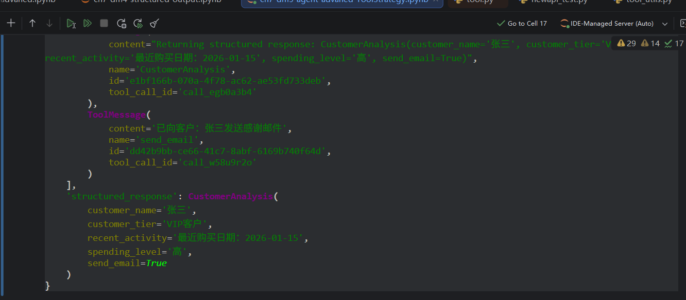

#### 输出模式5多schema输出模式

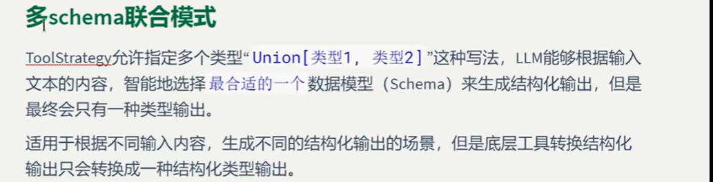

##### 举例1代码

```
from typing import Union
from pydantic import BaseModel, Field
from langchain.agents.structured_output import AutoStrategy
from langchain_openai import ChatOpenAI
from langchain.agents import create_agent
from rich import print as rprint
# 1.初始化模型
model = ChatOpenAI(
    model="carstenuhlig/omnicoder-9b:latest",
    # model="qwen3-vl:latest",
    api_key="sk12345",
    base_url="http://localhost:11434/v1",
)
# 2.使用Pydantic结构方式来定义一个类
class ContactInfo(BaseModel):
    """用户的联系方式"""
    name: str = Field(description="用户姓名")
    email: str = Field(description="用户邮箱")
    phone: str = Field(description="用户电话")

# 2.2使用Pydantic结构方式来定义另外一个类,
class EventInfo(BaseModel):
   """事件详情"""
   event_name: str = Field(description="事件名称")
   date: str = Field(description="事件发生日期")

# 3.创建agent
agent = create_agent(
    model=model,
    response_format=ToolStrategy(schema=Union[ContactInfo,EventInfo]), # 结构化输出的第3种方式
    system_prompt="Agent的行为指令" # 可选
)
# 3.调用
result = agent.invoke({
    "messages":[{"role":"user","content":"请提取项目文本的用户信息：小李的email是 wxm1234@gmail.com,电话是13532677677"}]
})

rprint(result)
```

##### agent输出

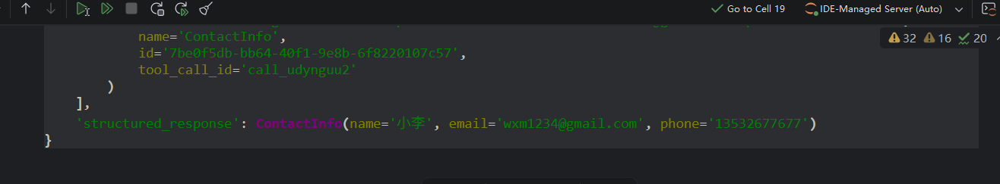

##### 然后我们修改提示词

``` 
from typing import Union
from pydantic import BaseModel, Field
from langchain.agents.structured_output import AutoStrategy
from langchain_openai import ChatOpenAI
from langchain.agents import create_agent
from rich import print as rprint
# 1.初始化模型
model = ChatOpenAI(
    model="carstenuhlig/omnicoder-9b:latest",
    # model="qwen3-vl:latest",
    api_key="sk12345",
    base_url="http://localhost:11434/v1",
)
# 2.使用Pydantic结构方式来定义一个类
class ContactInfo(BaseModel):
    """用户的联系方式"""
    name: str = Field(description="用户姓名")
    email: str = Field(description="用户邮箱")
    phone: str = Field(description="用户电话")

# 2.2使用Pydantic结构方式来定义另外一个类,
class EventInfo(BaseModel):
   """事件详情"""
   event_name: str = Field(description="事件名称")
   date: str = Field(description="事件发生日期")

# 3.创建agent
agent = create_agent(
    model=model,
    response_format=ToolStrategy(schema=Union[ContactInfo,EventInfo]), # 结构化输出的第3种方式
    system_prompt="Agent的行为指令" # 可选
)
# 3.调用
result = agent.invoke({
    "messages":[{"role":"user","content":"从这段话中提取结构化信息：2020年高考报名人数突破1200万"}]
})

rprint(result)
```
##### agent输出

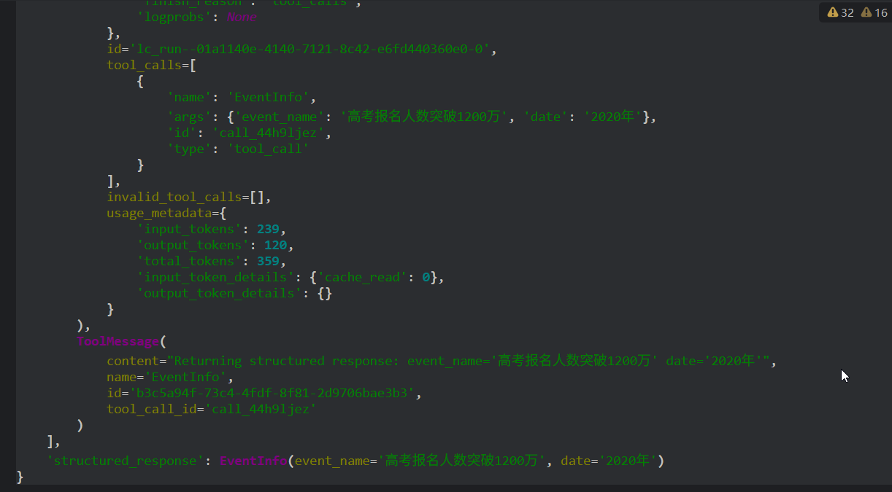

## 7.3.2自定义工具消息：tool_message_content参数

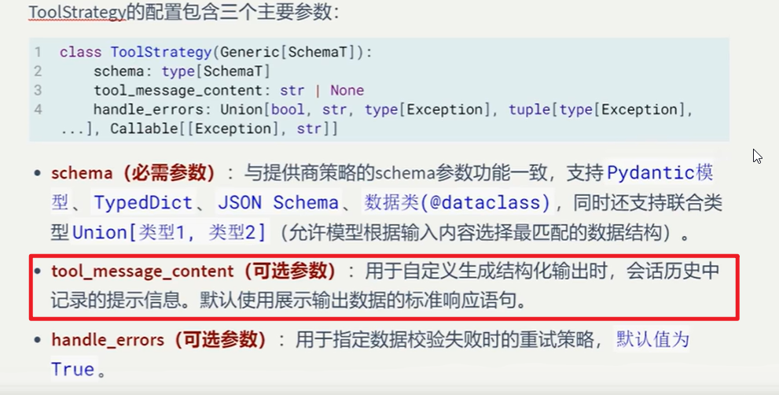

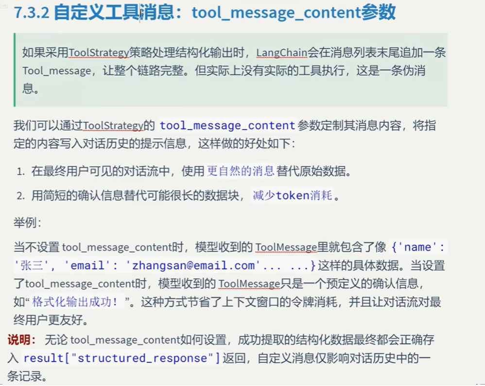

##### 举例代码

```
from pydantic import BaseModel, Field
from langchain.agents.structured_output import AutoStrategy
from langchain_openai import ChatOpenAI
from langchain.agents import create_agent
from rich import print as rprint
# 1.初始化模型
model = ChatOpenAI(
    model="carstenuhlig/omnicoder-9b:latest",
    # model="qwen3-vl:latest",
    api_key="sk12345",
    base_url="http://localhost:11434/v1",
)
# 2.使用Pydantic结构方式来定义一个类
class ContactInfo(BaseModel):
    """用户的联系方式"""
    name: str = Field(description="用户姓名")
    email: str = Field(description="用户邮箱")
    phone: str = Field(description="用户电话")

# 3.创建agent
agent = create_agent(
    model=model,
    tools=[],
    response_format=ToolStrategy(
        schema=ContactInfo,
        tool_message_content="格式化输出成功！！！"
    ), # 结构化输出的第3种方式

)
# 3.调用
result = agent.invoke({
    "messages":[{"role":"user","content":"请提取项目文本的用户信息：小李的email是 wxm1234@gmail.com,电话是13532677677"}]
})

rprint(result)
```

##### agent输出

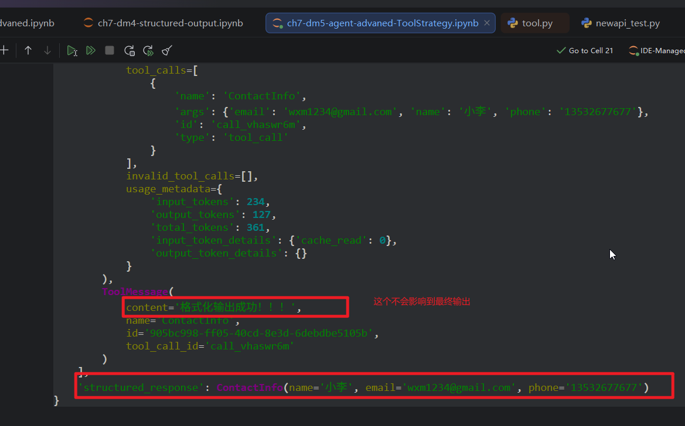

## 7.3.3错误处理：handle_errors参数

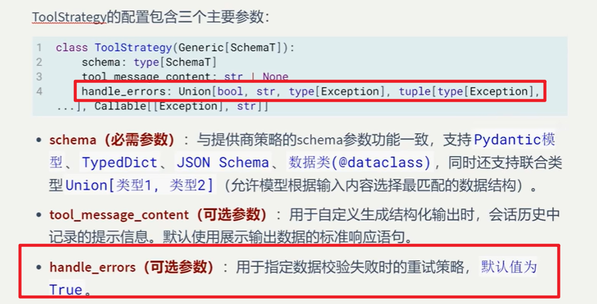

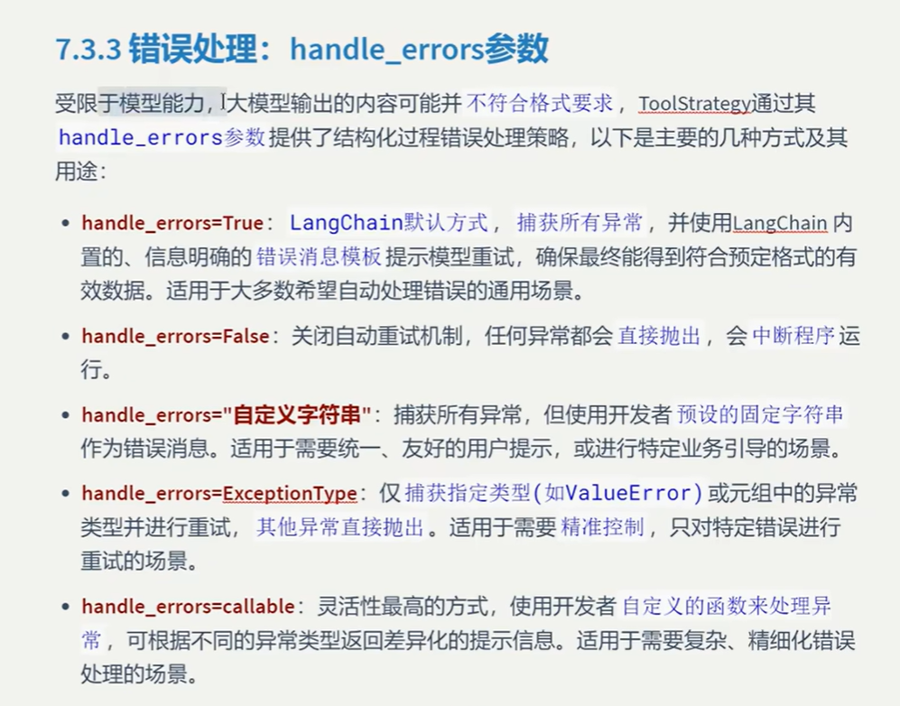

### 情况1：设置为True/False/固定字符串

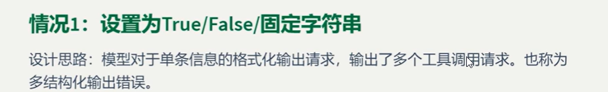

#### 举例1：handle_errors=True

```
from typing import Union

from langchain.agents.structured_output import ToolStrategy
from pydantic import BaseModel, Field
from langchain_openai import ChatOpenAI
from langchain.agents import create_agent
from rich import print as rprint
# 1.初始化模型
model = ChatOpenAI(
    model="carstenuhlig/omnicoder-9b:latest",
    # model="qwen3-vl:latest",
    api_key="sk12345",
    base_url="http://localhost:11434/v1",
)

class ContactInfo(BaseModel):
    """联系人信息"""
    name: str = Field(description="姓名")
    email: str = Field(description="邮箱")

class EnventDetails(BaseModel):
    """活动详情"""
    event_name: str = Field(description="活动名称")
    date: str = Field(description="活动日期")

agent = create_agent(
    model=model,
    response_format=ToolStrategy(
        Union[ContactInfo, EnventDetails,], ## 注意Union里面的东西只能取一个
        tool_message_content="提取完成！",
        handle_errors=True
    )
)


result = agent.invoke({
    "messages":[{
        "role":"user",
        "content":"请提取以下文本中的内容：张三，电子邮箱：zhang3@atguigu.com,活动名称：公司年会，活动日期：2026-7-15"
    }]
})

rprint(result)
```

#### agent 输出

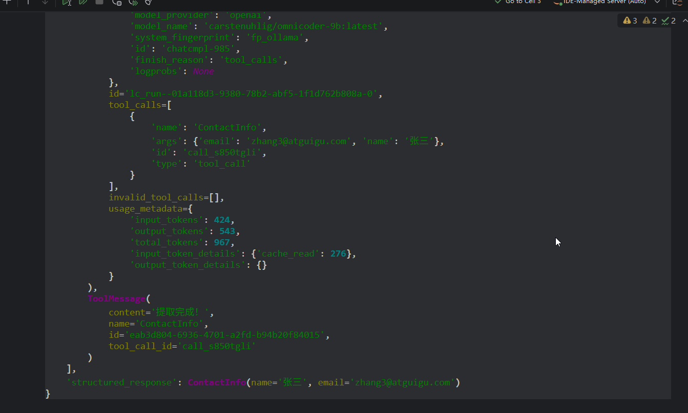

#### 举例2 hanlde_errors=False，没有捕获异常，程序会崩溃

```
from typing import Union

from langchain.agents.structured_output import ToolStrategy
from pydantic import BaseModel, Field
from langchain_openai import ChatOpenAI
from langchain.agents import create_agent
from rich import print as rprint
# 1.初始化模型
model = ChatOpenAI(
    model="carstenuhlig/omnicoder-9b:latest",
    # model="qwen3-vl:latest",
    api_key="sk12345",
    base_url="http://localhost:11434/v1",
)

class ContactInfo(BaseModel):
    """联系人信息"""
    name: str = Field(description="姓名")
    email: str = Field(description="邮箱")

class EnventDetails(BaseModel):
    """活动详情"""
    event_name: str = Field(description="活动名称")
    date: str = Field(description="活动日期")

agent = create_agent(
    model=model,
    response_format=ToolStrategy(
        Union[ContactInfo, EnventDetails,], ## 注意Union里面的东西只能取一个
        tool_message_content="提取完成！",
        handle_errors=False #不捕获异常，程序就会崩溃
    )
)


result = agent.invoke({
    "messages":[{
        "role":"user",
        "content":"请提取以下文本中的内容：张三，电子邮箱：zhang3@atguigu.com,活动名称：公司年会，活动日期：2026-7-15"
    }]
})

rprint(result)
```

#### agent输出

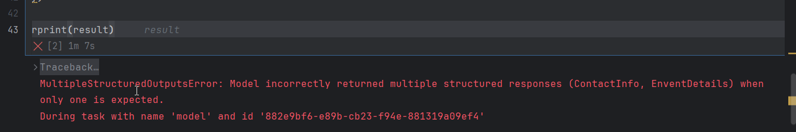

#### 举例3.handle_error=一个字符串

```
from typing import Union

from langchain.agents.structured_output import ToolStrategy
from pydantic import BaseModel, Field
from langchain_openai import ChatOpenAI
from langchain.agents import create_agent
from rich import print as rprint
# 1.初始化模型
model = ChatOpenAI(
    model="carstenuhlig/omnicoder-9b:latest",
    # model="qwen3-vl:latest",
    api_key="sk12345",
    base_url="http://localhost:11434/v1",
)

class ContactInfo(BaseModel):
    """联系人信息"""
    name: str = Field(description="姓名")
    email: str = Field(description="邮箱")

class EnventDetails(BaseModel):
    """活动详情"""
    event_name: str = Field(description="活动名称")
    date: str = Field(description="活动日期")

agent = create_agent(
    model=model,
    response_format=ToolStrategy(
        Union[ContactInfo, EnventDetails,], ## 注意Union里面的东西只能取一个
        tool_message_content="提取完成！",
        handle_errors="请检查输入数据"
    )
)


result = agent.invoke({
    "messages":[{
        "role":"user",
        "content":"请提取以下文本中的内容：张三，电子邮箱：zhang3@atguigu.com,活动名称：公司年会，活动日期：2026-7-15"
    }]
})

rprint(result)
```

#### agent输出，这个和老师的不太一样，它调用第二个类型

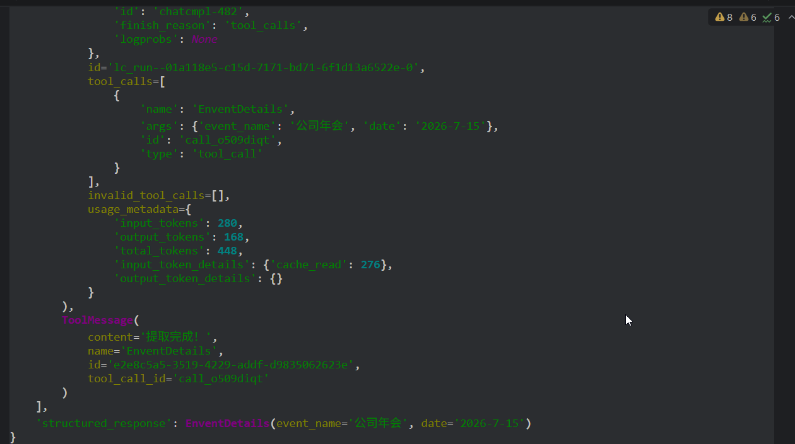


### 情况2：设置为指定异常类型

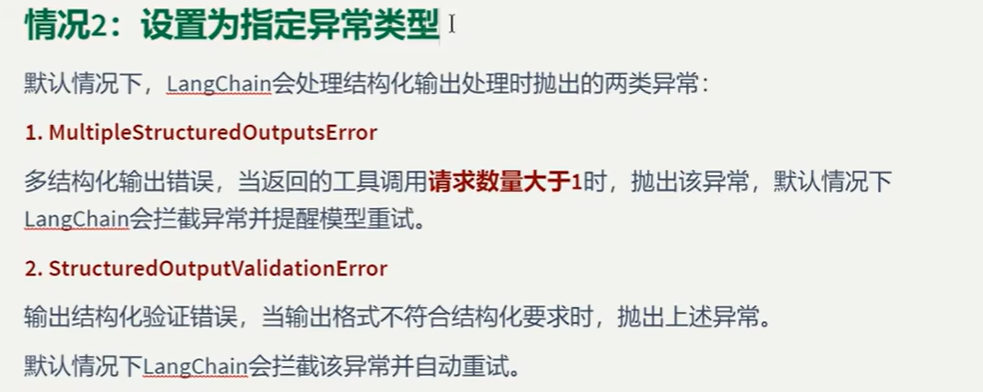

#### 举例代码

```
from typing import Union

from langchain.agents.structured_output import ToolStrategy,MultipleStructuredOutputsError,StructuredOutputValidationError
from pydantic import BaseModel, Field
from langchain_openai import ChatOpenAI
from langchain.agents import create_agent
from rich import print as rprint
# 1.初始化模型
model = ChatOpenAI(
    model="carstenuhlig/omnicoder-9b:latest",
    # model="qwen3-vl:latest",
    api_key="sk12345",
    base_url="http://localhost:11434/v1",
)

class ContactInfo(BaseModel):
    """联系人信息"""
    name: str = Field(description="姓名")
    email: str = Field(description="邮箱")

class EnventDetails(BaseModel):
    """活动详情"""
    event_name: str = Field(description="活动名称")
    date: str = Field(description="活动日期")

agent = create_agent(
    model=model,
    response_format=ToolStrategy(
        Union[ContactInfo, EnventDetails,], ## 注意Union里面的东西只能取一个
        tool_message_content="提取完成！",
        handle_errors=(MultipleStructuredOutputsError,StructuredOutputValidationError)
    )
)


result = agent.invoke({
    "messages":[{
        "role":"user",
        "content":"请提取以下文本中的内容：张三，电子邮箱：zhang3@atguigu.com,活动名称：公司年会，活动日期：2026-7-15"
    }]
})

rprint(result)
```

#### agent输出

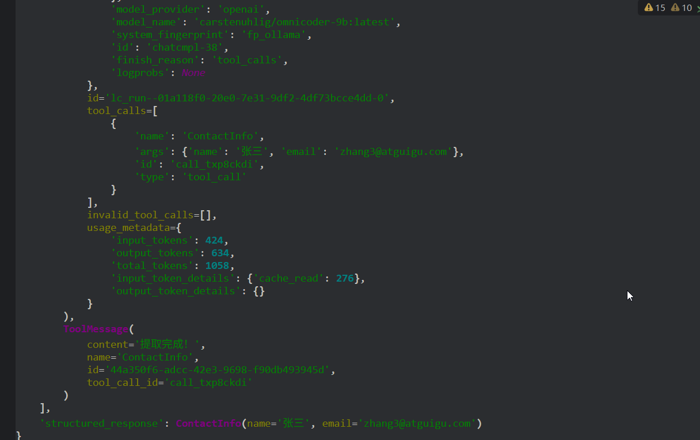

### 情况3：设置为自定义错误处理函数

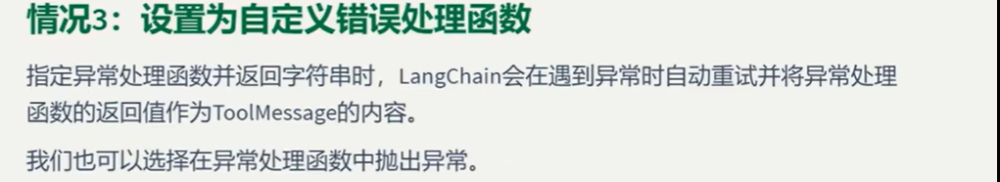

#### 情况3举例代码

```
from typing import Union

from langchain.agents.structured_output import ToolStrategy,MultipleStructuredOutputsError,StructuredOutputValidationError
from pydantic import BaseModel, Field
from langchain_openai import ChatOpenAI
from langchain.agents import create_agent
from rich import print as rprint
# 1.初始化模型
model = ChatOpenAI(
    # model="carstenuhlig/omnicoder-9b:latest",
    model="483025889/qwen3.5:9b",
    # model="mistral-nemo:latest",
    # model="qwen3-vl:latest",
    api_key="sk12345",
    base_url="http://localhost:11434/v1",
)

## 定义错误处理函数，太复杂，会引起agent死循环
# def custom_error_handler(error: Exception) ->str:
#     """自定义错误处理器"""
#     err_str = str(error)
#     print(f"捕获到错误类型{type(error).__name__}")
#     print(f"错误详情{err_str}")
#     if isinstance(error, MultipleStructuredOutputsError):
#         return "检测到多个响应，请选择最相关的一个进行返回"
#     # elif isinstance(error, StructuredOutputValidationError):
#     #     return "评价数据格式有误，请检查字段是否符合要求."
# 
#     else:
#         return f"Error: {err_str}"

## 定义错误处理函数，太复杂，会引起agent死循环
# def custom_error_handler2(error: Exception) ->str:
#     """自定义错误处理器"""
#     if isinstance(error, MultipleStructuredOutputsError):
#         return "检测到多个响应，请选择最相关的一个进行返回"
#     else:
#         return f"Error: {str(error)}"
    
def custom_error_handler3(error: Exception) ->str:
    """自定义错误处理器"""
    return f"Error: {str(error)}"    


class ContactInfo(BaseModel):
    """联系人信息"""
    name: str = Field(description="姓名")
    email: str = Field(description="邮箱")

class EnventDetails(BaseModel):
    """活动详情"""
    event_name: str = Field(description="活动名称")
    date: str = Field(description="活动日期")

agent = create_agent(
    model=model,
    response_format=ToolStrategy(
        Union[ContactInfo, EnventDetails], ## 注意Union里面的东西只能取一个
        tool_message_content="提取完成！",
        handle_errors=custom_error_handler3
    )
)


result = agent.invoke({
    "messages":[{
        "role":"user",
        "content":"请提取以下文本中的内容：姓名:张三，电子邮箱：zhang3@atguigu.com,活动名称：公司年会，活动日期：2026-7-15"
    }]
})

rprint(result)
```

#### agent输出

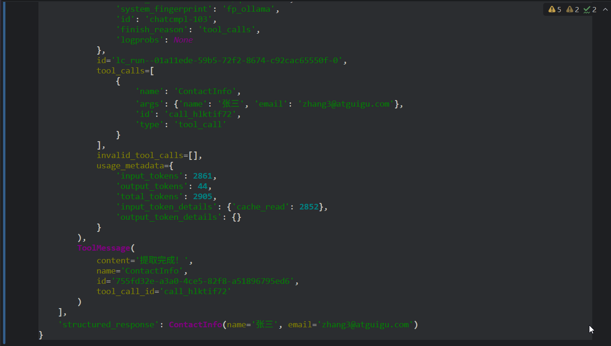

# 8.Agent的高级用法4：流式输出及模型

## 8.1流式输出的说明

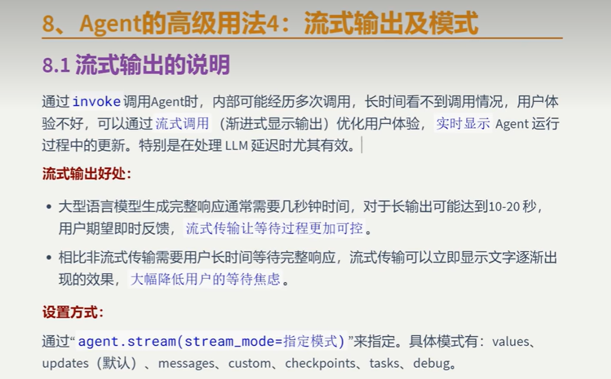

## 8.2具体的输出模式

### 这7种stream_mode的区别(按ctrl+点击链接可以打开被链接的文档)：[agent的7种stream_mode效果有什么区别](./扩展笔记-agent的7种stream_mode效果有什么区别.md)

### 8.2.1 values输出模式

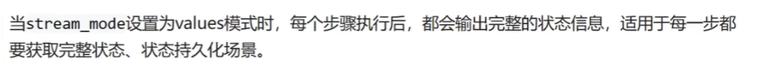

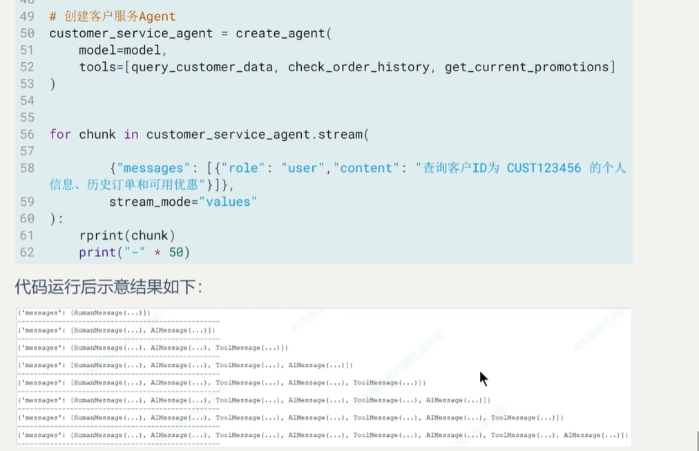

#### 举例代码

```
from langchain_core.tools import tool
from typing import Union, Dict, Any

from langchain.agents.structured_output import ToolStrategy,MultipleStructuredOutputsError,StructuredOutputValidationError
from pydantic import BaseModel, Field
from langchain_openai import ChatOpenAI
from langchain.agents import create_agent
from rich import print as rprint
# 1.初始化模型
model = ChatOpenAI(
    # model="carstenuhlig/omnicoder-9b:latest",
    model="qwen3-vl:latest",
    api_key="sk12345",
    base_url="http://localhost:11434/v1",
)

## 2.定义工具
@tool
def query_customer_data(customer_id: str) -> Dict[str,Any]:
       """
       查询客户基本信息

       Args:
              customer_id:  客户ID，用来唯一标识客户

       Returns:
               包含客户基本信息的字典，如姓名、等级，加入日期等
       """
       # 模拟数据库查询
       return {"name":"张三","level":"VIP","join_date":"2023-01-15"}

@tool
def check_order_history(customer_id: str) -> Dict[str,Any]:
       """
       查询客户订单历史

       Args:
              customer_id:  客户ID，用来唯一标识客户

       Returns:
             包含客户订单历史的字典，如总订单数，总花费等
       """
       return {"total_orders":15,"total_spent":25800.00}

@tool
def get_current_promotions() ->Dict[str,Any]:
     """
     获取当前可以促销活动

     Returns:
            包含当前可用促销活动的字典，如活动名称，邮箱日期等
     """
     return {
            "promotions":["老用户优惠","会员专属折扣"],
            "valid_until":"2027-01-31"
    }

agent = create_agent(
    model=model,
    tools=[query_customer_data,check_order_history, get_current_promotions]
)

for chunk in agent.stream({
    "messages":[{
        "role":"user",
        "content":"查询客户ID为CUST123456的个人信息、历史订单和可用优惠"
    }]
},stream_mode="values"):
    rprint(chunk)
    print("-"*50)


```

#### agent输出参考学习源码

### 8.2.2 updates输出模式，是默认值，

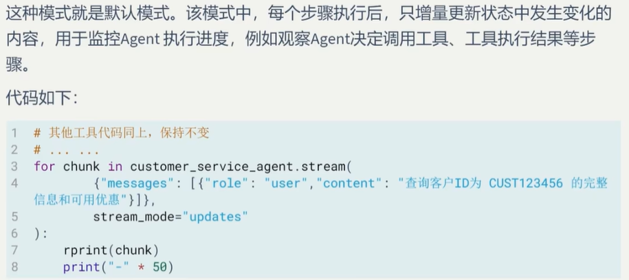

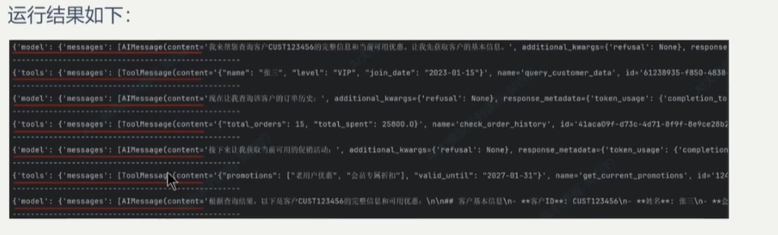

#### 其他都一样，就是修改stream_mode="updates"

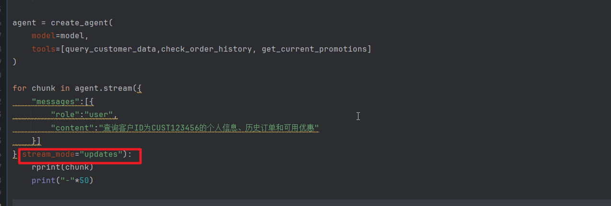


### 8.2.3 messages输出模式,代码基本相同，只需要修改stream_mode="messages"

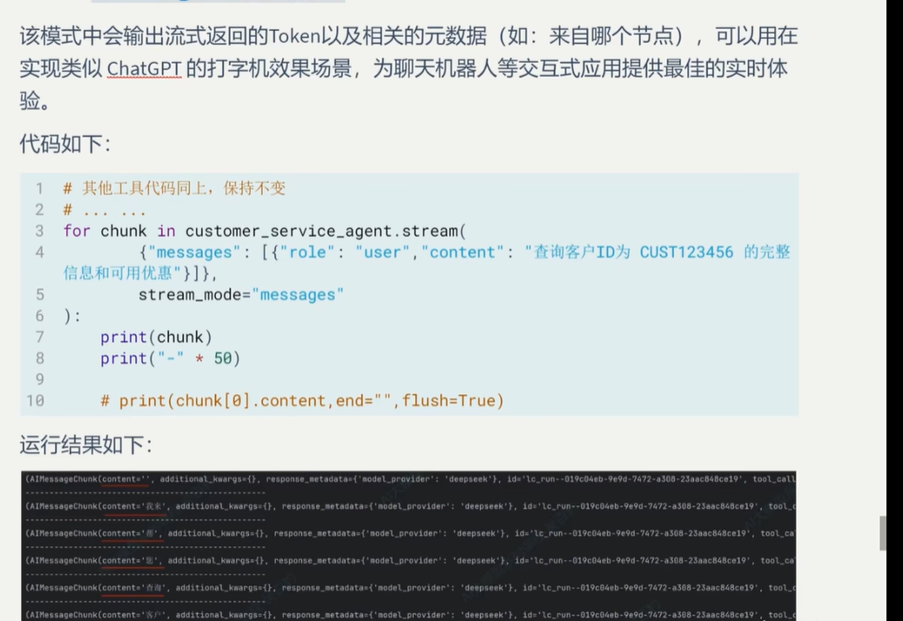

### 8.2.4 tasks输出模式,代码基本相同，只需要修改stream_mode="tasks"

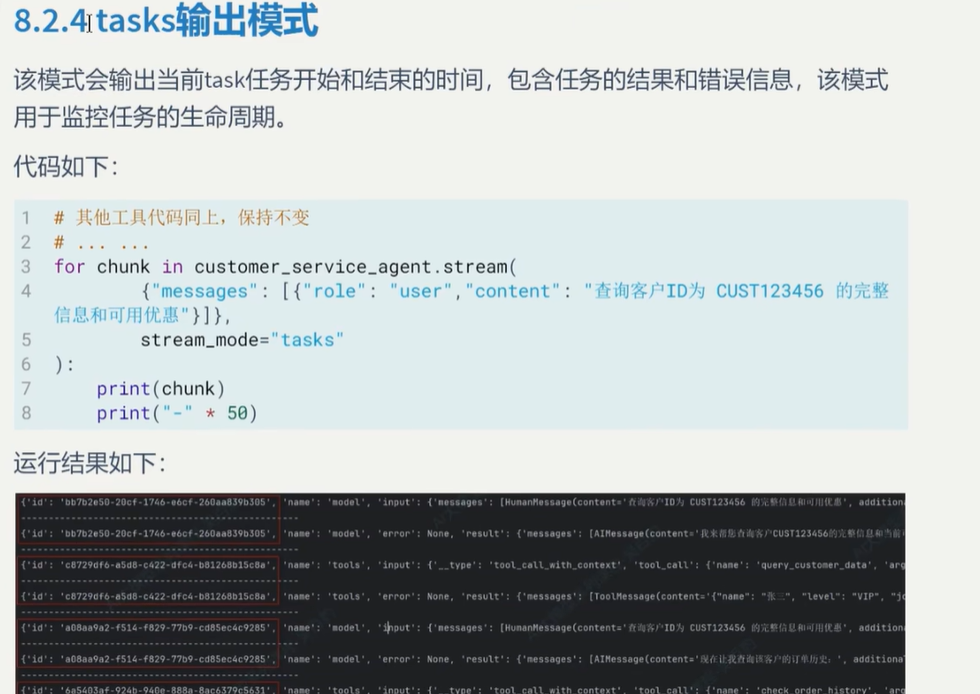

### 8.2.5 debug输出模式,代码基本相同，只需要修改stream_mode="debug"

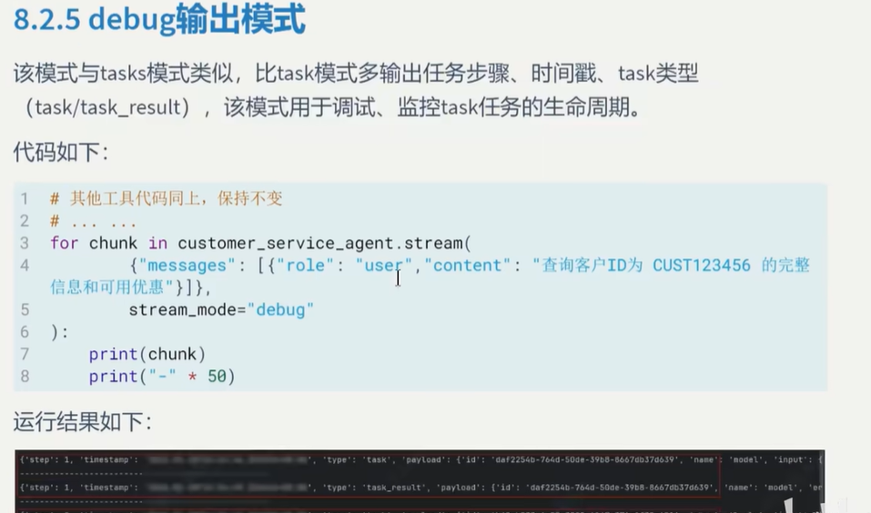

### 8.2.6 checkpoints输出模式,

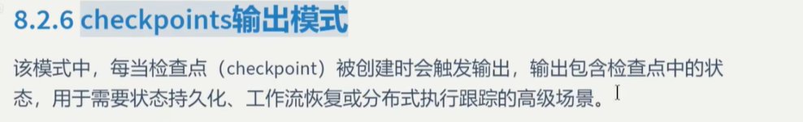

#### 举例代码：注意，这个代码和上面的有所不同

```
from langchain_core.tools import tool
from typing import Union, Dict, Any
from langchain_openai import ChatOpenAI
from langchain.agents import create_agent
from langgraph.checkpoint.memory import InMemorySaver
from rich import print as rprint
# 1.初始化模型
model = ChatOpenAI(
    # model="carstenuhlig/omnicoder-9b:latest",
    # model="qwen3-vl:latest",
    model="483025889/qwen3.5:9b",
    api_key="sk12345",
    base_url="http://localhost:11434/v1",
)

## 2.定义工具
@tool
def query_customer_data(customer_id: str) -> Dict[str,Any]:
       """
       查询客户基本信息

       Args:
              customer_id:  客户ID，用来唯一标识客户

       Returns:
               包含客户基本信息的字典，如姓名、等级，加入日期等
       """
       # 模拟数据库查询
       return {"name":"张三","level":"VIP","join_date":"2023-01-15"}

@tool
def check_order_history(customer_id: str) -> Dict[str,Any]:
       """
       查询客户订单历史

       Args:
              customer_id:  客户ID，用来唯一标识客户

       Returns:
             包含客户订单历史的字典，如总订单数，总花费等
       """
       return {"total_orders":15,"total_spent":25800.00}

@tool
def get_current_promotions() ->Dict[str,Any]:
     """
     获取当前可以促销活动

     Returns:
            包含当前可用促销活动的字典，如活动名称，邮箱日期等
     """
     return {
            "promotions":["老用户优惠","会员专属折扣"],
            "valid_until":"2027-01-31"
    }

# 创建一个checkpointer
checkpointer = InMemorySaver()

agent = create_agent(
    model=model,
    tools=[query_customer_data,check_order_history, get_current_promotions],
    checkpointer=checkpointer #启用检查点
)
# 3.创建唯一的会话ID
config = {"configurable":{"thread_id":"session01"}}

# 4.调用Agent
checkpoint_count = 0

for chunk in agent.stream({
    "messages":[{
        "role":"user",
        "content":"查询客户ID为CUST123456的个人信息、历史订单和可用优惠"
    }]
},stream_mode="checkpoints",config=config):
    checkpoint_count += 1
    print(f"检查点#{checkpoint_count}")
    rprint(chunk)
    print("-"*50)


```


### 8.2.7 custom输出模式

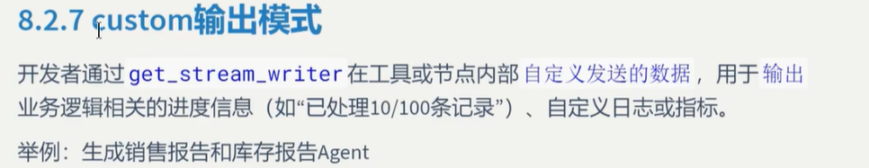

#### 举例，这里的代码也是有所不同

```
import time
from langchain_core.tools import tool
from typing import Union, Dict, Any
from langchain_openai import ChatOpenAI
from langchain.agents import create_agent
from langgraph.config import get_stream_writer
from rich import print as rprint
# 1.初始化模型
model = ChatOpenAI(
    # model="carstenuhlig/omnicoder-9b:latest",
    # model="qwen3-vl:latest",
    model="483025889/qwen3.5:9b",
    api_key="sk12345",
    base_url="http://localhost:11434/v1",
)

## 2.定义工具

@tool
def generate_sales_report() -> str:
    """生成销售报告"""
    writer = get_stream_writer()
    writer({"type":"生成销售报告","message":"开始生成销售报告"})
    # 模拟数据出来
    for i in range(1,4):
        time.sleep(0.5)
        writer({"type":"生成销售报告","message":f"生成销售报告进度百分比：{i*25}%"})
    writer({"type":"生成销售报告","message":"生成销售报告完成"})
    return "销售报告:总收入150万元，同比增长12%"

@tool
def generate_inventory_report() -> str:
    """生成库存报告"""
    writer = get_stream_writer()
    writer("开始库存分析")
    time.sleep(0.5)
    writer("检查当前库存")
    time.sleep(0.5)
    writer("生成库存报告。。。")

    return "当前库存量为100000件，库存充足，无异常"


agent = create_agent(
    model=model,
    tools=[generate_sales_report,generate_inventory_report]
)

for chunk in agent.stream({
    "messages":[{
        "role":"user",
        "content":"生成销售报告和库存报告"
    }]
},stream_mode="custom"):
    rprint(chunk)
    print("-"*50)


```

#### agent输出

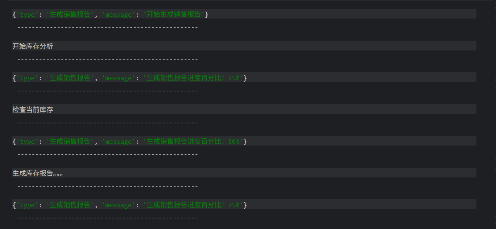

## 8.3 流式输出模式总结

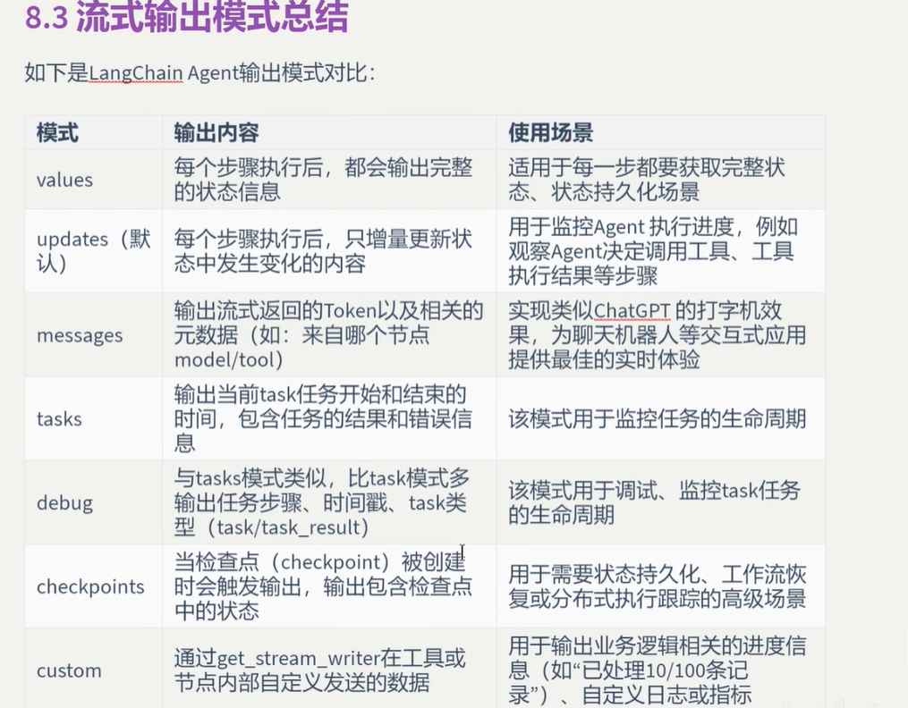

### 更好的总结

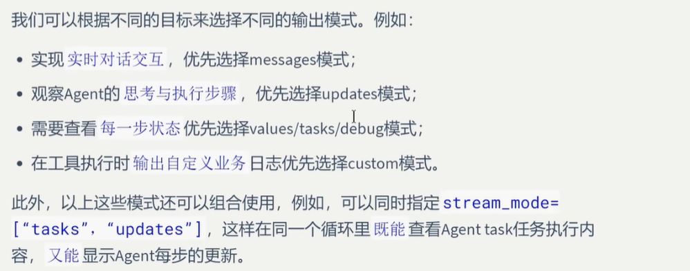

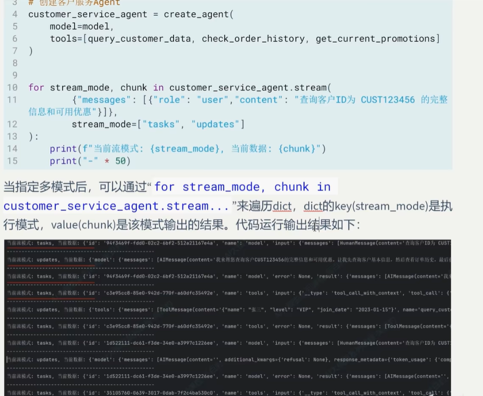

# 9.实战：多功能智能体助手

## 9.1 模型的初始化

## 9.2 工具的定义

## 9.3 agent的创建

## 9.4 主程序


